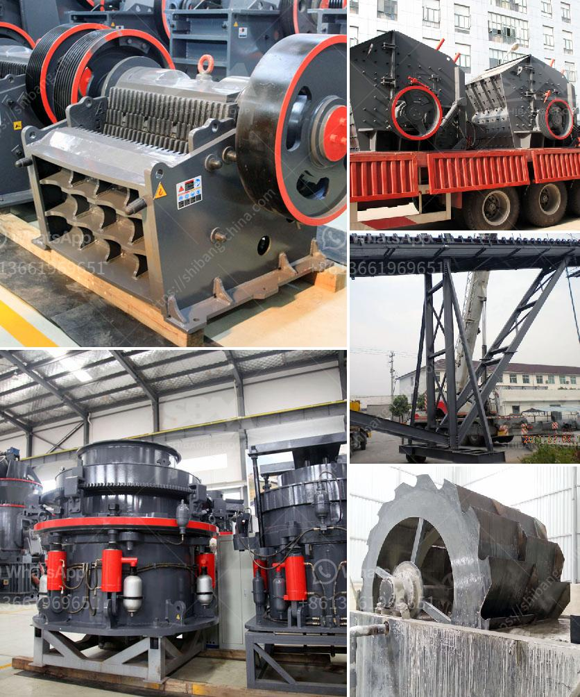

<h3>How to repair a crack in the trunnion of a ball mill?</h3>
A ball mill trunnion is an important part that carries the rotating body of the ball mill. It supports and connects the cylinder, and also is the entry and exit passage of the material. With rich experience in ball mill spare parts production, CHAENG is able to customize various types of ball mill trunnion with high quality according to drawings.

The ball mill trunnion produced by CHAENG is made of high-quality steel materials, and its hardness and service life are guaranteed. The quality of the trunnion directly affects the production efficiency of the ball mill. In order to ensure the normal operation of the ball mill, regular maintenance and repair of the ball mill trunnion are essential.

If the trunnion cracks, it must be replaced or repaired immediately. The steps to replace the trunnion liner in a ball mill are as follows:

Firstly, verify that the trunnion hole and trunnion liner are in line with the retainer ring hole of the trunnion. After the cracked trunnion liner is removed, the crack should be cleaned and any damaged parts should be repaired or replaced as required.

The new trunnion liner should be preheated before installation. It should be not overheated to prevent the trunnion liner from losing its temper. If conditions permit, cold air can be used to cool the trunnion liner. When the trunnion liner is cooled to a certain temperature, it can be installed into the trunnion hole.

Select a suitable lifting device to install the new trunnion liner. Install the trunnion liner from the top of the trunnion, and fix it to the support with bolts. During the installation process, the trunnion liner should be adjusted to ensure that it is centered with the trunnion hole.

After the trunnion liner is installed, it is necessary to check whether it is firm and whether the bolts are tightened. Rotate the ball mill by hand, and observe whether there is friction between the trunnion liner and the trunnion, and whether the lubricating oil is sprayed out. If there is friction or oil spray, it indicates that the trunnion liner needs to be adjusted.

After the installation of the new trunnion liner, the ball mill must be inspected and maintained regularly. Repair and replace the trunnion liner when it is worn. The cracks on the trunnion must be repaired in time to avoid accidents.

In conclusion, in order to ensure the safe and efficient operation of the ball mill, regular maintenance and repair of the trunnion are necessary. The repair of the trunnion is a complex and long-term project, which requires a certain amount of preparation work and the cooperation of multiple departments. Therefore, it is recommended to entrust a professional and experienced manufacturer to provide maintenance and repair services.
<h3>Contact us</h3><ul><li><strong>Whatsapp:&nbsp;<a href="https://wa.me/8613661969651">+8613661969651</a></strong></li><li><a href="https://swt.shibang-china.com/?git&amp;zhl&amp;How to repair a crack in the trunnion of a ball mill"><strong>Online Service(chat now)</strong></a></li></ul><h3>Related</h3><ul><li><a href='How the mechanism sand is produced .md'>How the mechanism sand is produced ?</a></li><li><a href='How to work with a Raymond Mill.md'>How to work with a Raymond Mill?</a></li><li><a href='How to crush material from 12mm to 6mm.md'>How to crush material from 12mm to 6mm?</a></li><li><a href='how to give a seminar on jaw crusher .md'>how to give a seminar on jaw crusher ?</a></li><li><a href='how to calculate crusher production cost.md'>how to calculate crusher production cost</a></li></ul>