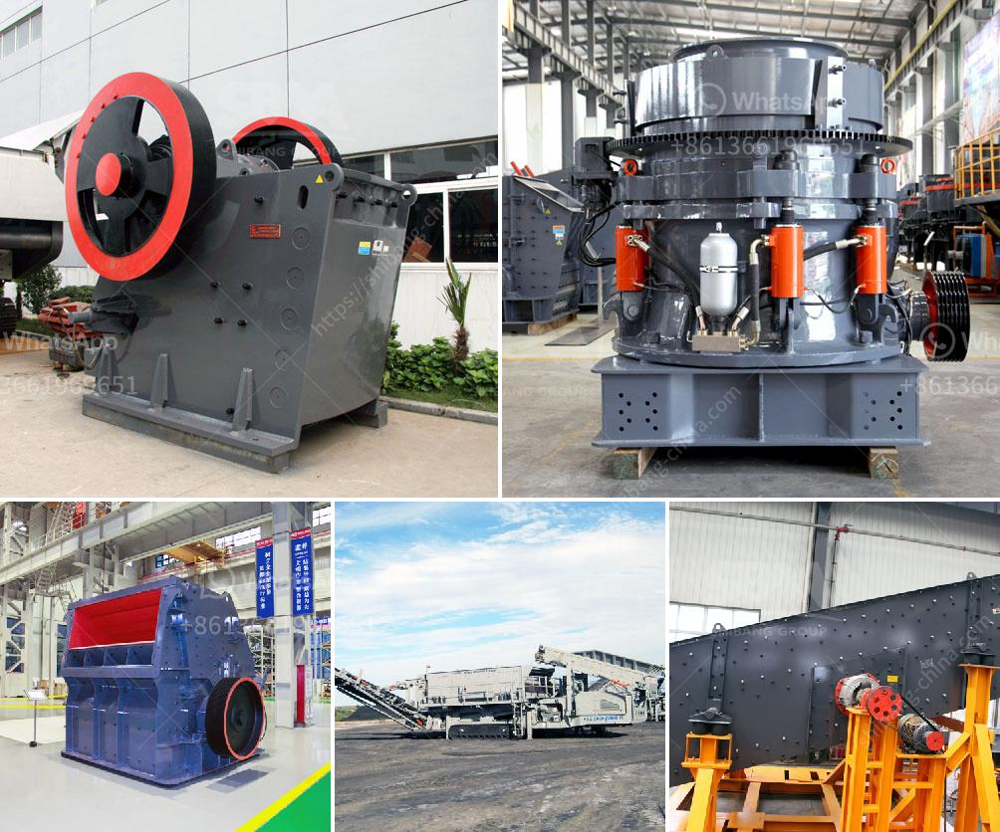

<h3>How to repair a damaged ball mill shaft?</h3>
A ball mill is a type of grinder used to grind, blend, and sometimes for mixing of materials for use in mineral dressing processes, paints, pyrotechnics, ceramics, and selective laser sintering. It works on the principle of impact and attrition: size reduction is done by impact as the balls drop from near the top of the shell. A ball mill consists of a hollow cylindrical shell rotating about its axis. The axis of the shell may be either horizontal or at a small angle to the horizontal. It is partially filled with balls. The grinding media are the balls, which may be made of steel, stainless steel, ceramic, or rubber.

A damaged ball mill shaft can lead to significant downtime and production losses. To repair a damaged ball mill shaft, you need to follow a particular process. The repair procedure is divided into several key steps:

1. Inspection: The first step is to determine the extent of the damage and identify the root cause. Inspect the shaft and the accompanying components like bearings, seals, and gears. Look for signs of wear, corrosion, pitting, or cracks. It is crucial to understand the underlying problem to implement an effective repair strategy.

2. Preparation: Before proceeding with repairs, ensure that the ball mill is completely shut down, locked out, and tagged out. This step is critical for the safety of the maintenance personnel. Once the mill is isolated, clean the damaged area to remove any contaminants or debris. Use appropriate tools and equipment for this operation.

3. Shaft alignment: Proper alignment is essential for the smooth running of the ball mill. Use precision tools to check the alignment of the shaft and correct any misalignment. This step is crucial for ensuring efficient operation and preventing further damage.

4. Welding: If the shaft is cracked or damaged, welding can be a suitable repair method. However, it is essential to ensure that the welding process is carried out by a trained and experienced welder following the appropriate welding standards. The weld must be strong enough to withstand the operating conditions of the ball mill.

5. Machining: After welding, the repaired area needs to be machined to its original dimensions. Machining removes any excess metal, smoothes the surface, and ensures the correct tolerances are maintained. Use precision measurement tools to ensure the repaired shaft meets the required specifications.

6. Balancing: To avoid vibration and premature wear of components, it is important to balance the repaired shaft. Unbalanced shafts can cause additional stress on the bearings and other rotating parts, leading to future failures. Follow the manufacturer's recommendations or consult with a balancing expert to achieve proper balance.

7. Lubrication: After the repairs are completed, ensure that all lubrication points are properly cleaned and lubricated. Use the recommended lubricants and follow the maintenance schedule provided by the manufacturer. Proper lubrication is vital for the smooth operation of the ball mill and prevents premature failures.

In conclusion, repairing a damaged ball mill shaft requires careful inspection, preparation, alignment, welding, machining, balancing, and lubrication. Implementing these repair steps correctly can help extend the service life of the ball mill and minimize costly downtime. Always ensure that the repairs are carried out by qualified personnel while adhering to industry standards and safety regulations.
<h3>Contact us</h3><ul><li><strong>Whatsapp:&nbsp;<a href="https://wa.me/8613661969651">+8613661969651</a></strong></li><li><a href="https://swt.shibang-china.com/?git&amp;zhl&amp;How to repair a damaged ball mill shaft"><strong>Online Service(chat now)</strong></a></li></ul><h3>Related</h3><ul><li><a href='How to choose a stone grinding machine ？.md'>How to choose a stone grinding machine ？</a></li><li><a href='How to eliminate jaw crusher problems during its operation.md'>How to eliminate jaw crusher problems during its operation?</a></li><li><a href='How to manufacture marble powder with a mesh size of 1000.md'>How to manufacture marble powder with a mesh size of 1000?</a></li><li><a href='How to Build a Marble Mill ？.md'>How to Build a Marble Mill ？</a></li><li><a href='How to choose a basalt crusher？.md'>How to choose a basalt crusher？</a></li></ul>