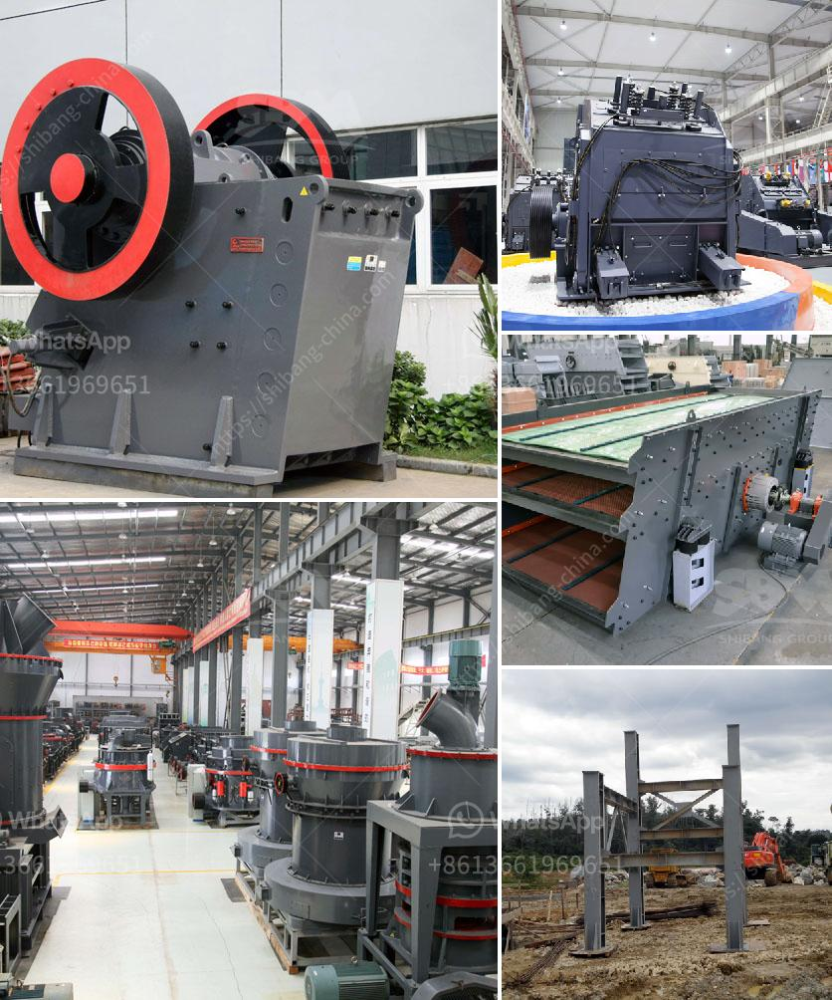

<h3>How to replace a broken bearing in a jaw crusher?</h3>
A jaw crusher is a common type of machinery used to break down materials into smaller pieces. When these machines are not functioning properly, they can cause significant downtime, frustrating both workers and management. This is especially true when the bearings in the jaw crusher are worn or damaged, leading to a decrease in productivity and efficiency. However, the process of replacing a broken bearing in a jaw crusher is not as complicated as it may seem. With the right tools and a little bit of patience, anyone can tackle this task.

The first step in replacing a broken bearing in a jaw crusher is to identify the exact location where the bearing is damaged or worn out. Once the problem area is identified, the machine can be safely shut down. It is important to note that shutting down the machine properly and avoiding any unnecessary damage is crucial in this process.

After the machine is safely shut down, the next step is to remove the old bearing. This can be done by first removing the crusher's flywheel and then removing the belt and the pulley. Care should be taken to ensure that no additional damage occurs during this step.

Once the old bearing has been removed, it is time to clean the shaft where the bearing will be installed. This can be done using a wire brush to remove any debris or dirt. After cleaning the shaft, it is important to measure the size of the new bearing to ensure that it will fit properly.

The next step is to apply a thin layer of grease to the new bearing. This will help to prevent any friction or damage during the installation process. It is important to use the correct type of grease as specified by the manufacturer.

Now, it is time to install the new bearing. This can be done by carefully sliding the bearing onto the shaft. Once the bearing is in place, it should be secured using the appropriate bearing lock nut or washer.

After the new bearing is securely installed, it is important to reassemble the crusher in the reverse order in which it was taken apart. This includes reattaching the pulley and the belt and then securing the flywheel.

Finally, the machine should be turned on to ensure that the new bearing is functioning properly. It is important to listen for any unusual noises or vibrations that may indicate further issues with the bearing or the crusher itself.

In conclusion, replacing a broken bearing in a jaw crusher is a task that can be accomplished with the right tools and a basic understanding of the process. By following these step-by-step instructions, anyone can successfully replace a broken bearing, restoring the crusher to its optimal performance and efficiency. Remember to take the necessary safety precautions and to consult with a professional if any doubts or concerns arise.
<h3>Contact us</h3><ul><li><strong>Whatsapp:&nbsp;<a href="https://wa.me/8613661969651">+8613661969651</a></strong></li><li><a href="https://swt.shibang-china.com/?git&amp;zhl&amp;How to replace a broken bearing in a jaw crusher"><strong>Online Service(chat now)</strong></a></li></ul><h3>Related</h3><ul><li><a href='How to improve the performance of a coal crusher.md'>How to improve the performance of a coal crusher?</a></li><li><a href='How to build a gravel crusher.md'>How to build a gravel crusher?</a></li><li><a href='How to Make Sand from River Pebbles ？.md'>How to Make Sand from River Pebbles ？</a></li><li><a href='How do you calculate the size reduction ratio of a crusher.md'>How do you calculate the size reduction ratio of a crusher?</a></li><li><a href='How to open a crusher plant in Fujairah.md'>How to open a crusher plant in Fujairah?</a></li></ul>