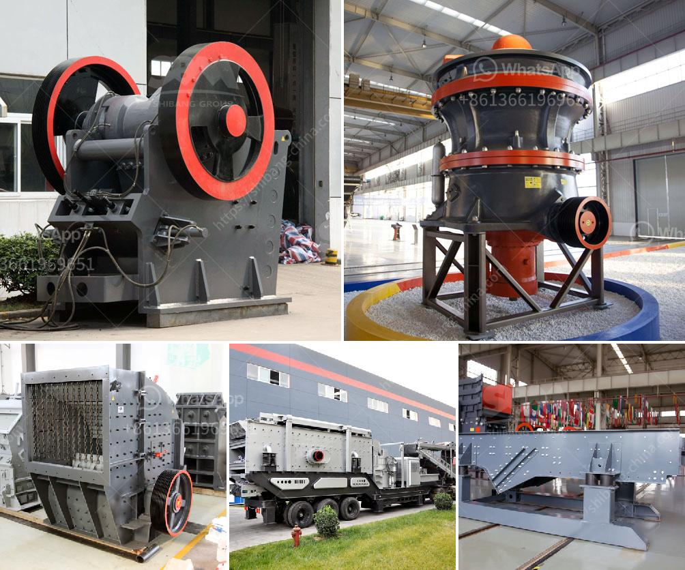

<h3>How to replace the bearing of the jaw crusher machine?</h3>
The jaw crusher machine is an essential piece of equipment in all mining and construction fields. The jaw crushers are used for crushing big rocks into small rocks or gravels for further processing. These machines have a number of advantages, such as high crushing ratio, uniform grain size, simple structure, and reliable operation. However, like any other machinery, the jaw crusher machine also requires regular maintenance and replacement of its parts, especially the bearings. If the bearings of the jaw crusher machine are not properly maintained and lubricated, it can cause a lot of trouble for the machine's operation. In this article, we will discuss how to replace the bearings of the jaw crusher machine.

Firstly, before replacing the bearings, it is crucial to turn off the power supply and stop the machine from running. This is to ensure your safety and prevent any accidents. Once the machine is stopped, you can proceed with replacing the bearings.

To start with, you need to remove the end cap of the machine. Simply unscrew the bolts or screws that secure the end cap in place. Once the end cap is removed, it will expose the bearings of the jaw crusher machine.

Next, you need to remove the jaw crusher's flywheel. The flywheel is typically held in place with a bolt or a retaining ring, depending on the make and model of the machine. Use the appropriate tools to loosen and remove the flywheel.

After removing the flywheel, you can now access the bearings. Take note of the position and orientation of the bearings before removing them. This will help you to install the new bearings correctly. Use a bearing puller or a suitable tool to remove the old bearings from their housing.

Before installing the new bearings, clean the housing thoroughly. Remove any old grease or dirt from the housing to ensure a smooth fit for the new bearings. Apply a thin layer of lubricant to the housing to help with the installation process.

Now, it is time to install the new bearings. Place the new bearings into the housing, ensuring they are properly aligned with the shaft of the jaw crusher machine. Use a suitable tool to gently tap the bearings into place. It is important not to apply excessive force, as you may damage the bearings or the machine.

Once the new bearings are installed, reassemble the flywheel and secure it in place. Make sure all bolts or retaining rings are tightened properly. Finally, replace the end cap of the machine and secure it with the bolts or screws.

After the replacement, it is important to test the jaw crusher machine to ensure it is running smoothly. Turn on the power supply and run the machine without any load for a while. Listen for any unusual noises or vibrations that may indicate incorrectly installed bearings. If everything seems fine, you can then proceed with regular operations.

In conclusion, replacing the bearings of the jaw crusher machine is a relatively straightforward process, but it requires careful preparation and attention to detail. By following the steps outlined in this article, you can ensure the longevity and optimal performance of your jaw crusher machine. Remember to always prioritize safety and consult the machine's manufacturer or a professional if you are unsure about any steps or procedures.
<h3>Contact us</h3><ul><li><strong>Whatsapp:&nbsp;<a href="https://wa.me/8613661969651">+8613661969651</a></strong></li><li><a href="https://swt.shibang-china.com/?git&amp;zhl&amp;How to replace the bearing of the jaw crusher machine"><strong>Online Service(chat now)</strong></a></li></ul><h3>Related</h3><ul><li><a href='How to choose the model of jaw crusher ？.md'>How to choose the model of jaw crusher ？</a></li><li><a href='How does a stone crusher work.md'>How does a stone crusher work?</a></li><li><a href='How to set up the stone crusher project .md'>How to set up the stone crusher project ?</a></li><li><a href='How to crush basalt rock.md'>How to crush basalt rock?</a></li><li><a href='How to Make Sand from River Pebbles ？.md'>How to Make Sand from River Pebbles ？</a></li></ul>