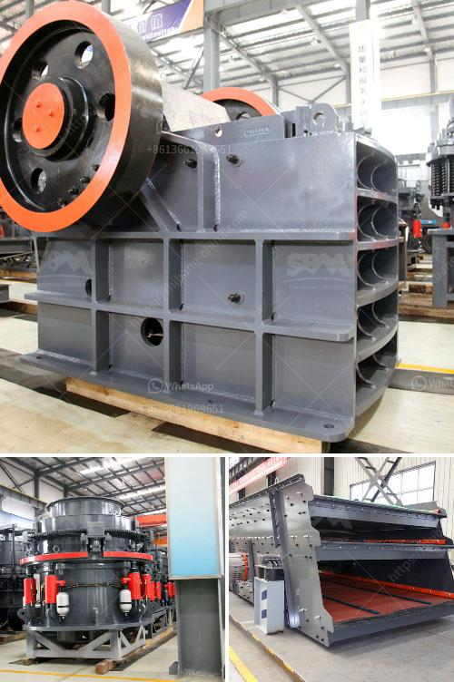

<h3>How to replace the belt on the crushing machinery ？</h3>
Crushing machinery plays a crucial role in various industries, such as mining, construction, and demolition. It helps reduce large-sized materials into smaller, more manageable pieces. One essential component of this machinery is the belt that drives the crushing mechanism. Over time, the belt may wear out or encounter damage, requiring replacement. In this article, we will discuss a step-by-step guide on how to replace the belt on the crushing machinery.

Before attempting any maintenance or repair on the crushing machinery, ensure that it is powered off and disconnected from any power source. This precaution is critical to prevent accidents and injury during the belt replacement process.

Take a close look at the machinery to identify the location of the existing belt. Familiarize yourself with the belt path, pulleys, and any tensioning mechanisms that may be present. This step aids in understanding the overall configuration and simplifies the replacement process.

In most cases, crushing machinery has a tensioning mechanism to ensure proper belt tension. Locate and release this mechanism to reduce tension on the belt. Depending on the machinery, this may involve loosening bolts, adjusting a tensioning mechanism, or releasing a spring-loaded system. Follow the manufacturer's instructions for your specific machinery.

Once the tension is released, carefully remove the old belt from the machinery. Inspect it for any signs of wear or damage. Keep in mind that depending on the design, you may need to remove other components, such as guards or covers, to access the belt properly.

Before purchasing a replacement belt, measure the old belt's length, width, and thickness accurately. These measurements are crucial in ensuring that the replacement belt matches the original specifications. Consult the machinery's manual or contact the manufacturer if uncertain about the correct belt specifications. Once you have the measurements, purchase a new belt from a reliable supplier or directly from the manufacturer.

Now that you have the replacement belt, reinstall it by following the reverse steps of removing the old belt. Start by threading the new belt around the pulleys, ensuring it follows the correct path. Next, engage the tensioning mechanism to apply appropriate tension to the belt. Again, refer to the manufacturer's instructions for the recommended tensioning technique.

After the replacement belt is installed, power on the crushing machinery and perform a few test runs. Observe the belt's movement, making sure it runs smoothly without slipping or creating excessive noise. If any issues are present, shut down the machinery and double-check the belt's alignment and tension. Make adjustments as necessary until the belt runs properly.

In conclusion, replacing the belt on crushing machinery is a crucial maintenance task to ensure optimal performance and prevent downtime. By following the above steps carefully, you can seamlessly replace the belt and keep the machinery running smoothly. Remember to prioritize safety throughout the process and consult the machinery's manual or manufacturer for specific instructions.
<h3>Contact us</h3><ul><li><strong>Whatsapp:&nbsp;<a href="https://wa.me/8613661969651">+8613661969651</a></strong></li><li><a href="https://swt.shibang-china.com/?git&amp;zhl&amp;How to replace the belt on the crushing machinery ？"><strong>Online Service(chat now)</strong></a></li></ul><h3>Related</h3><ul><li><a href='How to choose the model of jaw crusher ？.md'>How to choose the model of jaw crusher ？</a></li><li><a href='How to grind bentonite clay .md'>How to grind bentonite clay ?</a></li><li><a href='How to Start a Quarry Crushing Plant in Nigeria Need those crushing machines.md'>How to Start a Quarry Crushing Plant in Nigeria? Need those crushing machines?</a></li><li><a href='How to commission a limestone crusher first.md'>How to commission a limestone crusher first?</a></li><li><a href='How is dolomite crushed for road building etc.md'>How is dolomite crushed for road building, etc.?</a></li></ul>