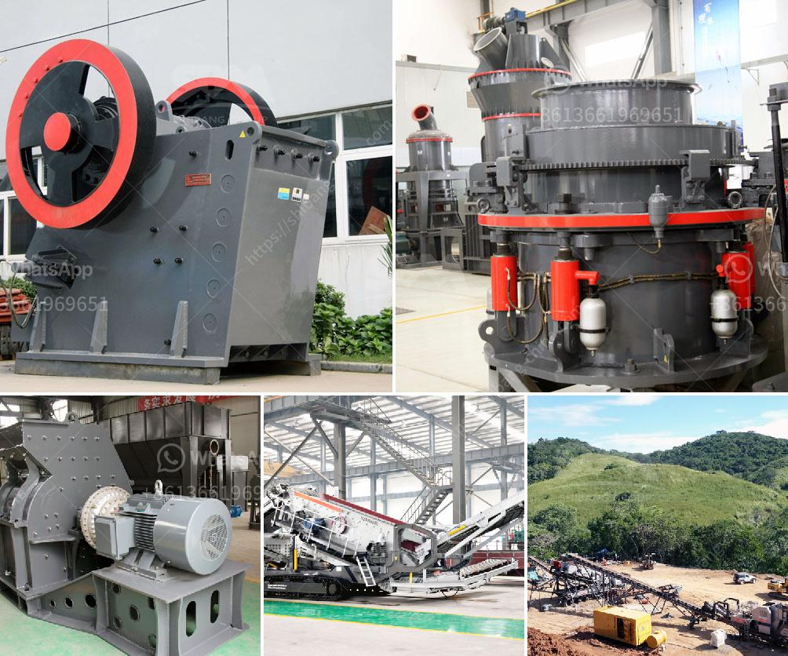

<h3>How to replace the hammer of a hammer crusher?</h3>
A hammer crusher is a type of ore crushing machine that uses high-speed rotating hammers to crush materials. The hammer is an important part of the crusher to ensure its stable operation. Replacing a hammer can be a simple and straightforward process if you follow the right steps.

Before starting, make sure to gather all the necessary tools and equipment. Clear the work area of any debris or obstructions. It is also important to wear appropriate safety gear, such as gloves and goggles, to protect yourself.

Turn off the power to the crusher and disconnect it from the power source. This will ensure your safety during the replacement process. Allow the machine to cool down before proceeding.

Inspect the old hammer for any signs of wear or damage. Once you have identified the hammer that needs replacement, use a wrench or socket to loosen the nuts or bolts securing the hammer. Carefully slide the hammer out of the crusher.

Take the new hammer and carefully slide it into the crusher. Ensure that it is properly aligned with the rotor and the other components of the crusher. Use a wrench or socket to tighten the nuts or bolts to secure the new hammer in place.

Once the new hammer is installed, reconnect the crusher to the power source. Start the crusher and run it for a few minutes to ensure that everything is working properly. Pay attention to any unusual sounds or vibrations that may indicate a problem.

To ensure the longevity and efficient operation of your hammer crusher, it is important to perform regular maintenance. This includes inspecting the hammers for wear and tear, checking for proper alignment, and lubricating the moving parts as directed by the manufacturer.

If you are unsure about any step of the process or if you encounter any difficulties, it is best to seek the help of a professional. They have the knowledge and experience to handle complex repairs and replacements, ensuring the safety and functionality of your crusher.

In conclusion, replacing the hammer of a hammer crusher can be a relatively straightforward process if you follow the right steps. Remember to always prioritize your safety by wearing the appropriate protective gear and disconnecting the power to the crusher. Regular maintenance and inspections of the hammers are crucial in extending the lifespan of your crusher. Seek professional assistance when needed to ensure a successful replacement and continued operation of your crusher.
<h3>Contact us</h3><ul><li><strong>Whatsapp:&nbsp;<a href="https://wa.me/8613661969651">+8613661969651</a></strong></li><li><a href="https://swt.shibang-china.com/?git&amp;zhl&amp;How to replace the hammer of a hammer crusher"><strong>Online Service(chat now)</strong></a></li></ul><h3>Related</h3><ul><li><a href='how to use jaw and impact crusher.md'>how to use jaw and impact crusher</a></li><li><a href='How to build a small limestone mill production line？.md'>How to build a small limestone mill production line？</a></li><li><a href='how to install a crusher in a quarry ？.md'>how to install a crusher in a quarry ？</a></li><li><a href='How to repair a damaged ball mill shaft.md'>How to repair a damaged ball mill shaft?</a></li><li><a href='How to commission a mobile cone crusher.md'>How to commission a mobile cone crusher?</a></li></ul>