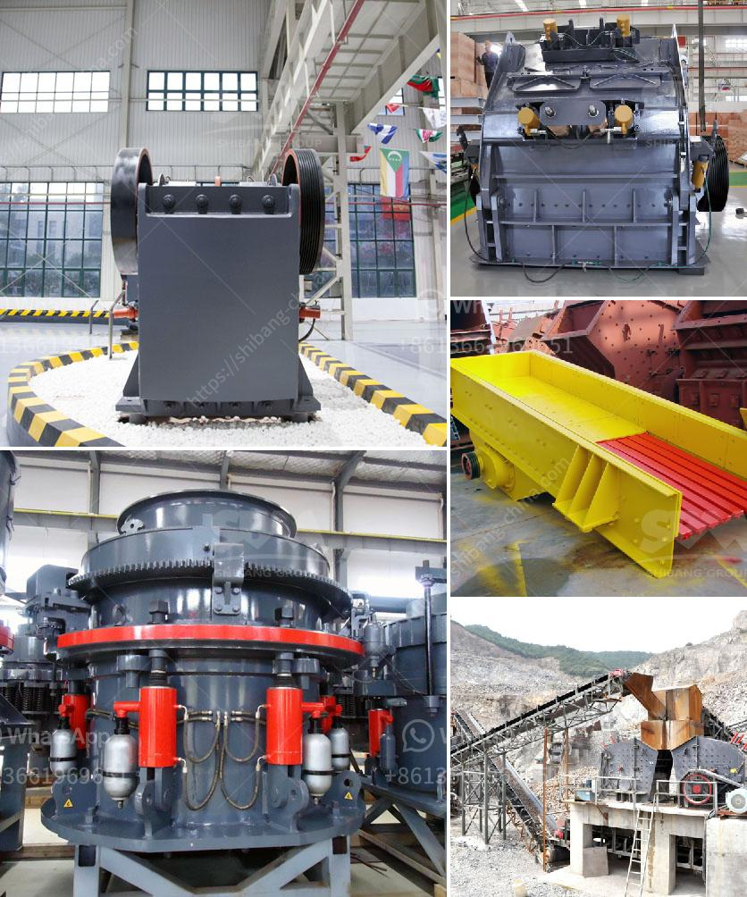

<h3>How to replace the vertical impact crusher on the production line?</h3>
A vertical impact crusher, also known as a sand making machine, is an important tool in the production line of industrial sand. It uses the principle of "stone hitting stone" to achieve the effect of imparting energy and crushing materials. Over time, due to wear and tear, the components of a vertical impact crusher may need to be replaced. Here are the steps to follow when replacing the vertical impact crusher on a production line.

Before starting the replacement process, you need to ensure you have all the necessary tools and equipment. This may include a wrench, hammer, lifting equipment, replacement parts, and adequate personal protective equipment (PPE) like gloves and goggles.

Safety is paramount when replacing any machine on the production line. Begin by shutting down the vertical impact crusher and disconnecting the power supply. This will prevent any accidental starting of the machine during the replacement process.

Thoroughly inspect the vertical impact crusher to identify the component that needs replacement. It could be the rotor, the hammer, the lining plate, or any other part that is worn out or damaged. Carefully examine each component to ensure you have identified the correct one.

Once you have identified the faulty component, use the appropriate tools to remove it. This may involve loosening screws, bolts, or any other fasteners holding the component in place. If necessary, use a hammer or a lifting equipment to aid in the removal process.

Before installing the replacement part, clean it thoroughly to remove any dirt, dust, or debris. This will help ensure a proper fit and secure attachment. If required, apply any necessary lubricants as per the manufacturer's instructions.

Carefully position the replacement part in the correct location within the vertical impact crusher. Make sure it aligns properly and securely fits into place. Use the appropriate tools to tighten any screws, bolts, or fasteners as necessary.

After installing the replacement part, carefully check the entire machine to ensure it is functioning properly. Start the machine and observe its performance to verify that the replacement has been successful. If there are any issues, double-check the installation and make necessary adjustments.

Once you are satisfied with the functionality of the vertical impact crusher, conduct a test run to ensure it operates smoothly and efficiently. If everything is working correctly, reconnect the power supply and resume production on the line.

In conclusion, replacing a vertical impact crusher on a production line involves careful preparation, inspection, and installation of the replacement component. By following these steps, you can ensure a smooth and successful replacement process, helping to maintain the productivity and efficiency of your production line.
<h3>Contact us</h3><ul><li><strong>Whatsapp:&nbsp;<a href="https://wa.me/8613661969651">+8613661969651</a></strong></li><li><a href="https://swt.shibang-china.com/?git&amp;zhl&amp;How to replace the vertical impact crusher on the production line"><strong>Online Service(chat now)</strong></a></li></ul><h3>Related</h3><ul><li><a href='How to calculate the charge volume of a ball mill.md'>How to calculate the charge volume of a ball mill?</a></li><li><a href='How to process tantalite mineral.md'>How to process tantalite mineral?</a></li><li><a href='How does the Vibrating Screen machine work？.md'>How does the Vibrating Screen machine work？</a></li><li><a href='How to replace the belt on the crushing machinery ？.md'>How to replace the belt on the crushing machinery ？</a></li><li><a href='How does a coal crusher work.md'>How does a coal crusher work?</a></li></ul>