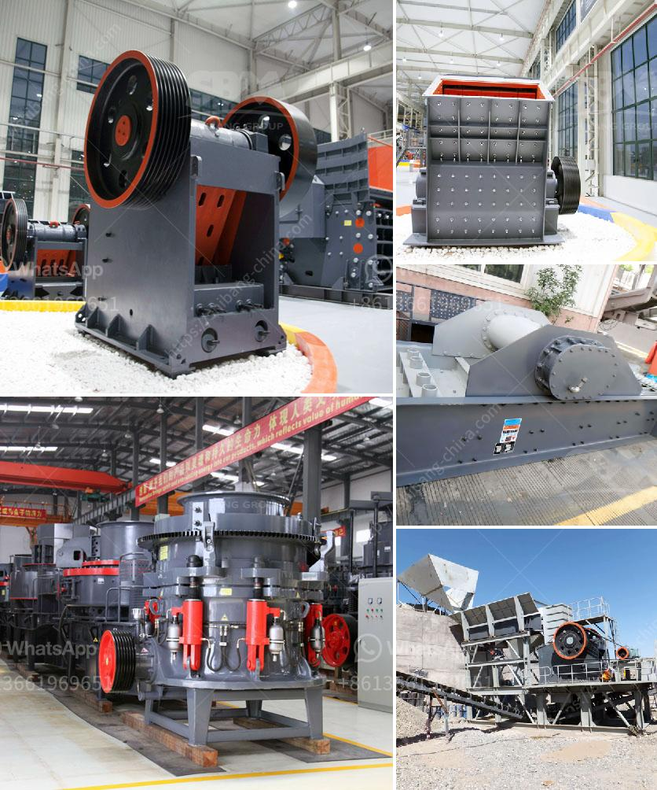

<h3>How to run a crushing plant?</h3>
Running a crushing plant efficiently and effectively is a crucial task for any construction or mining business. The process involves multiple stages and requires skillful planning to ensure the end product meets the desired specifications. This article will discuss useful tips and strategies to run a crushing plant smoothly, optimizing productivity and maximizing profits.

1. Develop a comprehensive plan: Before starting your crushing plant operations, it is crucial to prepare a detailed plan outlining various aspects such as the location, capacity, raw materials, and desired end product specifications. A well-conceived plan will help streamline operations and minimize downtime.

2. Equipment selection: Choosing the right equipment for your crushing plant is vital. It is essential to consider factors such as the hardness and type of raw materials, desired output size, and required processing capacity. Investing in high-quality equipment that matches your specific requirements will enhance efficiency and reduce maintenance costs.

3. Regular maintenance: Proper maintenance of the crushing plant is essential to ensure optimum performance and prolong the lifespan of the equipment. Create a maintenance schedule and adhere to it strictly. This includes regular inspections, lubrication, and addressing any minor issues promptly to avoid major breakdowns.

4. Efficient feeding: Proper feeding of raw materials into the crushing plant is crucial for optimal performance. Use appropriate feeding equipment such as vibrating feeders or grizzly screens to ensure a steady and consistent flow. Uneven or insufficient feeding can cause clogging and inefficiency in the crushing process.

5. Crushing chamber optimization: Adjusting the crushing chamber to match the desired output size is an essential step in running a crushing plant effectively. This can be achieved by adjusting the settings of the crusher, such as the closed side setting (CSS) or utilizing different crushing chambers for different materials. Consulting with experts or equipment manufacturers can provide valuable guidance in optimizing the crushing chamber.

6. Dust control: Dust can be a significant issue in crushing plants, and it is crucial to implement effective dust control measures. Install dust suppression systems or use water sprays in strategic locations to minimize airborne dust particles. This will create a safe and healthy working environment for the plant operators while reducing the impact on the surrounding environment.

7. Regular monitoring and optimization: Monitoring the performance of the crushing plant is essential for identifying any inefficiencies and making necessary adjustments. Use appropriate instrumentation and tracking systems to measure key performance indicators (KPIs) such as production rates, energy consumption, and product quality. Analyzing these KPIs regularly will help identify areas of improvement and optimize plant operations.

In conclusion, running a crushing plant efficiently requires careful planning, proper equipment selection, regular maintenance, and continuous optimization. By following these tips, construction and mining businesses can maximize productivity, minimize downtime, and achieve the desired quality and quantity of the end product. A well-run crushing plant not only ensures profitability but also contributes to overall operational success.
<h3>Contact us</h3><ul><li><strong>Whatsapp:&nbsp;<a href="https://wa.me/8613661969651">+8613661969651</a></strong></li><li><a href="https://swt.shibang-china.com/?git&amp;zhl&amp;How to run a crushing plant"><strong>Online Service(chat now)</strong></a></li></ul><h3>Related</h3><ul><li><a href='How much is the stone crusher plant.md'>How much is the stone crusher plant?</a></li><li><a href='How to segregate gold ore from copper ore .md'>How to segregate gold ore from copper ore ?</a></li><li><a href='how to increase production capicity of ball mill.md'>how to increase production capicity of ball mill?</a></li><li><a href='How to design an iron ore conveyor.md'>How to design an iron ore conveyor?</a></li><li><a href='How to work a roller grinding mill.md'>How to work a roller grinding mill?</a></li></ul>