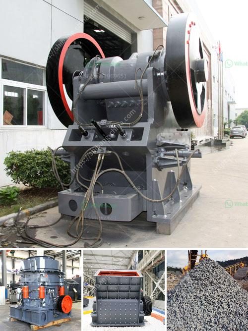

<h3>How to segregate gold ore from copper ore ?</h3>
Gold and copper are both valuable metals that have a wide range of applications in various industries. However, when it comes to extracting and processing these metals, it is essential to segregate gold ore from copper ore to maximize the efficiency and quality of the extraction process. This article will outline some of the techniques and methods to achieve this segregation.

One of the primary methods used to segregate gold ore from copper ore is flotation. Flotation is a separation process that utilizes the differences in physical and chemical properties of the ore minerals. By using various reagents, such as collectors and frothers, the mineral surfaces can be modified to enable selective attachment of certain minerals.

In the case of gold and copper ores, the flotation process entails adding specific reagents that selectively bind to the gold particles, allowing them to float to the surface as a froth while leaving behind the copper particles in the pulp. This process relies on the fact that gold is hydrophobic, meaning it repels water, while copper is hydrophilic, meaning it attracts water. Therefore, by altering the surface properties of the minerals, gold can be separated from copper.

Another method used for segregating gold ore from copper ore is gravity separation. Gravity separation relies on the difference in specific gravity between the gold and copper minerals. Gold has a much higher specific gravity compared to copper, which allows it to settle out and be separated from the lighter copper-bearing minerals.

To achieve separation through gravity, various equipment such as jigs, shaking tables, and centrifugal concentrators can be used. These devices exploit the differences in specific gravity by applying a flowing water or air stream to the ore mixture, causing the denser gold particles to settle to the bottom, while the less dense copper minerals remain in suspension.

In addition to flotation and gravity separation, other techniques such as magnetic separation and leaching can also be used to segregate gold ore from copper ore. Magnetic separation relies on the magnetic properties of the minerals to separate them, while leaching involves dissolving one component selectively from the ore mixture.

Overall, segregating gold ore from copper ore is crucial for the efficient and effective extraction of both metals. The segregation process can be achieved through various techniques such as flotation, gravity separation, magnetic separation, and leaching. Each method has its advantages and limitations, and the choice of the appropriate technique depends on factors such as the mineralogy of the ore, the desired purity of the final products, and the economics of the extraction process.

It is important to note that these segregation methods are typically not used individually but in combination with each other to achieve the desired outcome. Moreover, the segregation process often involves multiple stages and the use of different reagents and equipment to optimize the separation efficiency. Therefore, a comprehensive understanding of the ore properties and the segregation techniques is essential for successful gold and copper extraction.
<h3>Contact us</h3><ul><li><strong>Whatsapp:&nbsp;<a href="https://wa.me/8613661969651">+8613661969651</a></strong></li><li><a href="https://swt.shibang-china.com/?git&amp;zhl&amp;How to segregate gold ore from copper ore "><strong>Online Service(chat now)</strong></a></li></ul><h3>Related</h3><ul><li><a href='How to choose the right primary crusher for your plant.md'>How to choose the right primary crusher for your plant?</a></li><li><a href='How does investing in a cone crusher benefit.md'>How does investing in a cone crusher benefit?</a></li><li><a href='How to start a cone crusher.md'>How to start a cone crusher?</a></li><li><a href='How can I improve the grinding of a raw mill.md'>How can I improve the grinding of a raw mill?</a></li><li><a href='How to Adjust a Cone Crusher ？.md'>How to Adjust a Cone Crusher ？</a></li></ul>