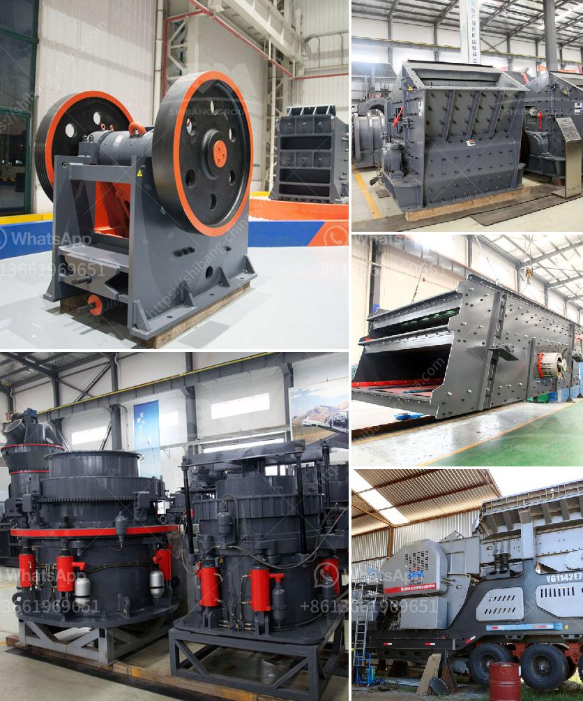

<h3>How to select a High-quality sand making machine?</h3>
Selecting a high-quality sand making machine is essential for anyone involved in the construction, mining, or industrial sectors. With the rapid development of infrastructure projects, the demand for sand and gravel continues to rise. This has led to an increase in the need for efficient and reliable sand making machines. However, with the numerous options available in the market, selecting the right one can be a daunting task. This article aims to guide you through the process of selecting a high-quality sand making machine.

Firstly, it is essential to consider the production capacity of the sand making machine. The production capacity determines the amount of sand the machine can produce in a given period. It is crucial to choose a machine that matches your production needs to ensure efficient and uninterrupted operations. Additionally, consider the maximum feeding size and output size of the machine. These specifications need to align with the requirements of your project.

Secondly, it is important to assess the durability and reliability of the sand making machine. This can be determined by examining the materials used in the construction of the machine. Look for machines constructed with high-quality materials such as steel, as they provide better resistance against wear and tear. Additionally, check the reputation of the manufacturer and read customer reviews to gauge the reliability of the machine.

Next, consider the power and energy consumption of the sand making machine. Opt for machines with low power consumption but high production efficiency. These machines will not only save energy costs but also help reduce the carbon footprint of your operations. It is recommended to choose a machine that has received energy-saving certification from relevant authorities.

Furthermore, the maintenance and after-sales service of the sand making machine should be taken into account. A good machine should be easy to maintain, with readily available spare parts. Check if the manufacturer provides after-sales service, including technical support and assistance. This will ensure that any potential issues or breakdowns can be promptly addressed, minimizing downtime and maximizing productivity.

Lastly, consider the price of the sand making machine. While it is important to stick to your budget, do not compromise on quality. A high-quality sand making machine might have a higher initial cost but will prove to be more cost-effective in the long run due to its durability and efficiency. Compare prices from different manufacturers, but also consider the reputation and quality of the machine.

In conclusion, selecting a high-quality sand making machine requires careful consideration of various factors. These include the production capacity, durability, power consumption, maintenance, and after-sales service. By conducting thorough research, reading customer reviews, and consulting experts in the field, you can make an informed decision. Remember, investing in a high-quality sand making machine will not only ensure the success of your project but also contribute to the sustainable and efficient growth of your business.
<h3>Contact us</h3><ul><li><strong>Whatsapp:&nbsp;<a href="https://wa.me/8613661969651">+8613661969651</a></strong></li><li><a href="https://swt.shibang-china.com/?git&amp;zhl&amp;How to select a Highquality sand making machine"><strong>Online Service(chat now)</strong></a></li></ul><h3>Related</h3><ul><li><a href='How to service limestone crushers.md'>How to service limestone crushers?</a></li><li><a href='How to make a coal primary jaw crusher machine.md'>How to make a coal primary jaw crusher machine?</a></li><li><a href='How to setting up of stone crusher unit in maharashtra and order there of .md'>How to setting up of stone crusher unit in maharashtra and order there of ?</a></li><li><a href='How to get a sandmaking mini machine.md'>How to get a sand-making mini machine?</a></li><li><a href='How to grind bentonite clay .md'>How to grind bentonite clay ?</a></li></ul>