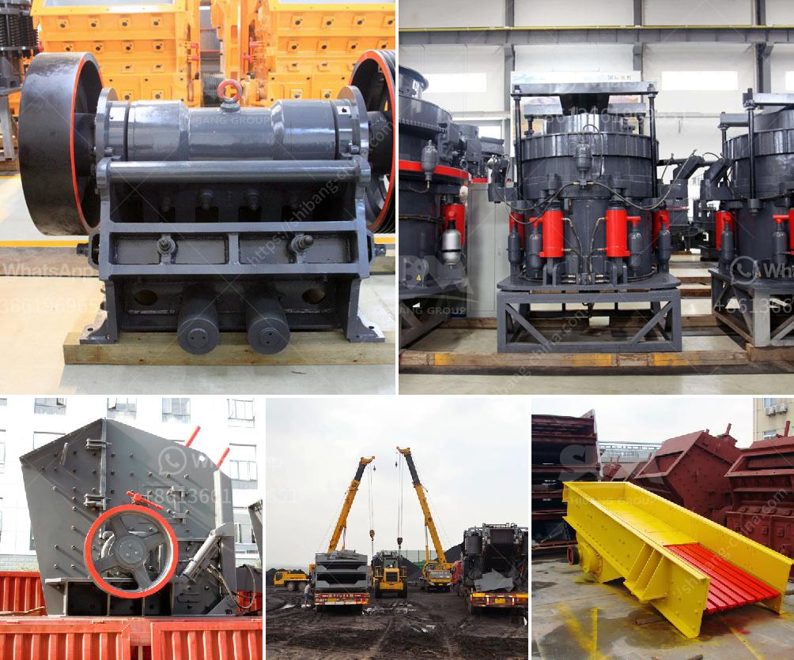

<h3>How to select a crusher to crush different minerals?</h3>
Crushing is an essential process in the mining and mineral processing industry. A crusher is a machine that breaks large rocks into smaller ones, allowing them to be processed easily. There are various types of crushers available on the market that can be used to crush different minerals. Selecting the right crusher to crush different minerals can be a difficult task. This article will guide you on how to choose the ideal crusher for your mineral processing needs.

The first step in selecting a crusher is to understand the nature of the mineral being crushed. Hardness, brittleness, and abrasiveness are key factors that determine the type of crusher required. For instance, a soft mineral like coal may not need a crushing process, while a hard mineral like granite requires multiple crushing stages.

Once you have determined the nature of the mineral, consider the required output size. Crushers are available in different sizes and configurations, each designed to produce a specific output size. If you need fine particles, a cone crusher or impact crusher may be suitable. On the other hand, if you need a coarser output, a jaw crusher or gyratory crusher might be a better option.

Another important consideration is the capacity of the crusher. The capacity refers to the maximum amount of material the crusher can process in a given time frame. It is crucial to ensure that the selected crusher can handle the expected workload without causing any downtime or inefficiency. Choosing a crusher with a higher capacity than your current needs can provide room for growth in the future.

The next factor to consider is the maintenance requirements of the crusher. A crusher is a mechanical device that undergoes wear and tear during its operation. Regular maintenance is necessary to keep it in optimal condition and prevent breakdowns. Some crushers require more frequent maintenance than others. It is essential to evaluate your maintenance capabilities and select a crusher that aligns with them.

Operating costs are another significant aspect to consider when selecting a crusher. The operating costs include energy consumption, maintenance costs, and wear parts replacement expenses. Different crushers have varying operating costs, and it is essential to compare them before making a decision. Additionally, the availability and cost of spare parts should be considered, as they can impact the overall operating costs.

Lastly, it is crucial to consider the environment in which the crusher will operate. Factors like dust control, noise levels, and safety should be evaluated to ensure compliance with regulations and minimize potential hazards. Some crushers are equipped with advanced features to address these environmental concerns, so it is worth exploring them.

In conclusion, selecting the right crusher for your mineral processing needs requires careful consideration of various factors. The nature of the mineral, required output size, capacity, maintenance requirements, operating costs, and environmental considerations must be taken into account. By thoroughly evaluating these factors, you can choose the ideal crusher that will optimize your mineral processing operations.
<h3>Contact us</h3><ul><li><strong>Whatsapp:&nbsp;<a href="https://wa.me/8613661969651">+8613661969651</a></strong></li><li><a href="https://swt.shibang-china.com/?git&amp;zhl&amp;How to select a crusher to crush different minerals"><strong>Online Service(chat now)</strong></a></li></ul><h3>Related</h3><ul><li><a href='how to increase life of shaft in jaw crusher？.md'>how to increase life of shaft in jaw crusher？</a></li><li><a href='How to manage and run a crushing plant.md'>How to manage and run a crushing plant?</a></li><li><a href='How to deal with the vicious competition in the mining industry .md'>How to deal with the vicious competition in the mining industry ?</a></li><li><a href='How can sulfur and copper be removed from iron ore.md'>How can sulfur and copper be removed from iron ore?</a></li><li><a href='How to Build a Granite Jaw Crusher in South Africa ？.md'>How to Build a Granite Jaw Crusher in South Africa ？</a></li></ul>