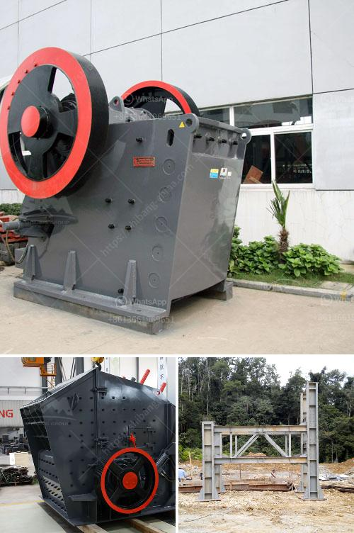

<h3>How to select a jaw crusher?</h3>
A jaw crusher is a necessary investment for your business because it performs several vital functions. Choosing the right crusher will help you extract maximum value from your materials and minimize downtime, thereby increasing profitability. However, selecting a crusher is not a straightforward process. It involves careful assessment of several factors to ensure that you make an informed decision. In this article, we will discuss the key considerations for selecting a jaw crusher.

The first step in selecting a jaw crusher is understanding the material properties that will be processed. This includes hardness, abrasiveness, moisture content, and cohesiveness. These factors influence the crusher's capacity and ability to handle different materials. For example, a crusher with high hardness capacity is suitable for processing harder materials like granite, while a crusher with high moisture content capacity is more suited for materials with high moisture content like clay.

Another important consideration is the required capacity of the jaw crusher. This is determined by the production rate and the size of the material being crushed. In general, a larger jaw crusher will have a higher capacity, but it may also require a larger investment. Therefore, it is crucial to assess the expected production requirements and select a crusher that matches those needs.

The maximum feed size that the crusher can handle is also an essential factor to consider. Ideally, the jaw crusher should be able to handle all the material that will be fed into the crusher without causing any blockages or excessive wear. It is important to choose a crusher with a large enough feed opening to accommodate the largest pieces of material that will be processed.

The maintenance and operating costs of the jaw crusher should also be taken into account. This includes the cost of spare parts, labor, and energy consumption. Opting for a crusher with good reliability and low maintenance requirements can help minimize these costs over the long term.

A reputable manufacturer is crucial when selecting a jaw crusher. Choosing a reliable brand ensures that you are investing in a high-quality and durable machine. It is advisable to do thorough research on different manufacturers, read customer reviews, and consult industry experts to determine which manufacturers have a solid reputation.

Finally, consider the after-sales service provided by the manufacturer. A reliable and responsive after-sales service is essential for any equipment purchase. You want a manufacturer that can provide timely assistance, spare parts, and technical support whenever needed.

In conclusion, selecting the right jaw crusher requires careful consideration of various factors such as material characteristics, capacity requirements, feed size, maintenance and operating costs, manufacturer reputation, and after-sales service. It is crucial to evaluate each factor thoroughly to ensure that you make an informed decision that will maximize your productivity and profitability.
<h3>Contact us</h3><ul><li><strong>Whatsapp:&nbsp;<a href="https://wa.me/8613661969651">+8613661969651</a></strong></li><li><a href="https://swt.shibang-china.com/?git&amp;zhl&amp;How to select a jaw crusher"><strong>Online Service(chat now)</strong></a></li></ul><h3>Related</h3><ul><li><a href='how to start a stone crushing business in USA .md'>how to start a stone crushing business in USA ?</a></li><li><a href='How to increase the output of jaw crusher .md'>How to increase the output of jaw crusher ?</a></li><li><a href='How to choose the suitable location of crusher in open pit mining.md'>How to choose the suitable location of crusher in open pit mining?</a></li><li><a href='How to clean copper ore with equipment .md'>How to clean copper ore with equipment ?</a></li><li><a href='How big is a 100 tph rock crushing plant.md'>How big is a 100 tph rock crushing plant</a></li></ul>