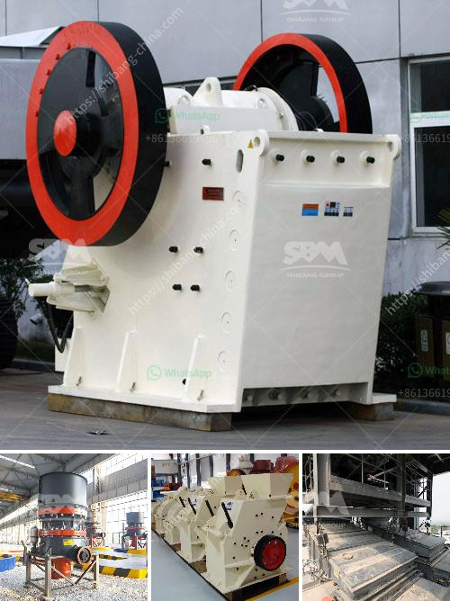

<h3>How to select a reversible hammer crusher as a coal crusher?</h3>
When choosing a reversible hammer mill crusher for coal, you will need to consider factors such as machine performance and specifications, as well as the type of coal you will be processing. Reversible hammer mill crushers offer many advantages over traditional impact crushers, in terms of performance and cost-efficiency.

Here are several key considerations to keep in mind when selecting a reversible hammer mill crusher for your coal application:

1. Capacity and throughput: It is essential to determine the mineral processing capacity required for your coal operation. Depending on the volume of coal that needs to be processed, you will need to choose a reversible hammer mill crusher with appropriate specifications and a sufficiently high capacity. Consider the typical feed rate of your coal operation and ensure the equipment you choose can handle it efficiently.

2. Feed size and product size requirements: Reversible hammer mill crushers can process coal with a maximum feed size of 70-100 mm. In general, when the product size requirement is 10mm or less, it is more suitable to use a hammer mill crusher; when the product size requirement is 30mm or less, a reversible impact crusher is more suitable.

3. Power requirements: Reversible hammer mill crushers are typically driven by electric motors. Assess the power requirements for your coal processing operation and ensure the crusher meets the necessary power ratings to accommodate your needs.

4. Wear parts and maintenance: Consider the availability and cost of wear parts for the reversible hammer mill crusher you select. Replacing wear parts is a significant expense, so it is crucial to choose a crusher with easily accessible and durable wear parts. Additionally, consider the ease of maintenance and the cost of ongoing maintenance when comparing different crusher options.

5. Safety features: Coal crusher operations can be hazardous due to the nature of coal and the potential for explosions. Look for a reversible hammer mill crusher that has adequate safety features built into its design, such as an automatic shut-off system to protect the equipment and the personnel.

6. Cost-effectiveness: Compare the initial investment cost, operational costs, and maintenance expenses of different reversible hammer mill crushers. Consider the total cost of ownership, including the efficiency and productivity gains a particular crusher can deliver. Additionally, evaluate the long-term reliability and durability of the equipment, as this contributes to its overall cost-effectiveness.

In conclusion, selecting a reversible hammer mill crusher as a coal crusher requires careful consideration of various factors. Ensure that the crusher's capacity and specifications meet your coal processing needs. Carefully assess the feed and product size requirements, power requirements, wear parts availability, maintenance, safety features, and cost-effectiveness. By considering these factors, you can choose the most suitable reversible hammer mill crusher for your coal crushing operation.
<h3>Contact us</h3><ul><li><strong>Whatsapp:&nbsp;<a href="https://wa.me/8613661969651">+8613661969651</a></strong></li><li><a href="https://swt.shibang-china.com/?git&amp;zhl&amp;How to select a reversible hammer crusher as a coal crusher"><strong>Online Service(chat now)</strong></a></li></ul><h3>Related</h3><ul><li><a href='How to operate a stone crusher.md'>How to operate a stone crusher?</a></li><li><a href='how a stone crusher operates ？.md'>how a stone crusher operates ？</a></li><li><a href='How to choose the size of jaw crusher ？.md'>How to choose the size of jaw crusher ？</a></li><li><a href='How to select crushing equipment.md'>How to select crushing equipment?</a></li><li><a href='How to get the best aggregates after crushing and screening.md'>How to get the best aggregates after crushing and screening?</a></li></ul>