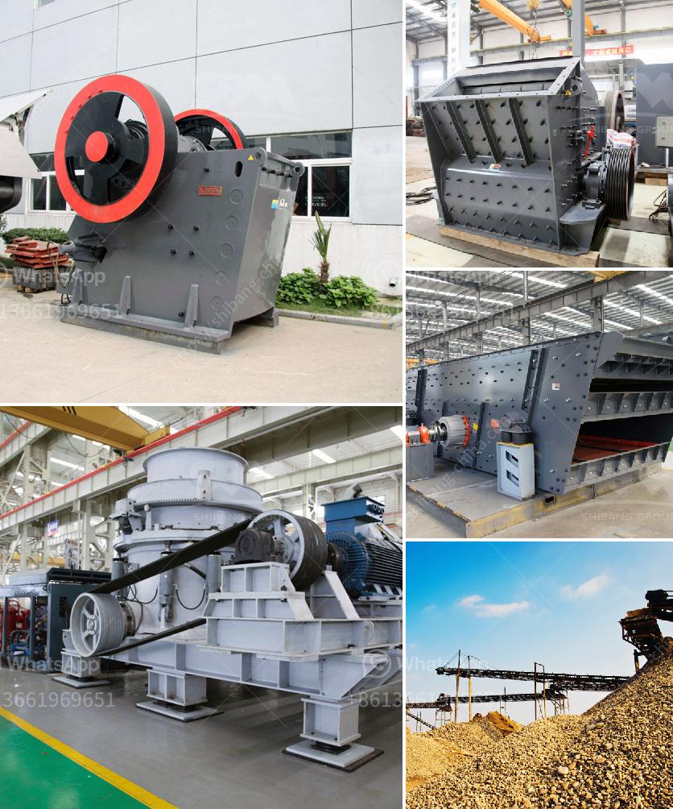

<h3>How to select a site for aggregate quarry in kenya ?</h3>
Choosing the right location for an aggregate quarry in Kenya is vital for efficient and sustainable operations. It ensures that the quarry will meet the market demand and provide a stable supply of aggregates, preventing issues like delays and interruptions. Selecting the ideal site requires careful consideration of several factors, including geological and environmental aspects, transportation infrastructure, legal considerations, and community engagement. This article will guide you through the process, outlining key steps to selecting a site for an aggregate quarry in Kenya.

The first step in selecting a site for an aggregate quarry is conducting geological surveys. Knowledge of the local geology is crucial to determine the quality and quantity of aggregates available. Geological surveys provide insights into the type, depth, and extent of rock formations, helping to estimate the potential reserves. Other factors to consider during the geological surveys include soil composition, groundwater levels, and any potential hazards that could affect quarrying operations.

Environmental considerations are equally important when selecting a quarry site. Assessing the impact of quarry operations on the surroundings is crucial to ensure compliance with environmental regulations. These assessments typically include analyzing air and water quality, identifying sensitive ecological areas, and evaluating potential impacts on the local flora and fauna. It's essential to adhere to local regulations and obtain all necessary permits before commencing operations, ensuring that the quarry operates sustainably and minimizes its environmental footprint.

Transportation infrastructure is another critical aspect to consider. Proximity to major highways, railways, and ports is advantageous for efficient transportation of aggregates to the market. Location near these transportation hubs reduces transportation costs and ensures a swift and reliable supply to customers. Additionally, accessibility to the quarry site via local roads should be taken into account to facilitate the movement of heavy machinery, materials, and finished products.

Legal considerations are paramount when selecting a quarry site in Kenya. Familiarize yourself with the legal framework for quarrying activities, including zoning regulations, land ownership, and mining licenses. Engage in consultations with relevant authorities, such as the National Environmental Management Authority (NEMA) and county governments, to ensure compliance with all legal requirements. Obtaining the necessary permits, such as an environmental impact assessment license and a mining license, is crucial to avoid any legal issues that could disrupt quarry operations.

Lastly, community engagement is key to building a successful quarry business. Engage with the local community, traditional leaders, and relevant stakeholders to address their concerns and ensure that the quarry's presence brings positive socio-economic impacts. Promote dialogue, transparency, and partnerships with the community to avoid conflicts, as a quarry can significantly impact the local community's livelihoods and environment.

Selecting an ideal site for an aggregate quarry in Kenya requires careful consideration of geological, environmental, transportation, legal, and community aspects. Conducting geological surveys, environmental assessments, and engaging with the local community are crucial steps in the decision-making process. By following these steps, operators can establish a sustainable and efficient quarry that meets market demand, contributes to local development, and maintains environmental integrity.
<h3>Contact us</h3><ul><li><strong>Whatsapp:&nbsp;<a href="https://wa.me/8613661969651">+8613661969651</a></strong></li><li><a href="https://swt.shibang-china.com/?git&amp;zhl&amp;How to select a site for aggregate quarry in kenya "><strong>Online Service(chat now)</strong></a></li></ul><h3>Related</h3><ul><li><a href='how does a stone crushing quarry work .md'>how does a stone crushing quarry work ?</a></li><li><a href='how to cal belt conveyor length for stone crusher ？.md'>how to cal belt conveyor length for stone crusher ？</a></li><li><a href='How to Build a Sand Screening Plant.md'>How to Build a Sand Screening Plant?</a></li><li><a href='how to manage a granite quarry factory .md'>how to manage a granite quarry factory ?</a></li><li><a href='How is quartz mined and processed.md'>How is quartz mined and processed?</a></li></ul>