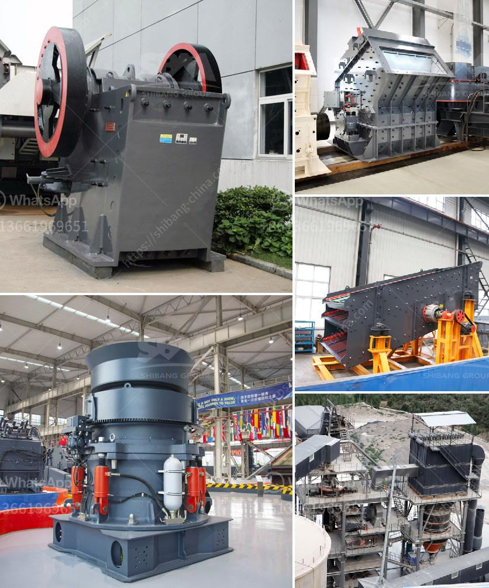

<h3>How to select a vibrating screen in Britain?</h3>
A vibrating screen is an essential piece of equipment used to separate materials efficiently and accurately in various industries. Whether you are in the mining, construction, or recycling sector, choosing the right vibrating screen is crucial to ensure optimal performance and productivity. In Britain, there are several factors to consider when selecting a vibrating screen, and this article will guide you through the process.

The first and most important aspect to consider is your specific application requirements. Determine the type of material you will be processing, its size, moisture content, and desired screening efficiency. Each vibrating screen is designed to handle different materials and conditions, so understanding your application needs is crucial in choosing the appropriate type.

There are various types of vibrating screens available in the market. The most common ones include circular, linear, and inclined screens. Circular screens are ideal for scalping or providing a high-capacity classification. Linear screens are best for screening fine particles and have high accuracy. Inclined screens offer better screening efficiency for coarse particles. Consider your application requirements when selecting the appropriate screen type.

The number of decks in a vibrating screen directly affects its performance. A single-deck screen is suitable for coarse materials, while multiple decks are ideal for fine and delicate materials. Determine the number of decks needed based on your material characteristics and desired end product specifications.

Selecting the right size and capacity of the vibrating screen is vital to ensure it can handle the required throughput. Larger screens are capable of handling higher volumes, but they may occupy more space. Consider your production needs and the available space to make an informed decision.

Vibrating screens can be driven by various mechanisms, including unbalanced motors, electromagnetic drives, or exciter drives. Each drive system has its advantages and disadvantages. Unbalanced motors provide simple and reliable operation, while electromagnetic drives offer precise control over vibration intensity. Exciter drives are versatile and suitable for various applications. Choose a drive system that suits your operational needs and budget.

The selection of appropriate screen media is crucial for efficient and effective screening. Different materials require different types of screen media, such as woven wire, rubber, or polyurethane. Consider the material characteristics, desired screening efficiency, and maintenance requirements when choosing the right screen media.

Lastly, consider the maintenance and service requirements of the vibrating screen. A well-maintained screen will ensure its longevity and reliable operation. Look for screens that are easy to access, have removable panels for cleaning, and come with reliable after-sales support.

In conclusion, selecting the right vibrating screen for your application in Britain involves thorough consideration of your specific requirements. Pay attention to factors such as screen type, deck configuration, size and capacity, drive system, screen media, and maintenance requirements. Consulting with reputable suppliers and manufacturers can also provide valuable insights and expertise. By taking these steps, you can ensure the optimal performance and longevity of your vibrating screen, ultimately maximizing productivity in your industry.
<h3>Contact us</h3><ul><li><strong>Whatsapp:&nbsp;<a href="https://wa.me/8613661969651">+8613661969651</a></strong></li><li><a href="https://swt.shibang-china.com/?git&amp;zhl&amp;How to select a vibrating screen in Britain"><strong>Online Service(chat now)</strong></a></li></ul><h3>Related</h3><ul><li><a href='How to build crushing plant foundation .md'>How to build crushing plant foundation ?</a></li><li><a href='How to Splice Crusher Belt Conveyor ？.md'>How to Splice Crusher Belt Conveyor ？</a></li><li><a href='How to choose the best mining equipment.md'>How to choose the best mining equipment?</a></li><li><a href='How to Build Your Own Rock Crusher in the Philippines ？.md'>How to Build Your Own Rock Crusher in the Philippines ？</a></li><li><a href='How to operate aggregate crushing plant.md'>How to operate aggregate crushing plant?</a></li></ul>