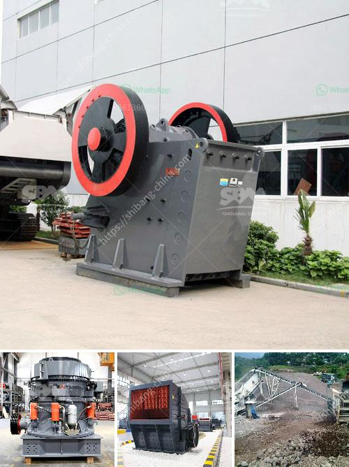

<h3>How to select ball mill?</h3>
A ball mill is a type of grinder used to grind materials into extremely fine powder for use in various industries. It is a cylindrical device with a horizontal axis, and the grinding medium is different types of steel balls. Ball mills are widely used in cement, silicate products, new building materials, refractory materials, fertilizers, black and non-ferrous metal dressings, and glass ceramics. With the continuous development of new materials and technologies, the demand for ball mills is increasing, and there are various types of ball mills on the market. Therefore, it is important to select the appropriate ball mill to ensure efficient and safe operation. Here are some factors to consider when selecting a ball mill.

1. Material properties: It is essential to consider the physical and chemical properties of the material to be ground. Is it abrasive or not? Is it brittle or tough? The material's hardness, moisture content, and temperature sensitivity also play a significant role in determining the type of ball mill suitable for the application.

2. Production capacity: The required production capacity is an important factor to consider when selecting a ball mill. It is essential to determine the desired throughput in terms of tons per hour or kilograms per hour. Different ball mills have different capacities, and selecting a ball mill with the appropriate capacity ensures that the grinding process can keep up with production demands.

3. Grinding medium: The type and size of the grinding medium used in the ball mill affect the grinding efficiency and final product quality. Grinding media can be made of steel balls, ceramic balls, or natural stones. The size and composition of the grinding media should be selected based on the material being ground and the desired particle size of the final product.

4. Operating conditions: The operating conditions, including the rotational speed of the mill, temperature, and humidity, should be taken into account when selecting a ball mill. Different materials have different optimal operating conditions to achieve the desired grinding results. Factors such as the required fineness, the presence of corrosive or explosive gases, and the need for cooling or heat dissipation should be considered.

5. Equipment cost and maintenance: The cost of the ball mill and its maintenance requirements are crucial factors to consider. A high-quality but costly ball mill may be more cost-effective in the long run due to its durability and low maintenance requirements. On the other hand, a cheaper or less durable ball mill may require frequent repairs and replacements, leading to higher overall costs.

In conclusion, selecting the right ball mill is essential for efficient and safe grinding operations. Factors such as material properties, production capacity, grinding medium, operating conditions, and equipment costs should be carefully considered. By selecting the appropriate ball mill, one can ensure optimal grinding performance and achieve the desired final product quality.
<h3>Contact us</h3><ul><li><strong>Whatsapp:&nbsp;<a href="https://wa.me/8613661969651">+8613661969651</a></strong></li><li><a href="https://swt.shibang-china.com/?git&amp;zhl&amp;How to select ball mill"><strong>Online Service(chat now)</strong></a></li></ul><h3>Related</h3><ul><li><a href='how to build a vibrating screen separators .md'>how to build a vibrating screen separators ?</a></li><li><a href='How to invest in crushing machines？.md'>How to invest in crushing machines？</a></li><li><a href='How to Design a Copper Processing Plant.md'>How to Design a Copper Processing Plant?</a></li><li><a href='How to select a site for aggregate quarry in kenya .md'>How to select a site for aggregate quarry in kenya ?</a></li><li><a href='How to Build a Granite Jaw Crusher in South Africa ？.md'>How to Build a Granite Jaw Crusher in South Africa ？</a></li></ul>