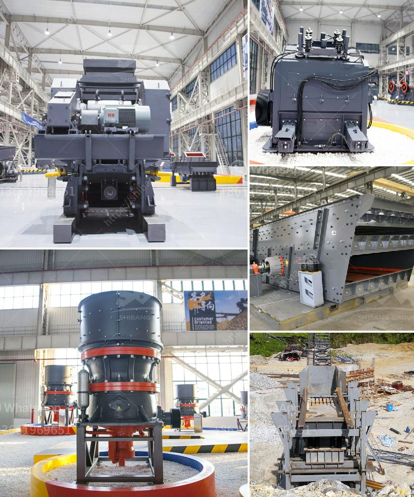

<h3>How to select cone crusher parts?</h3>
Cone crushers are used in various industries to crush different types of materials, ranging from hard rocks to soft minerals. The robustness and reliability of these machines make them suitable for use in different environments, making them highly sought after in the mining, construction, and aggregate industries. However, like any machine, cone crushers require regular maintenance and replacement of worn-out parts to ensure their optimal performance. In this article, we will discuss how to select the right cone crusher parts for your specific needs.

1. Identify the type of cone crusher: Before selecting cone crusher parts, it is essential to determine the type of cone crusher being used. Different cone crushers have different designs, which require specific parts to function properly. Therefore, understanding the model and specifications of the cone crusher is crucial in selecting compatible parts.

2. Consider the crushing application: Different crushing applications require specific capabilities from the cone crusher. For example, a secondary cone crusher used for crushing abrasive and hard materials may require parts with high resistant properties to withstand the wear and tear. On the other hand, a tertiary cone crusher used for producing fine aggregates may need parts with precision and accuracy to ensure optimal particle shape. Hence, it is important to consider the crushing application to choose the appropriate parts.

3. Evaluate the operating conditions: Cone crushers operate in various environments, including high-temperature environments, dusty conditions, or wet environments. These different conditions may impact the performance and lifespan of the cone crusher parts. Therefore, it is important to assess the operating conditions and choose parts that can withstand such environments. For instance, cone crusher parts used in high-temperature environments may require materials with higher heat resistance, while parts used in dusty environments might need additional protection against dust infiltration.

4. Quality and durability: It is crucial to select cone crusher parts that are of high quality and durability. Inferior quality parts may compromise the overall performance of the cone crusher and lead to frequent breakdowns and increased maintenance costs. Look for reputable suppliers that offer parts made from high-grade materials, backed by certifications and warranties. Additionally, consider the design and manufacturing process of the parts to ensure they meet your expectations for longevity and reliability.

5. Consult industry experts: If you are unsure about which cone crusher parts to select, it is always recommended to consult experts in the field. Experienced professionals can provide valuable insights and recommendations based on their in-depth knowledge of cone crushers. Whether it is the original equipment manufacturer (OEM) or a reliable aftermarket supplier, their expertise can help you make informed decisions and find the right parts for your cone crusher.

In summary, selecting the right cone crusher parts involves considering the type of cone crusher, the crushing application, operating conditions, and the quality and durability of the parts. By undertaking a thorough assessment and seeking expert advice, you can ensure the optimal performance and reliability of your cone crusher.
<h3>Contact us</h3><ul><li><strong>Whatsapp:&nbsp;<a href="https://wa.me/8613661969651">+8613661969651</a></strong></li><li><a href="https://swt.shibang-china.com/?git&amp;zhl&amp;How to select cone crusher parts"><strong>Online Service(chat now)</strong></a></li></ul><h3>Related</h3><ul><li><a href='How to disassemble a cone crusher.md'>How to disassemble a cone crusher?</a></li><li><a href='How to judge how much power the jaw crusher needs？.md'>How to judge how much power the jaw crusher needs？</a></li><li><a href='How to build a granite crushing plant？.md'>How to build a granite crushing plant？</a></li><li><a href='How does a stone crusher work？.md'>How does a stone crusher work？</a></li><li><a href='How to install a conveyor belt for the coal mill.md'>How to install a conveyor belt for the coal mill?</a></li></ul>