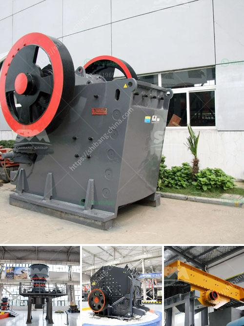

<h3>How to select crushing equipment?</h3>
Selecting the proper crushing equipment is crucial to ensure efficient and economical operations in various industries such as mining, construction, recycling, and agriculture. The right equipment not only affects the processing capacity but also influences the product size, shape, and quality. With numerous options available in the market, it is essential to consider several factors before making a decision. In this article, we will discuss the key aspects to focus on when selecting crushing equipment.

The first step in selecting the right crushing equipment is to analyze the type of material you need to process. Different materials have varying characteristics and require specific equipment to achieve the desired results. For example, hard rock mining operations require crushers with high horsepower and strong impact resistance, while soft materials like coal or limestone may be better suited for compression crushers.

Consider the anticipated capacity requirements of your operations. This will help you determine the equipment size and configuration necessary to achieve optimal performance. It is crucial to choose a crusher that can handle the maximum throughput required without causing excessive wear or downtime.

Define the specific product size and shape requirements that need to be achieved. Different crushers have different abilities to produce the desired output. Cone crushers are typically used for producing cubical-shaped products, whereas impact crushers are more suitable for products with irregular shapes. Evaluate the product specifications in relation to market demands and ensure the selected equipment can meet those standards.

Crushing equipment can significantly contribute to operational expenses, including fuel, maintenance, and labor. Consider the energy consumption and operating costs associated with different types of crushers. Opt for equipment that offers a good balance between capital investment and long-term operational expenses. Additionally, equipment that can be easily maintained and repaired will save both time and money.

If your operations require frequent relocation, consider portable crushing equipment. Mobile crushers not only offer the advantage of easy transportation but also provide flexibility to tackle various jobsites. They are particularly useful in construction and demolition projects where material needs to be crushed on-site.

As sustainability becomes an increasingly important aspect of various industries, it is essential to consider the environmental impact of the crushing equipment. Look for crushers with advanced dust suppression systems to minimize airborne particles and reduce pollution. Additionally, opt for equipment that operates on clean energy, such as electric-powered crushers, to reduce carbon emissions.

Investing in durable and reliable crushing equipment is key to minimizing downtime and maximizing productivity. Research the reputation and track record of equipment manufacturers and choose a trusted supplier. Select equipment made from high-quality materials that can withstand the rigors of the application and provide a long lifespan.

In conclusion, selecting the right crushing equipment is a critical step in ensuring efficient and cost-effective operations. Analyze the material type, capacity requirements, product specifications, operational costs, mobility, environmental impact, and equipment reliability before making a decision. By considering these factors, you can find the perfect crushing equipment that meets your specific needs and enhances your overall operational efficiency.
<h3>Contact us</h3><ul><li><strong>Whatsapp:&nbsp;<a href="https://wa.me/8613661969651">+8613661969651</a></strong></li><li><a href="https://swt.shibang-china.com/?git&amp;zhl&amp;How to select crushing equipment"><strong>Online Service(chat now)</strong></a></li></ul><h3>Related</h3><ul><li><a href='How to choose a vibration motor.md'>How to choose a vibration motor?</a></li><li><a href='How to make boulders into gravel.md'>How to make boulders into gravel</a></li><li><a href='How to clean manganese ore .md'>How to clean manganese ore ?</a></li><li><a href='How to increase productivity in ball mill.md'>How to increase productivity in ball mill?</a></li><li><a href='How to adjust impact crusher 7 key steps.md'>How to adjust impact crusher? 7 key steps</a></li></ul>