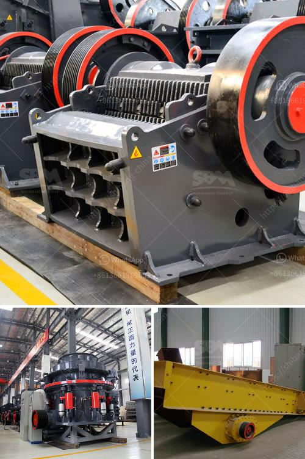

<h3>How to separate coal from iron ore ?</h3>
Coal and iron ore are two essential materials that are widely used in various industries. While coal is primarily used for power generation and fueling steel production, iron ore is used for the production of steel and various other products. In many cases, these two materials are found together in natural deposits, making it necessary to separate them before their specific usage. Here are some methods commonly used to separate coal from iron ore.

Magnetic separation is a widely used method for separating minerals based on their magnetic properties. This technique relies on the difference in magnetic susceptibility between the coal and the iron ore. By applying a magnetic field, the iron ore particles can be attracted to the magnetic drum or belt, while the coal particles pass by unaffected. This allows for effective separation of the two materials.

Dense media separation is another commonly used method for separating coal from iron ore. It relies on the difference in density between the two materials. In this process, a suspension of fine magnetite or ferrosilicon powder is used as a medium. The coal particles float on the suspension, while the iron ore particles sink. The separated materials can then be collected and processed further.

Froth flotation is a method commonly used for separating minerals. In this process, chemicals, known as collectors, are added to water to create a froth. The coal particles attach to the air bubbles in the froth and rise to the surface, while the iron ore particles sink. This allows for effective separation of the two materials.

Gravity separation is a method that relies on the difference in density between the coal and the iron ore. In this process, the material is fed onto a vibrating table or inclined plane, and water is used as a medium. The coal particles, being lighter, are carried to the top, while the iron ore particles sink. The separated materials can then be collected and processed further.

Electrostatic separation is a method that utilizes the difference in electrical conductivity between the coal and the iron ore. In this process, the material is charged by passing it through a high-voltage field or by using appropriate electrodes. The charged coal particles are attracted to oppositely charged electrodes or surfaces, while the iron ore particles are unaffected. This allows for effective separation of the two materials.

In conclusion, coal and iron ore are two essential materials that are often found together in natural deposits. However, their specific usage requires them to be separated. Magnetic separation, dense media separation, froth flotation, gravity separation, and electrostatic separation are some commonly used methods for separating coal from iron ore. Each method utilizes different principles to achieve effective separation. The choice of method depends on various factors such as the characteristics of the materials and the desired outcome. By employing these methods, the coal and iron ore can be efficiently separated, leading to their optimal utilization in various industries.
<h3>Contact us</h3><ul><li><strong>Whatsapp:&nbsp;<a href="https://wa.me/8613661969651">+8613661969651</a></strong></li><li><a href="https://swt.shibang-china.com/?git&amp;zhl&amp;How to separate coal from iron ore "><strong>Online Service(chat now)</strong></a></li></ul><h3>Related</h3><ul><li><a href='how does a grinding cement mill work？.md'>how does a grinding cement mill work？</a></li><li><a href='How to crush feldspar with impact crusher ？.md'>How to crush feldspar with impact crusher ？</a></li><li><a href='How to build your own shaker wash plant.md'>How to build your own shaker wash plant?</a></li><li><a href='How to manage a quarry plant 10 suggestions.md'>How to manage a quarry plant? 10 suggestions</a></li><li><a href='How is the cone crusher working.md'>How is the cone crusher working?</a></li></ul>