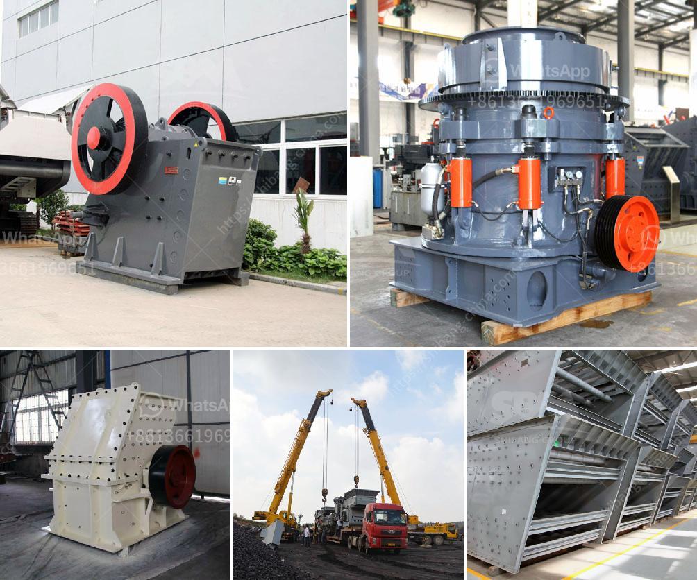

<h3>How to separate gold from chalcopyrite?</h3>
Chalcopyrite is a copper iron sulfide mineral that often contains traces of gold. It is one of the major sources of copper in the world, making it a valuable mineral for extraction. However, extracting gold from chalcopyrite is not an easy task. The process requires specific knowledge and techniques to separate the gold from the chalcopyrite effectively. In this article, we will explore some methods used to separate gold from chalcopyrite.

One common method used to separate gold from chalcopyrite is through a process called flotation. Flotation relies on the different surface properties of the minerals present in the ore. In this process, the chalcopyrite ore is finely ground, mixed with water, and chemicals (collectors and frothers) are added. The mixture is then agitated, and air is blown through it, causing the chalcopyrite particles to float while the heavier gold particles sink. The chalcopyrite concentrate can be further processed to extract the gold.

Another method to separate gold from chalcopyrite is through roasting and magnetic separation. In this process, the chalcopyrite ore is heated in the presence of air or oxygen to convert the sulfide mineral into copper oxide. This converts the chalcopyrite into a more easily separable form. After roasting, the ore is subjected to magnetic separation, where a magnetic field is applied to separate the magnetic particles (gold) from the non-magnetic particles (copper oxide). This method is effective in separating gold from chalcopyrite and is commonly used in industrial processes.

Leaching is a method that uses chemicals to extract gold from ores. The chalcopyrite ore is finely ground and then treated with a leaching agent, such as cyanide or acid. These chemicals dissolve the gold from the ore, leaving behind the copper and other impurities. The gold-containing solution is then further processed to recover the gold.

Electrowinning is a widely used method for separating gold from chalcopyrite. The chalcopyrite ore is first processed through crushing and grinding to reduce the size of the particles. Then, the ore is mixed with water and an electrolyte solution. The mixture is then passed through an electrified circuit, where gold particles are attracted to the cathode (negative electrode) and deposited there. This method allows for a high recovery rate of gold from chalcopyrite.

In conclusion, extracting gold from chalcopyrite requires specific methods and techniques due to its complex nature. Flotation, roasting and magnetic separation, leaching, and electrowinning are some of the commonly used methods for separating gold from chalcopyrite. Each method has its advantages and limitations, and the selection of the appropriate method depends on the specific characteristics of the ore and the desired outcome. With careful planning and execution, it is possible to separate gold from chalcopyrite effectively and efficiently.
<h3>Contact us</h3><ul><li><strong>Whatsapp:&nbsp;<a href="https://wa.me/8613661969651">+8613661969651</a></strong></li><li><a href="https://swt.shibang-china.com/?git&amp;zhl&amp;How to separate gold from chalcopyrite"><strong>Online Service(chat now)</strong></a></li></ul><h3>Related</h3><ul><li><a href='How to Configure Crusher Indonesia ？.md'>How to Configure Crusher Indonesia ？</a></li><li><a href='how to manage a granite quarry factory .md'>how to manage a granite quarry factory ?</a></li><li><a href='How do we crush cobaltite.md'>How do we crush cobaltite?</a></li><li><a href='How to choose crusher manufacturer.md'>How to choose crusher manufacturer?</a></li><li><a href='How much does calcite mineral processing equipment cost.md'>How much does calcite mineral processing equipment cost?</a></li></ul>