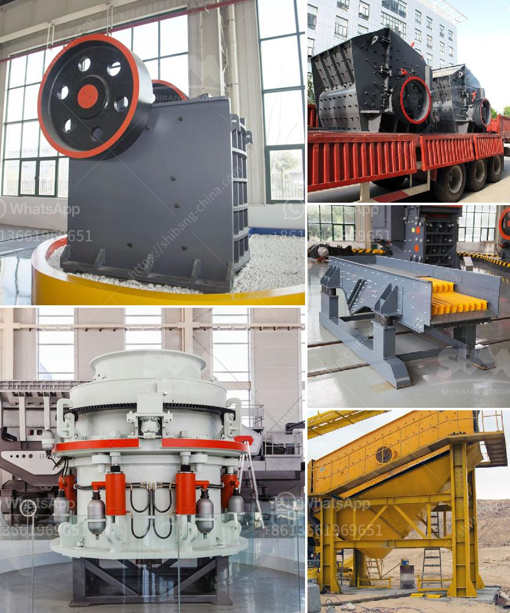

<h3>How to separate gold from sand with machine ?</h3>
Gold is a valuable and highly sought-after precious metal that is often used for various purposes, including jewelry, electronics, and even in medical treatments. However, extracting gold from sand can be a daunting task, especially when there is a significant amount of it.

One of the most commonly used methods to separate gold from sand is by gravity separation. In this process, the gold ore is placed on a slant and filtered with water. The lighter sand particles are washed away while the heavier gold particles remain.

While simple in theory, the process of separating gold from sand can be tedious and time-consuming. However, with the help of modern technology and machinery, this process has become much more efficient and straightforward.

One of the most popular machines used for this task is a gold separation machine. These machines come in various types and sizes, but all serve the same purpose of separating gold from sand and other unwanted particles.

One popular method used by these machines is the shaking table. The shaking table creates a fluidized bed of particles, where the heavy gold particles settle to the bottom due to gravity, while the lighter sand particles are carried away by water. This method is effective in separating fine gold particles from sand, as it utilizes the principle of differential settlement.

Another machine commonly used for gold separation is the sluice box. A sluice box is a long and narrow channel with riffles or grooves along the bottom. When water is passed through the channel, the gold particles settle at the bottom of the channel due to their high density, while the lighter sand particles are washed away. This method is ideal for extracting large quantities of gold from sand quickly.

There are also more advanced machines available, such as the gold centrifuge. A gold centrifuge uses centrifugal force to separate gold particles from sand. The machine spins at a high speed, forcing the heavier gold particles to the outer edge of the centrifuge, while the lighter sand particles are expelled through a separate outlet. This method is highly efficient and can separate even the smallest gold particles from sand.

Before using any of these machines, it is important to ensure that the sand has been properly filtered and cleansed of any impurities. Additionally, wearing appropriate safety equipment is crucial, as dealing with machinery and chemicals can be hazardous.

In conclusion, separating gold from sand is a process that requires both skill and the use of specialized machinery. However, with the advancements in technology, this process has become much simpler and more efficient. Whether using a shaking table, sluice box, or centrifuge, these machines allow for the extraction of gold from sand, enabling individuals to reap the benefits of this precious metal.
<h3>Contact us</h3><ul><li><strong>Whatsapp:&nbsp;<a href="https://wa.me/8613661969651">+8613661969651</a></strong></li><li><a href="https://swt.shibang-china.com/?git&amp;zhl&amp;How to separate gold from sand with machine "><strong>Online Service(chat now)</strong></a></li></ul><h3>Related</h3><ul><li><a href='How does a work of impact crusher.md'>How does a work of impact crusher?</a></li><li><a href='How To Build A Top Quarry In Nigeria.md'>How To Build A Top Quarry In Nigeria?</a></li><li><a href='How to adjust impact crusher 7 key steps.md'>How to adjust impact crusher? 7 key steps</a></li><li><a href='How does a Raymond mill work.md'>How does a Raymond mill work?</a></li><li><a href='How to improve the crushing capacity of ball mill.md'>How to improve the crushing capacity of ball mill?</a></li></ul>