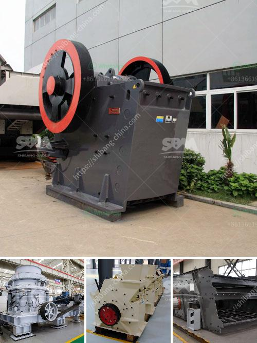

<h3>How to separate iron from manganese?</h3>
Iron and manganese are two essential elements that have numerous industrial applications. However, there are instances where it becomes necessary to separate these elements from one another. This separation process is particularly important in industries like steel production, where the presence of manganese can adversely affect the quality of the final product. In this article, we will explore methods to separate iron from manganese effectively.

One common method to separate iron from manganese is through magnetic separation. This method utilizes magnetic properties of both iron and manganese to separate them. However, it is not a suitable method for all types of iron and manganese ores. The separation process involves using a magnetic drum or separator to remove iron-bearing particles, thereby leaving the manganese ore alone. It is worth noting that this process can only successfully separate certain types of manganese ores, such as ferromanganese, ferruginous manganese, and pyrolusite.

Another method to separate iron from manganese is through precipitation. This method is particularly useful when dealing with manganese ores that contain high levels of iron impurities. The process involves adding a chemical reagent, such as ammonium sulfite or sodium sulfite, to the manganese solution. This addition causes the iron to precipitate as iron hydroxide while leaving the manganese solution unaffected. The precipitated iron hydroxide can then be easily separated from the solution through filtration or sedimentation.

In some cases, manganese can be separated from iron through a smelting process. Smelting involves the use of heat and a reducing agent to separate elements from their compounds. The manganese ore is first mixed with a reducing agent, such as carbon, and then heated in a furnace. The reducing agent reacts with the oxygen in the manganese oxide, causing it to form carbon dioxide and leaving behind pure manganese. This method requires careful temperature control and is more commonly used on an industrial scale rather than in small-scale applications.

In addition to the methods mentioned above, solvent extraction can be used to separate iron from manganese. Solvent extraction utilizes two immiscible solvents (usually an organic solvent and an aqueous solution) to selectively transfer one or more solutes from one phase to another. This method can effectively separate iron and manganese based on their different solubilities in different solvents. However, the success of this method depends on the specific properties of the solvents and the solute.

In conclusion, there are several methods available to separate iron from manganese, each with its own advantages and limitations. These methods include magnetic separation, precipitation, smelting, and solvent extraction. The choice of method depends on factors such as the type of manganese ore, the presence of impurities, and the desired purity of the separated elements. Industries that rely on the separation of iron and manganese should carefully evaluate the different methods to determine the most suitable approach for their specific situation.
<h3>Contact us</h3><ul><li><strong>Whatsapp:&nbsp;<a href="https://wa.me/8613661969651">+8613661969651</a></strong></li><li><a href="https://swt.shibang-china.com/?git&amp;zhl&amp;How to separate iron from manganese"><strong>Online Service(chat now)</strong></a></li></ul><h3>Related</h3><ul><li><a href='How to separate gold from sand with machine .md'>How to separate gold from sand with machine ?</a></li><li><a href='How to crush concrete for recycling .md'>How to crush concrete for recycling ?</a></li><li><a href='How to disassemble a cone crusher.md'>How to disassemble a cone crusher?</a></li><li><a href='How to install a stone crusher plant.md'>How to install a stone crusher plant?</a></li><li><a href='How to buy a stone crusher machine in Africa.md'>How to buy a stone crusher machine in Africa</a></li></ul>