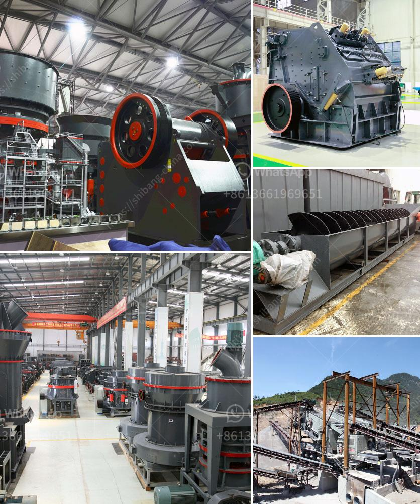

<h3>How to separate the gold from the powdered sand ?</h3>
Gold is a precious metal highly sought after for its rarity and beauty. Often found in riverbeds and streams, gold can be extracted from the surrounding sand particles through various methods. While panning and sluicing are traditional methods, separating gold from powdered sand can be a complex and meticulous process. This article will guide you through some effective techniques to separate gold from powdered sand.

First and foremost, it is crucial to understand the properties of gold and sand to devise an efficient separation strategy. Gold is an extremely dense metal, with a specific gravity of 19.3, which means it is 19.3 times as heavy as an equal volume of water. Sand, on the other hand, has a significantly lower specific gravity of around 2.65. By exploiting this difference in density, we can employ gravity-based techniques to separate the gold from powdered sand.

One of the simplest methods to separate gold from powdered sand is through panning. Panning is a gold mining technique that involves swirling water and sediment in a pan to separate gold particles. To begin, fill a pan with sand and water and shake it to create a slurry. Swirl the pan in a circular motion, allowing the sand to separate from the heavier gold particles. As you continue swirling, the gold particles should settle at the bottom of the pan, while lighter sand particles and water are gradually washed out. Carefully pour the water out of the pan, leaving only the gold particles behind. Repeat this process multiple times until you are left with only gold particles.

Sluicing is another method that can be utilized to separate gold from powdered sand. A sluice box is a trough-like structure that allows water and sand to flow through, while trapping heavier gold particles. Similar to panning, the sluice box takes advantage of the density differences between gold and sand. To use this method, build a sluice box by arranging tapered wooden planks together, leaving spaces for water and sand to flow. Place the powdered sand at the top of the sluice box and pour water over it while continuously agitating it. The water will wash out lighter sand particles, while heavier gold particles will settle at the bottom of the sluice box. Periodically remove the captured gold particles, and repeat the process until most of the gold is separated.

For more efficient separation, you can employ more advanced techniques such as electrostatic separation or spiral concentrators. Electrostatic separation utilizes the different electrical properties of gold and sand particles to separate them. By charging the particles, they can be attracted or repelled by electrostatic forces, allowing for their separation. Spiral concentrators, on the other hand, use centrifugal force to separate particles based on their density. These machines spin rapidly, causing heavier gold particles to be forced towards the outer edge of the spiral while lighter sand particles are carried towards the center. This process allows for quick and efficient separation of gold from powdered sand.

In conclusion, separating gold from powdered sand can be accomplished through various techniques. While panning and sluicing are traditional methods, electrostatic separation and spiral concentrators offer more efficiency. Remember to always research and understand the properties of gold and sand before attempting any separation method. By utilizing these techniques, you can successfully extract gold from powdered sand and unlock its value.
<h3>Contact us</h3><ul><li><strong>Whatsapp:&nbsp;<a href="https://wa.me/8613661969651">+8613661969651</a></strong></li><li><a href="https://swt.shibang-china.com/?git&amp;zhl&amp;How to separate the gold from the powdered sand "><strong>Online Service(chat now)</strong></a></li></ul><h3>Related</h3><ul><li><a href='How to repair a damaged ball mill shaft.md'>How to repair a damaged ball mill shaft?</a></li><li><a href='How to manufacture cement plant ball mill in Kenya.md'>How to manufacture cement plant ball mill in Kenya?</a></li><li><a href='how to install and operate hammer crusher.md'>how to install and operate hammer crusher?</a></li><li><a href='How to process ore in crusher with sticky soil .md'>How to process ore in crusher with sticky soil ?</a></li><li><a href='How to set up a mine crushing station in the Philippines ？.md'>How to set up a mine crushing station in the Philippines ？</a></li></ul>