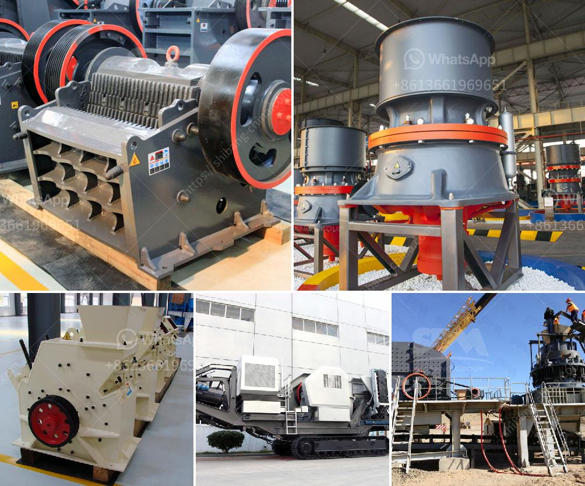

<h3>How to service limestone crushers?</h3>
Limestone crushers are a crucial part of the mining process in many industries, particularly in cement and aggregate production. The maintenance of these crushers is essential to ensure their proper functioning and longevity. Here, we discuss some key tips to maintain limestone crushers, helping you to get the most out of your equipment.

Firstly, it's important to perform regular maintenance for the limestone crushers. Daily inspection of the machine is recommended. As a part of this, check for any loose or broken belts, worn-out bearings, or an excessive amount of dust in the crusher. Regular cleaning and lubrication of these parts will ensure that the machine operates smoothly and efficiently.

Secondly, consider the correct sizing of the equipment. The size and capacity of the crusher should be selected according to the requirements of the project. The crusher needs to be properly matched to the feed size and output requirements to avoid excessive wear and tear on the machine. Oversized feed material can cause the crusher to work harder and can potentially lead to failures or lower productivity. Thus, it's important to check the feed size and adjust accordingly.

Furthermore, it's important to monitor the wear and tear of the crusher's parts. Regularly inspect the wear liners, hammers, and other parts for any signs of damage or excessive wear. Replace these parts if necessary to prevent any further damage or decline in performance. Keeping a spare set of wear parts can help minimize downtime and ensure continuous operation of the crusher.

In addition, it's crucial to follow the manufacturer's recommended maintenance schedule. This may include periodic inspection and replacement of critical components like the bearings and seals. Regular inspection will help identify potential problems early on and prevent costly breakdowns. It's also important to follow any lubrication guidelines provided by the manufacturer to ensure smooth operation and prevent premature wear of the machine.

Lastly, but equally important, is proper training of the operators. Ensuring that the operators are trained and familiar with the equipment's operation and maintenance procedures will go a long way in minimizing accidents and maximizing the crusher's efficiency. Regular refresher courses or updates on new techniques and developments in the industry will help keep the operators up-to-date on best practices.

In conclusion, proper maintenance of limestone crushers is essential to ensure efficient operation and extend their lifespan. Regular inspection, cleaning, and lubrication of the machine, along with timely replacement of critical parts, will help prevent major breakdowns and ensure uninterrupted production. Additionally, correct sizing of the equipment and proper training of operators play a vital role in maintaining the crushers. By following these tips, you can ensure optimal performance and longevity of your limestone crushers, maximizing your return on investment in this important equipment.
<h3>Contact us</h3><ul><li><strong>Whatsapp:&nbsp;<a href="https://wa.me/8613661969651">+8613661969651</a></strong></li><li><a href="https://swt.shibang-china.com/?git&amp;zhl&amp;How to service limestone crushers"><strong>Online Service(chat now)</strong></a></li></ul><h3>Related</h3><ul><li><a href='how much does rock crusher cost ？.md'>how much does rock crusher cost ？</a></li><li><a href='How much does an 800ton jaw crusher cost.md'>How much does an 800-ton jaw crusher cost?</a></li><li><a href='How can I improve the grinding of a raw mill.md'>How can I improve the grinding of a raw mill?</a></li><li><a href='How is limestone processed flowchart.md'>How is limestone processed flowchart?</a></li><li><a href='How to operate mine crushing machinery.md'>How to operate mine crushing machinery?</a></li></ul>