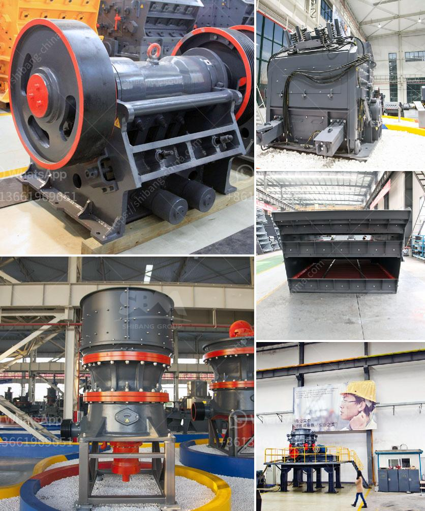

<h3>How to set up a ball mill in a cement plant ？</h3>
A ball mill plays a critical role in the process of making cement. It is responsible for grinding down materials into powder form and then blending them to produce the desired end product. However, setting up a ball mill in a cement plant is not a simple task, as there are many factors to consider, including equipment and overall configuration.

To help navigate through this process, here are some steps to follow when setting up a ball mill in a cement plant:

1. Select the right equipment: As a starting point, it is necessary to have a clear understanding of the machinery required for the task. A ball mill is composed of several components, including a rotating cylinder, a motor, inlet and outlet ports, grinding media, and a driving mechanism. Ensure all the parts are properly sourced and compatible with each other.

2. Design the layout: The space in a cement plant is often constrained, so it is crucial to plan the ball mill's location wisely. Consider factors such as accessibility for maintenance, transport of materials, and the flow of production. A well-designed layout will optimize operational efficiency and minimize downtime.

3. Prepare the foundation: The ball mill requires a solid foundation to maintain stability during operation. Ensure the ground is level and sufficiently reinforced to support the weight of the machinery and absorb any vibrations. Consult with a structural engineer to determine the appropriate foundation design.

4. Install and align the components: Once the foundation is ready, proceed with the installation of the ball mill. Begin by assembling the rotating cylinder and motor, ensuring they are aligned properly. Connect the driving mechanism to the motor and secure all other components in place according to the manufacturer's instructions.

5. Integrate the ball mill into the overall system: Cement plants consist of multiple interconnected systems, such as raw material storage, conveying, and mix preparation. Ensure the ball mill is seamlessly integrated into these processes by connecting the necessary pipelines, ducts, and conveyor belts. Implement safety precautions, such as guards and enclosures, to protect workers during operation.

6. Conduct a test run: After setting up the ball mill, it is crucial to run a test to ensure proper functioning. Use a load test to determine if the motor, transmission, and other components are operating smoothly. Adjust any settings or make necessary repairs if issues are identified.

7. Implement regular maintenance: Long-term operation of a ball mill in a cement plant requires a comprehensive maintenance plan. Schedule routine inspections, lubrication, and cleaning to prevent equipment breakdowns and extend the lifespan of the machinery. Train staff on maintenance procedures and monitor performance regularly to address any emerging issues promptly.

Setting up a ball mill in a cement plant is a complex undertaking, but by following these steps, plant operators can successfully navigate through the process. A well-designed and properly integrated ball mill will contribute to the efficiency and profitability of the cement production line.
<h3>Contact us</h3><ul><li><strong>Whatsapp:&nbsp;<a href="https://wa.me/8613661969651">+8613661969651</a></strong></li><li><a href="https://swt.shibang-china.com/?git&amp;zhl&amp;How to set up a ball mill in a cement plant ？"><strong>Online Service(chat now)</strong></a></li></ul><h3>Related</h3><ul><li><a href='How to separate gold from sand with machine .md'>How to separate gold from sand with machine ?</a></li><li><a href='How to produce crushed sand.md'>How to produce crushed sand</a></li><li><a href='how much price for used stone crusher in Uae.md'>how much price for used stone crusher in Uae</a></li><li><a href='How to set up a quarry plant.md'>How to set up a quarry plant?</a></li><li><a href='How to work a roller grinding mill.md'>How to work a roller grinding mill?</a></li></ul>