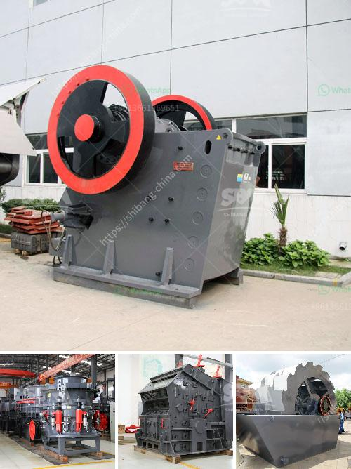

<h3>How to set up a coal pulverizer plant?</h3>
Coal pulverizer plants are key infrastructure for the power industry, as they provide reliable and efficient combustion of coal for electricity generation. Setting up a coal pulverizer plant involves several steps and considerations, and this article will guide you through the process.

Before diving into the details, it's crucial to understand the fundamental role of a coal pulverizer plant. This facility is responsible for grinding coal into a fine powder, which is then blown into the combustion chamber of a boiler. The coal powder mixes with air and is ignited, producing high-temperature steam that drives a turbine connected to a generator. This, in turn, produces electricity.

1. Site selection: Choose a suitable location to build the plant, considering factors such as proximity to coal mines or transportation infrastructure. Access to sufficient water for cooling purposes is also important.

2. Permits and regulations: Obtain the necessary permits and approvals from local authorities and comply with environmental regulations to ensure the plant's compliance with emission standards and other regulations.

3. Design and engineering: Engage a team of experienced engineers to design the plant layout, ensuring efficient flow of materials and minimizing safety risks. The design should also consider the integration of pollution control equipment, such as scrubbers and filters, to reduce air and water pollution.

4. Coal procurement: Establish reliable coal supply arrangements with coal mines or traders. Consider the quality, quantity, and transportation logistics of the coal to ensure a consistent and uninterrupted supply.

5. Equipment selection: Conduct a thorough evaluation of various pulverizer models available in the market. Consider factors such as pulverizing capacity, energy efficiency, maintenance requirements, and overall cost-effectiveness. Engage with reputable manufacturers to procure the required equipment.

6. Installation and construction: Hire experienced contractors to install and construct the plant. Ensure their adherence to industry standards and safety protocols throughout the process. Timely completion of construction is crucial to commence plant operations.

7. Commissioning and testing: Once the plant is constructed, perform thorough testing and commissioning to ensure it operates smoothly and efficiently. Conduct a variety of performance tests to validate the pulverizer's capacity and fineness control.

8. Operation and maintenance: Train the plant operators on safe and efficient operation of the pulverizer plant. Develop a comprehensive maintenance plan to ensure regular inspections, cleaning, and replacement of worn-out parts. Regularly monitor performance metrics and adjust operations as needed to optimize efficiency.

9. Safety measures: Implement stringent safety protocols to protect plant personnel and prevent accidents. Install fire suppression systems, emergency shut-off mechanisms, and dust control measures to maintain a safe working environment.

10. Monitoring and compliance: Continuously monitor the plant's performance and emissions to ensure compliance with environmental regulations. Regularly report to regulatory authorities and implement corrective measures as necessary to maintain compliance.

Setting up a coal pulverizer plant requires a comprehensive approach, addressing technical, regulatory, and environmental aspects. With careful planning and meticulous execution, a well-designed coal pulverizer plant can contribute to the stable and sustainable supply of electricity, vital to meeting the energy demands of modern society.
<h3>Contact us</h3><ul><li><strong>Whatsapp:&nbsp;<a href="https://wa.me/8613661969651">+8613661969651</a></strong></li><li><a href="https://swt.shibang-china.com/?git&amp;zhl&amp;How to set up a coal pulverizer plant"><strong>Online Service(chat now)</strong></a></li></ul><h3>Related</h3><ul><li><a href='How many kilowatts motor is equipped with jaw crusher ？.md'>How many kilowatts motor is equipped with jaw crusher ？</a></li><li><a href='How to feed a jaw crusher from a concrete hopper.md'>How to feed a jaw crusher from a concrete hopper?</a></li><li><a href='How to improve the output of stone crushing plant .md'>How to improve the output of stone crushing plant ?</a></li><li><a href='How industry crush graphite.md'>How industry crush graphite?</a></li><li><a href='How to increase the capacity of ball mill .md'>How to increase the capacity of ball mill ?</a></li></ul>