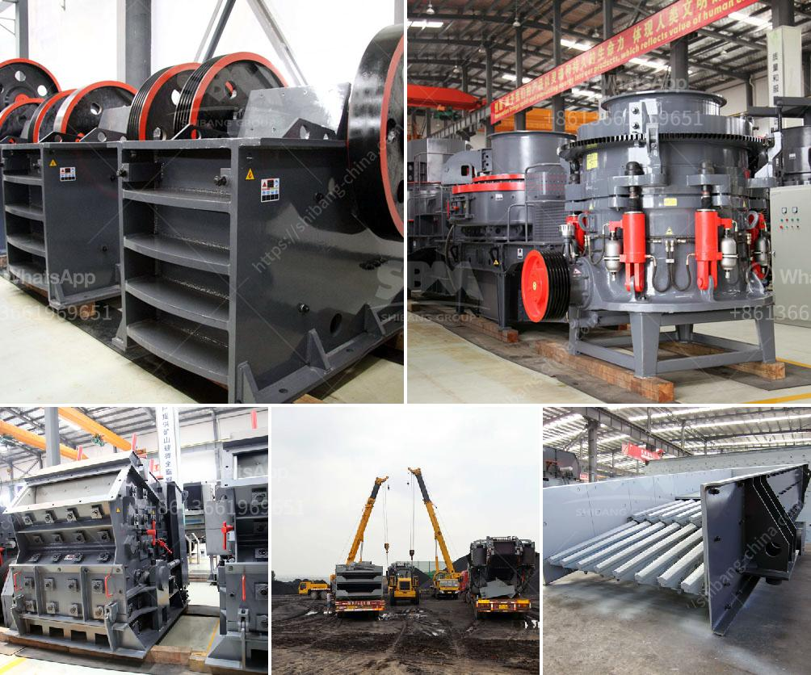

<h3>How to set up a crushing plant in the Philippines?</h3>
Setting up a crushing plant in the Philippines can be a complex process which consists of various steps. It is important to properly plan and carefully assess each step in order to ensure that the plant meets the production requirements and operates efficiently.

Firstly, you need to gather detailed information about the site where the plant will be set up. This includes the topography, geology, available resources, and any potential environmental concerns. Conducting a thorough site investigation will help you determine the suitability of the location and identify any necessary permits or clearances that need to be obtained.

Once you have identified a suitable location, the next step is to design the crushing plant layout. This involves determining the size and configuration of the equipment, the type and quantity of raw materials that will be processed, the final product size requirements, and the capacity of the plant. It is important to choose the right equipment that suits the specific needs of your operation.

In the Philippines, there are several types of crushers available, such as jaw crusher, cone crusher, impact crusher, and gyratory crusher, among others. However, not all crushers are suitable for all applications. It is important to choose a crusher that is capable of handling the specific requirements of your project.

After selecting the appropriate crushers, you will need to design the other components of the plant, such as the screen, conveyor system, and control panel. These components should be designed to work seamlessly together to ensure smooth and efficient operation. It is also important to consider factors such as maintenance requirements, energy efficiency, and noise levels when designing the plant.

Next, you will need to procure the necessary equipment and materials for the project. This may involve sourcing crushers and other machinery from reputable suppliers, as well as obtaining the required permits and clearances for the importation of equipment and materials. It is crucial to ensure that all equipment and materials meet the required standards and are of high quality.

Once the equipment and materials have been procured, the installation and commissioning of the crushing plant can begin. This will involve assembling and setting up the equipment, connecting the electrical and hydraulic systems, and conducting test runs to ensure that everything is working properly.

Finally, it is important to implement a comprehensive maintenance and operational plan for the crushing plant. Regular inspection and maintenance of the equipment will help prevent breakdowns and ensure optimal performance. Additionally, having efficient operational processes in place will help maximize productivity and minimize downtime.

In conclusion, setting up a crushing plant in the Philippines requires careful planning and coordination. By following these steps and working with experienced professionals, you can ensure that your plant is set up to meet your production requirements and operates efficiently.
<h3>Contact us</h3><ul><li><strong>Whatsapp:&nbsp;<a href="https://wa.me/8613661969651">+8613661969651</a></strong></li><li><a href="https://swt.shibang-china.com/?git&amp;zhl&amp;How to set up a crushing plant in the Philippines"><strong>Online Service(chat now)</strong></a></li></ul><h3>Related</h3><ul><li><a href='how to calculate tons per hour ball mill machine .md'>how to calculate tons per hour ball mill machine ?</a></li><li><a href='How to install quarry equipment.md'>How to install quarry equipment?</a></li><li><a href='how to start a stone crushing business in USA .md'>how to start a stone crushing business in USA ?</a></li><li><a href='How to install a crusher for quarry operation.md'>How to install a crusher for quarry operation?</a></li><li><a href='How to design a ball mill for cement ？.md'>How to design a ball mill for cement ？</a></li></ul>