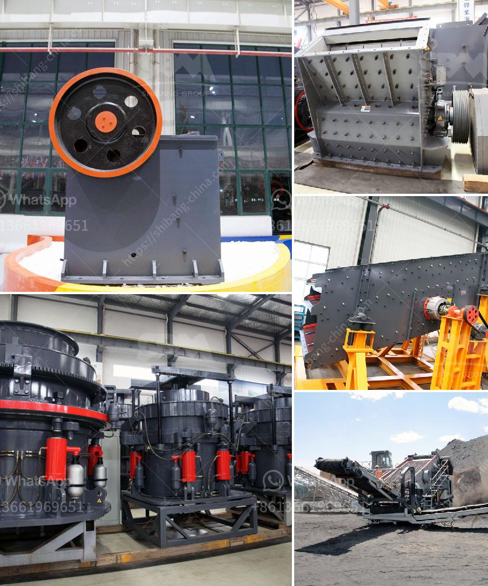

<h3>How to set up a crushing production line station ？</h3>
Setting up a crushing production line station is a crucial step in the process of producing high-quality aggregate materials for construction purposes. By implementing the right equipment, technology, and processes, you can ensure efficient and effective crushing operations that meet the demands of your production requirements. In this article, we will discuss the key steps involved in setting up a crushing production line station.

The first step in setting up a crushing production line station is selecting an appropriate site. Factors to consider include the distance from the source of raw materials, accessibility for transportation, availability of electricity and water supply, and compliance with local regulations and environmental standards.

The choice of equipment is crucial in setting up a crushing production line station. Key equipment includes crushers, vibrating feeders, vibrating screens, belt conveyors, and control systems. Consider factors such as the type and hardness of the raw materials, the desired output size, and the production capacity required. Consult with experts in the field to ensure you choose the right equipment for your specific needs.

Once the equipment is selected, it needs to be properly installed and commissioned. This step involves the assembly, installation, and connection of the different components of the production line station. It is important to follow the manufacturer's instructions and guidelines to ensure safe and efficient installation. Additionally, commissioning involves the testing and adjustment of each component to ensure proper functioning.

Developing an effective production workflow is essential for smooth and efficient crushing operations. This includes determining the sequence of operations, the allocation of resources, and the coordination of different activities. Ensure that the workflow optimizes the production process, minimizes downtime, and maximizes output.

To ensure the longevity and reliability of the crushing production line station, regular maintenance and repairs are essential. Develop a maintenance schedule and implement regular inspections of the equipment. Train your staff on proper maintenance procedures and provide them with the necessary tools and resources. Promptly address any repairs or equipment failures to minimize downtime and ensure uninterrupted production.

Safety should be a top priority in setting up a crushing production line station. Implement safety measures such as safety guards, warning signs, and emergency stop mechanisms to protect workers and prevent accidents. Train your staff on proper safety procedures and provide them with personal protective equipment. Regularly review and update safety protocols to ensure compliance with industry standards.

In conclusion, setting up a crushing production line station involves careful planning, equipment selection, installation, and maintenance. By following these key steps, you can establish a productive and successful crushing operation that delivers high-quality aggregate materials for construction projects. Remember to consult with experts in the field and prioritize safety throughout the entire process.
<h3>Contact us</h3><ul><li><strong>Whatsapp:&nbsp;<a href="https://wa.me/8613661969651">+8613661969651</a></strong></li><li><a href="https://swt.shibang-china.com/?git&amp;zhl&amp;How to set up a crushing production line station ？"><strong>Online Service(chat now)</strong></a></li></ul><h3>Related</h3><ul><li><a href='How to operate a stone crusher.md'>How to operate a stone crusher?</a></li><li><a href='7 Factors Affecting the Price of Jaw Crusher.md'>7 Factors Affecting the Price of Jaw Crusher</a></li><li><a href='How to change the HP cone crusher mantle.md'>How to change the HP cone crusher mantle?</a></li><li><a href='How to choose crushing machinery for sand making plant？.md'>How to choose crushing machinery for sand making plant？</a></li><li><a href='how to choose a crushing machine .md'>how to choose a crushing machine ?</a></li></ul>