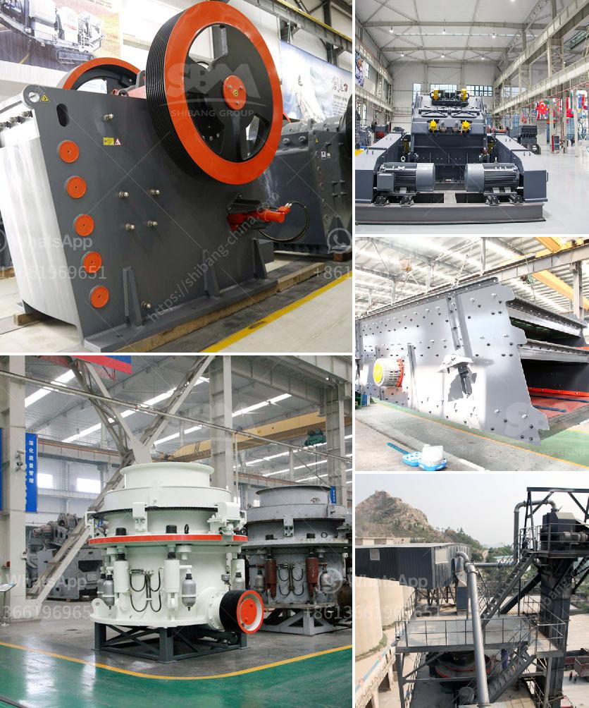

<h3>How to set up a gold mining ball mill?</h3>
Setting up a gold mining ball mill can be a complex process, but it doesn't have to be. If you're interested in mining and want to learn how to set up a gold mining ball mill, this article will guide you through the process.

Firstly, it's important to understand that a gold mining ball mill consists of a series of cylindrical shells that rotate around their own axis. These shells contain grinding media, such as steel balls or rods, which crush the material within the mill as they tumble.

To set up a gold mining ball mill, you need to first identify the location and dimensions of the mill. This includes the length, width, and height of the mill. Once you have this information, you can determine the size of the mill and the number of grinding media required.

The next step is to ensure that the foundation of the mill is solid and sturdy. The mill must be placed on a strong concrete foundation to prevent any movement or vibration during operation. This is crucial as any movement can lead to equipment failure or poor grinding efficiency.

Once the foundation is in place, it's time to install the mill itself. The mill consists of various components, including the main shell, feed and discharge heads, trunnion bearings, and motor. These components need to be carefully assembled to ensure smooth operation.

After the mill is in place, it's time to establish the correct ball charge size and ratio. This refers to the amount of grinding media and materials inside the mill. It's essential to have the right balance, as too much or too little grinding media can affect the efficiency of the mill. Additionally, the correct ball charge size and ratio can also impact the fineness and quality of the crushed material.

Once the mill is set up, it's essential to perform regular maintenance to keep it running smoothly. This includes lubricating the gears and trunnion bearings, inspecting and replacing worn liners, and checking the motor and electrical connections. Regular maintenance will ensure the mill operates efficiently and extends its lifespan.

Finally, it's crucial to monitor the performance of the mill regularly. This can be done by analyzing power consumption, production rate, and grind size distribution. Monitoring these factors will allow you to make adjustments to optimize the mill's performance and maximize gold recovery.

In conclusion, setting up a gold mining ball mill involves careful planning and attention to detail. From identifying the location and dimensions of the mill, to assembling and maintaining the components, every step is crucial to ensure efficient and reliable operation. By following these steps, you'll be well on your way to setting up a successful gold mining ball mill.
<h3>Contact us</h3><ul><li><strong>Whatsapp:&nbsp;<a href="https://wa.me/8613661969651">+8613661969651</a></strong></li><li><a href="https://swt.shibang-china.com/?git&amp;zhl&amp;How to set up a gold mining ball mill"><strong>Online Service(chat now)</strong></a></li></ul><h3>Related</h3><ul><li><a href='How can one avoid chalking during kaolin crushing.md'>How can one avoid chalking during kaolin crushing?</a></li><li><a href='how to load cone crusher .md'>how to load cone crusher ?</a></li><li><a href='How to improve the quality of crusher aggregates .md'>How to improve the quality of crusher aggregates ?</a></li><li><a href='How to set up a ball mill in a cement plant ？.md'>How to set up a ball mill in a cement plant ？</a></li><li><a href='How to make sand from rocks.md'>How to make sand from rocks?</a></li></ul>