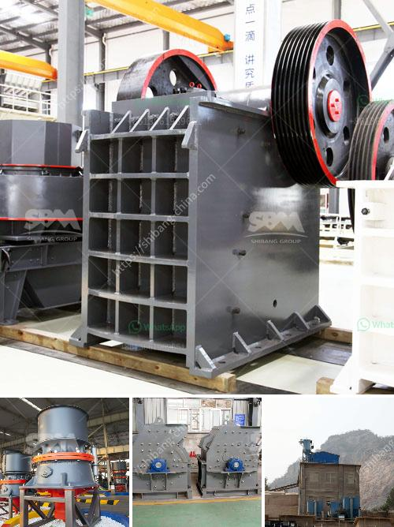

<h3>How to set up a granite processing plant?</h3>
Granite is one of the most popular stones used for construction purposes. It is widely recognized for its durability, strength, and aesthetic appeal. Setting up a granite processing plant can be a profitable venture if you have the right resources and knowledge. In this article, we will discuss the steps involved in setting up a granite processing plant.

1. Market Analysis: Before setting up a granite processing plant, it is vital to conduct thorough market research. Analyze the demand and supply of granite in your target market. Identify potential customers, such as construction companies, architects, and interior designers. Understanding the market trends and competition will help you make informed decisions.

2. Location: Choose a suitable location for your granite processing plant. Look for an area with easy access to raw materials and transportation facilities. It is essential to consider factors like land availability, proximity to the target market, and legal regulations while selecting the location.

3. Business Plan: Develop a comprehensive business plan outlining your goals, investment requirements, marketing strategies, and financial projections. This plan will act as a roadmap and help you stay organized during the setup process. Seek professional assistance if needed to create a robust and realistic business plan.

4. Source Raw Materials: Granite processing plants require a reliable supply of high-quality raw materials. Identify local or international suppliers who can consistently provide raw granite blocks at competitive rates. Establish long-term partnerships to ensure a steady supply chain.

5. Obtain Required Permits: Contact local authorities and obtain the necessary permits and licenses to operate a granite processing plant legally. This step is crucial to avoid legal issues and ensure compliance with environmental and safety regulations.

6. Equipment and Machinery: Purchase or lease the required equipment and machinery for your processing plant. The equipment may include stone cutting machines, polishing machines, and specialized tools for shaping and finishing granite slabs. Consider the capacity of the plant and choose equipment accordingly.

7. Workforce: Hire skilled workers with experience in granite processing to ensure smooth operations. Depending on the scale of your plant, you may need stone cutters, polishers, machine operators, supervisors, and administrative staff. Provide proper training and create a safe work environment to maximize productivity.

8. Quality Control: Implement a stringent quality control system to deliver high-quality granite products. Inspect each batch of processed granite for flaws, cracks, or color inconsistencies. Strict quality control will ensure customer satisfaction and help build a reputable brand.

9. Marketing and Sales: Develop a strong marketing and sales strategy to promote your granite products. Utilize various channels, such as websites, social media, trade shows, and collaborations with home improvement stores, to reach potential customers. Showcase the unique characteristics of your granite products and emphasize their durability, beauty, and versatility.

10. Continuous Improvement: Regularly review and improve your processing plant operations. Stay updated with the latest technology, industry trends, and customer preferences. Invest in research and development to introduce new products or services that set you apart from the competition.

Setting up a granite processing plant requires careful planning and consideration. However, with proper research, strategic decisions, and efficient operations, it can be a profitable venture. Emphasize quality, customer satisfaction, and innovation to succeed in the competitive granite industry.
<h3>Contact us</h3><ul><li><strong>Whatsapp:&nbsp;<a href="https://wa.me/8613661969651">+8613661969651</a></strong></li><li><a href="https://swt.shibang-china.com/?git&amp;zhl&amp;How to set up a granite processing plant"><strong>Online Service(chat now)</strong></a></li></ul><h3>Related</h3><ul><li><a href='how do you process of gold in south africa.md'>how do you process of gold in south africa</a></li><li><a href='How to design a crushing plant.md'>How to design a crushing plant?</a></li><li><a href='how to work cone crusher ？.md'>how to work cone crusher ？</a></li><li><a href='how does the jaw crusher works.md'>how does the jaw crusher works</a></li><li><a href='How to Artificially Make Concrete Sand？.md'>How to Artificially Make Concrete Sand？</a></li></ul>