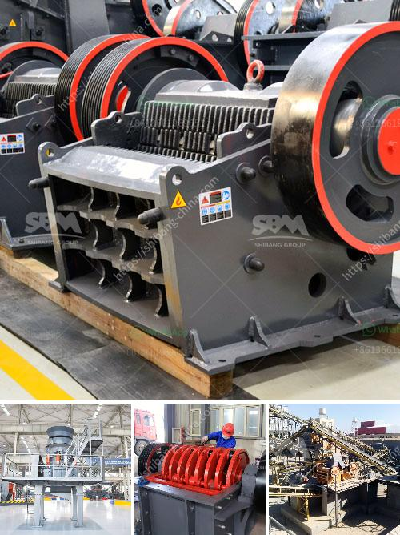

<h3>How to set up a jaw crusher production line ？</h3>
Setting up a jaw crusher production line can be a complex and tedious task. It requires a lot of planning and expertise to ensure that everything runs smoothly. However, with careful consideration and attention to detail, the process can be simplified.

Before setting up a jaw crusher production line, it is necessary to assess the site's geographical conditions. This includes evaluating factors such as terrain, climate, and access to resources. The site should ideally be level and provide easy access to raw materials, water, and electricity. It is also crucial to consider the environmental impact and local regulations that may affect the production process.

Once the site has been selected, it is important to determine the required capacity of the production line. This will depend on factors such as the demand for the final product, the size of the raw materials, and the operating hours of the facility. It is essential to choose a jaw crusher that can handle the desired capacity and efficiently process the raw materials.

Next, it is necessary to design the layout of the production line. This includes determining the placement of the jaw crusher, conveyor belts, and other equipment. The goal is to ensure a smooth flow of materials throughout the production process, from raw material intake to the finished product. Adequate space should be allocated for maintenance and repairs to optimize productivity.

In addition to the jaw crusher, other equipment such as vibrating feeders, screens, and conveyors should be incorporated into the production line. These components contribute to the efficiency of the process by ensuring a steady and controlled flow of materials. It is important to invest in high-quality equipment that is durable and reliable to minimize maintenance and downtime.

Safety should be a priority when setting up a jaw crusher production line. Protective measures, such as enclosed conveyor systems and safety guards, should be implemented to prevent accidents and injuries. Proper training should also be provided to operators to ensure they understand how to operate the equipment safely and efficiently.

Regular maintenance and inspections are essential to keep the jaw crusher production line running smoothly. It is important to follow the manufacturer's recommended maintenance schedule and address any issues promptly. This includes replacing worn parts, lubricating moving components, and checking for any signs of damage or wear.

In conclusion, setting up a jaw crusher production line requires careful planning and consideration of various factors. It is crucial to assess the site's conditions, determine the required capacity, and design a layout that allows for efficient material flow. By prioritizing safety and regular maintenance, the production line can operate smoothly and maximize productivity.
<h3>Contact us</h3><ul><li><strong>Whatsapp:&nbsp;<a href="https://wa.me/8613661969651">+8613661969651</a></strong></li><li><a href="https://swt.shibang-china.com/?git&amp;zhl&amp;How to set up a jaw crusher production line ？"><strong>Online Service(chat now)</strong></a></li></ul><h3>Related</h3><ul><li><a href='How to extract copper from tailings.md'>How to extract copper from tailings?</a></li><li><a href='How to choose a vibration motor.md'>How to choose a vibration motor?</a></li><li><a href='How can one avoid chalking during kaolin crushing.md'>How can one avoid chalking during kaolin crushing?</a></li><li><a href='How to build iron ore crushing line in Malaysia .md'>How to build iron ore crushing line in Malaysia ?</a></li><li><a href='how to make stone into powder how much does a grinder cost .md'>how to make stone into powder how much does a grinder cost ?</a></li></ul>