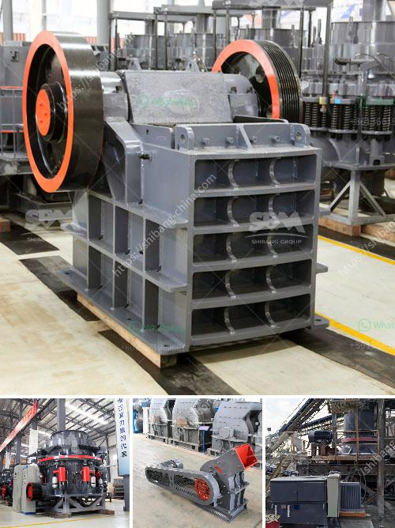

<h3>How to set up a limestone processing plant?</h3>
Limestone is a common rock found in abundance throughout the world. It is primarily used for construction purposes, ranging from buildings to roads and bridges. With its versatile applications, setting up a limestone processing plant can be a profitable venture.

To successfully set up a limestone processing plant, there are several factors to consider, including location, equipment, and materials sourcing. Here is a step-by-step guide to help you get started:

1. Choose an Ideal Location: It is crucial to select a suitable location for your limestone processing plant. Look for a place with easy access to limestone deposits, as this will minimize transportation costs. Additionally, consider proximity to infrastructure, such as roads and railways, which will simplify the distribution of your finished products.

2. Obtain Necessary Permits and Licenses: Before commencing operations, ensure that you have obtained all the required permits and licenses from local authorities. These may include environmental permits, mining rights, and land lease agreements. Compliance with regulations is essential to avoid legal issues in the future.

3. Conduct a Feasibility Study: Perform a detailed feasibility analysis to assess the profitability of your limestone processing plant. Consider factors such as expected demand, market competition, and production costs. This study will help you determine the optimum processing capacity and investment required.

4. Source Equipment: Depending on the scale of your limestone processing plant, you will need specific equipment to extract, crush, process, and transport limestone. Essential equipment includes crushers, conveyors, storage facilities, and screening equipment.

5. Establish Reliable Suppliers: Secure a reliable source of limestone by establishing long-term contracts with reputable quarry operators. Ensure that your suppliers can provide consistent quality and quantity of limestone throughout the year.

6. Implement an Efficient Production Process: Set up a production process that maximizes efficiency and minimizes waste. This includes proper crushing, grinding, and screening techniques. Additionally, consider implementing modern automation systems to streamline operations and enhance productivity.

7. Develop a Product Distribution Strategy: Create a distribution strategy to ensure the timely delivery of your processed limestone to customers. Analyze market demands and identify potential customers, such as construction companies, cement manufacturers, or individual consumers. Establish partnerships and negotiate favorable transportation rates to optimize your supply chain.

8. Prioritize Environmental Sustainability: As limestone processing involves extensive mining activities, it is essential to prioritize environmental sustainability. Ensure that your operations comply with environmental regulations, and implement measures to minimize air and water pollution, land degradation, and noise pollution.

In conclusion, setting up a limestone processing plant requires careful planning and consideration of various factors. From selecting an ideal location, sourcing reliable suppliers, and obtaining necessary permits to optimizing your production process and distribution strategy, all these steps are crucial for a successful venture. By following these guidelines, you can establish a profitable limestone processing plant and contribute to the construction industry's growth and development.
<h3>Contact us</h3><ul><li><strong>Whatsapp:&nbsp;<a href="https://wa.me/8613661969651">+8613661969651</a></strong></li><li><a href="https://swt.shibang-china.com/?git&amp;zhl&amp;How to set up a limestone processing plant"><strong>Online Service(chat now)</strong></a></li></ul><h3>Related</h3><ul><li><a href='How to repair mining crushers You need to know these 7 steps.md'>How to repair mining crushers? You need to know these 7 steps</a></li><li><a href='How to increase the output of ball mill.md'>How to increase the output of ball mill?</a></li><li><a href='How to design an iron ore processing facility with crushing and beneficiation.md'>How to design an iron ore processing facility with crushing and beneficiation?</a></li><li><a href='how does the jaw crusher works.md'>how does the jaw crusher works</a></li><li><a href='How to do the maintenance of crushing screening plant.md'>How to do the maintenance of crushing screening plant?</a></li></ul>