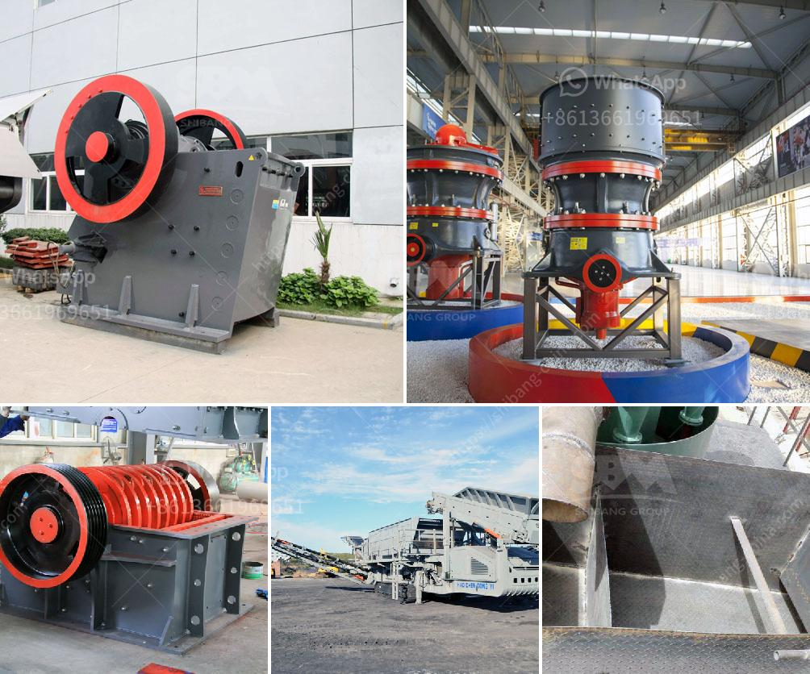

<h3>How to set up a milling plant in zambia?</h3>
Setting up a milling plant in Zambia can be a lucrative business opportunity for entrepreneurs interested in the agriculture sector. Zambia is known for its rich agricultural resources, particularly maize, which is a staple food for the majority of the population. With the right approach and proper planning, setting up a milling plant can not only meet the local demand for flour but also contribute to the overall economic growth of the country.

1. Conduct Market Research: Before embarking on the venture, it is crucial to conduct thorough market research. Identify the demand for flour in the target area and analyze the competition. Evaluate the current market trends, pricing strategies, and potential consumers to determine the feasibility of the project.

2. Develop a Business Plan: A well-structured business plan is the foundation of any successful venture. It should outline the milling plant operations, marketing strategy, financial projections, and a contingency plan. Include information about the equipment required, potential suppliers, and the estimated cost of the project.

3. Secure Financing: Determine your financial needs and explore available funding options. You can seek assistance from local financial institutions, investors, or apply for government grants. Prepare a convincing business proposal to attract potential lenders or investors.

4. Register the Business: Register your milling plant as a legal entity with the relevant government authorities. Obtain the necessary licenses and permits required for operating a milling plant in Zambia. Comply with all regulations related to food safety and quality standards set by the government.

5. Location and Infrastructure: Select an ideal location for your milling plant considering proximity to raw materials, availability of essential utilities like water and electricity, and good transportation access for both inputs and distribution. Ensure that the chosen area has enough space for expansion plans and adequate storage facilities.

6. Procure the Machinery: Acquire the necessary milling equipment suitable for your production capacity. This may include grain cleaning and milling machines, packaging machinery, and storage facilities. Consider purchasing from reputable suppliers to ensure the quality and durability of the machinery.

7. Hire Skilled Workforce: Employ experienced personnel who can handle milling operations efficiently. Hire skilled workers for machine operation, quality control, maintenance, and administration. Train them on safety measures, production processes, and maintenance of machinery.

8. Establish Supply Chain: Develop a reliable supply chain by establishing partnerships with local farmers or suppliers for a steady supply of raw materials. Ensure the procurement process is efficient, cost-effective, and upholds quality standards.

9. Market and Distribution: Develop a comprehensive marketing strategy to promote your flour products. Identify potential customers such as retailers, wholesalers, and institutions. Build strong relationships with distributors to ensure a wide distribution reach.

10. Monitor and Improve: Regularly assess your milling operations, quality control measures, and customer feedback. Continuously strive for improvement by investing in advanced technology, exploring new market segments, and diversifying your product range.

Setting up a milling plant in Zambia can be a profitable venture, considering the country's vast agricultural potential. However, it is imperative to conduct thorough research, make informed decisions, and adhere to all legal regulations to ensure a successful and sustainable milling business.
<h3>Contact us</h3><ul><li><strong>Whatsapp:&nbsp;<a href="https://wa.me/8613661969651">+8613661969651</a></strong></li><li><a href="https://swt.shibang-china.com/?git&amp;zhl&amp;How to set up a milling plant in zambia"><strong>Online Service(chat now)</strong></a></li></ul><h3>Related</h3><ul><li><a href='How to install cement mill liners .md'>How to install cement mill liners ?</a></li><li><a href='how to design a sand washing classifier？.md'>how to design a sand washing classifier？</a></li><li><a href='How to clean manganese ore .md'>How to clean manganese ore ?</a></li><li><a href='How to start crushed limestone production.md'>How to start crushed limestone production?</a></li><li><a href='How the limestone crusher works .md'>How the limestone crusher works ?</a></li></ul>