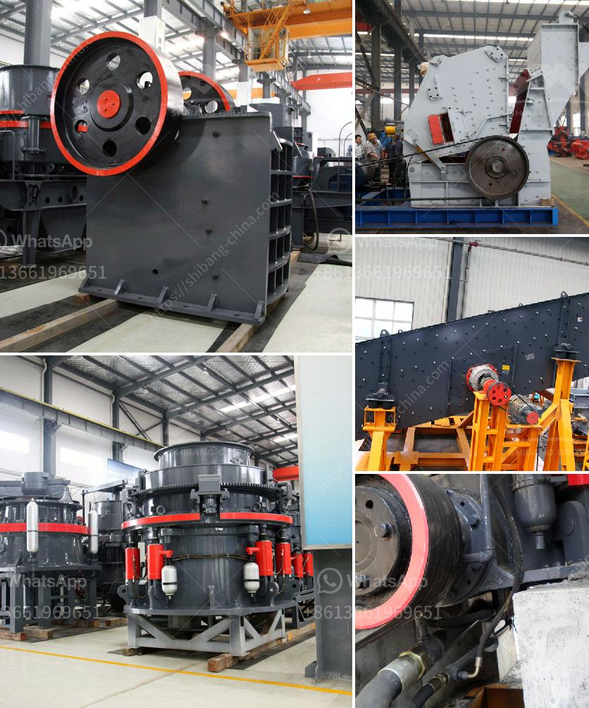

<h3>How to set up a mine crushing station in the Philippines ？</h3>
Setting up a mine crushing station in the Philippines requires careful planning and dedication to ensure the project's success. Having a properly functioning crushing station is crucial for mining operations to efficiently extract valuable minerals from the earth. In this article, we will discuss the important steps involved in setting up a mine crushing station in the Philippines.

1. Conduct a thorough feasibility study: Before commencing any mining operation, it is essential to conduct a comprehensive feasibility study to evaluate the viability of the project. This study should include factors such as mineral deposits, market demand, environmental impact, and financial analysis. It will serve as a blueprint for the entire process of setting up a crushing station.

2. Obtain necessary permits and licenses: Mining operations in the Philippines require obtaining permits and licenses from the appropriate government agencies. These permits may include an environmental compliance certificate, mining permits, and other clearances. It is crucial to abide by all regulations and ensure the necessary paperwork is in place before starting any construction.

3. Assess the site and prepare the infrastructure: Selecting the right location for the crushing station is crucial. Consider factors such as accessibility, proximity to mineral deposits, and availability of utilities. Infrastructure preparations include constructing access roads, setting up proper drainage systems, and ensuring a reliable power supply. Adequate space should be allocated for the crushing station, equipment, stockpiles, and other necessary structures.

4. Choose the right crushing equipment: The selection of crushing equipment for a mine crushing station should be based on the type of minerals and their hardness. Commonly used equipment includes jaw crushers, cone crushers, impact crushers, and gyratory crushers. It is essential to consider factors such as capacity, efficiency, and maintenance requirements when choosing the right equipment for the project.

5. Design and construct the crushing station: Engage an experienced design and engineering team to develop a layout for the crushing station. The layout should consider factors such as the flow of materials, safety, and ease of maintenance. The team should also ensure that the crushing station complies with all relevant safety standards. Once the design is finalized, construction can begin.

6. Install necessary infrastructure and support systems: Apart from the primary crushing equipment, auxiliary systems such as conveyors, screens, and feeders are crucial for the operation of a crushing station. These systems help transport materials, separate different sizes of crushed materials, and regulate the flow of feed. The installation of dust collection systems and noise reduction measures is also essential to maintain environmental standards.

7. Train and educate the workforce: Ensuring the proper training and education of the workforce is crucial to the smooth operation of the crushing station. Employees should be trained in safe working practices, equipment operation, maintenance procedures, and environmental regulations. Regular refresher courses and ongoing education programs should be conducted to keep the workforce up to date with the latest industry standards and practices.

Setting up a mine crushing station in the Philippines involves several important steps, from feasibility studies to obtaining permits, selecting equipment, and constructing the necessary infrastructure. By carefully following these steps and ensuring compliance with regulations, a mine crushing station can be successfully established, contributing to efficient and profitable mining operations in the country.
<h3>Contact us</h3><ul><li><strong>Whatsapp:&nbsp;<a href="https://wa.me/8613661969651">+8613661969651</a></strong></li><li><a href="https://swt.shibang-china.com/?git&amp;zhl&amp;How to set up a mine crushing station in the Philippines ？"><strong>Online Service(chat now)</strong></a></li></ul><h3>Related</h3><ul><li><a href='How mobile crushing plant can realize the recycling of construction waste .md'>How mobile crushing plant can realize the recycling of construction waste ?</a></li><li><a href='How is manganese extracted.md'>How is manganese extracted?</a></li><li><a href='Procedures on how to mine nickel ore .md'>Procedures on how to mine nickel ore ?</a></li><li><a href='How to start a business stone mining .md'>How to start a business stone mining ?</a></li><li><a href='How to work with a Raymond Mill.md'>How to work with a Raymond Mill?</a></li></ul>