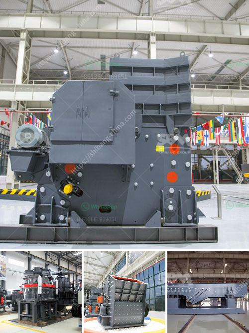

<h3>How to set up a quarry business in india?</h3>
India is a rapidly developing country with a booming infrastructure sector. With the growing demand for construction materials, such as granite, mica, and sand, the mining industry is enticing entrepreneurs to set up quarrying businesses in different parts of the country.

If you are interested in starting a quarry business in India, there are several key considerations to keep in mind. In this article, we will discuss everything you need to know about setting up a quarry business in India.

Before diving into any business venture, it is essential to conduct thorough research. One of the primary factors to consider is the market demand for your quarrying products. Assess the local competition and identify the potential customers in your chosen area.

Furthermore, understand the legal and environmental regulations that govern quarrying activities in India. Different states might have varying regulations, so it is crucial to familiarize yourself with the specific laws applicable in the region you intend to set up your quarry business.

Quarrying operations require various licenses and permits from the government authorities. The first step is to obtain a mining lease from the concerned state's mining department. This license is essential for operating a quarry legally and is usually granted for a specific period, typically 5 to 10 years.

To acquire the mining lease, you will need to submit an application along with supporting documents such as a project report, mining plan, environmental clearance, and proof of financial stability. It is advisable to seek professional assistance to navigate the complex licensing process.

Quarrying operations require significant financial investment. You will need capital to purchase or rent heavy machinery, secure land for the quarry, and cover operational expenses such as labor, transportation, and marketing. Identify potential sources of funding, such as banks, investors, or government schemes that promote entrepreneurship and infrastructure development.

Prepare a comprehensive business plan highlighting your financial projections, marketing strategies, and growth prospects. This will help investors or lenders understand the potential return on investment and mitigate risks.

Once you have acquired a mining lease and secured funds, it is time to set up your quarry site. Identify a suitable location with abundant reserves of the desired mineral. Conduct a geological survey to assess the quality and quantity of the mineral deposits.

Based on the survey findings, plan the layout of your quarry, including the extraction areas, storage facilities, and processing units. Ensure adequate infrastructure, including access roads, water supply, electricity, and waste management systems.

With the physical infrastructure in place, it is time to operationalize your quarry business. Hire trained personnel, including mining engineers and skilled laborers, to ensure safe and efficient operations. Implement strict safety protocols and provide regular training to your workforce to prevent accidents and minimize environmental impact.

Establish partnerships with suppliers and distributors to streamline the supply chain and ensure a steady flow of raw materials to meet market demand. Market your products through various channels, such as construction companies, government tenders, and online platforms.

In conclusion, starting a quarry business in India requires thorough research, obtaining the necessary licenses and permits, securing funding, setting up the quarry site, and operationalizing the business with proper safety protocols. With the country's growing infrastructure sector, establishing a successful quarrying business can be a lucrative venture for aspiring entrepreneurs.
<h3>Contact us</h3><ul><li><strong>Whatsapp:&nbsp;<a href="https://wa.me/8613661969651">+8613661969651</a></strong></li><li><a href="https://swt.shibang-china.com/?git&amp;zhl&amp;How to set up a quarry business in india"><strong>Online Service(chat now)</strong></a></li></ul><h3>Related</h3><ul><li><a href='how to replace dryer bearing ？.md'>how to replace dryer bearing ？</a></li><li><a href='How to make sand from stone dust.md'>How to make sand from stone dust?</a></li><li><a href='How to crush the very hard iron ore magnetite.md'>How to crush the very hard iron ore magnetite?</a></li><li><a href='how does a limestone ball mill working .md'>how does a limestone ball mill working ?</a></li><li><a href='How many kilowatts motor is equipped with jaw crusher ？.md'>How many kilowatts motor is equipped with jaw crusher ？</a></li></ul>