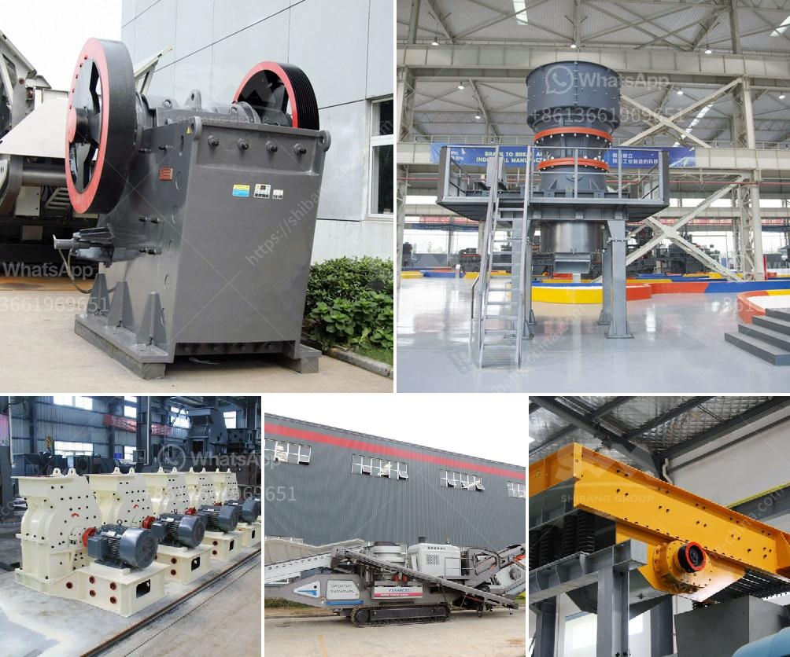

<h3>How to set up a quarry plant in India?</h3>
India is known for its rich and diverse mineral resources, making it an attractive destination for quarrying activities. Quarrying refers to the process of extracting minerals and other materials from the earth's surface. It plays a vital role in the construction industry, as it provides raw materials for building roads, bridges, and buildings. Setting up a quarry plant in India requires careful planning and execution. In this article, we will discuss the steps involved in setting up a quarry plant in India.

1. Identify the Location: The first step in setting up a quarry plant is to identify a suitable location that has ample reserves of desired minerals. Conduct detailed surveys and geological studies to assess the quality and quantity of the minerals available in the area. It is important to choose a location that is easily accessible and has good transportation links.

2. Obtain Legal Permissions: Quarrying activities require various legal permissions and clearances from government authorities. Obtain the necessary licenses and permits from the concerned departments, such as the Department of Mines and Geology and the Pollution Control Board. Compliance with environmental regulations and consent from local communities is essential.

3. Secure Land and Infrastructure: Acquire the land required for setting up the quarry plant. Ensure that the land is legally owned or leased and has the necessary infrastructure, such as roads, water supply, and electricity connections. It is advisable to involve a lawyer or a legal expert to handle the land acquisition process and to ensure all legal formalities are completed.

4. Plan the Quarry Layout: Design an efficient and sustainable quarry layout. Consider factors such as the topography of the area, availability of resources, and the nature of the minerals to be extracted. Plan the location of quarry pits, stockpiles for storing extracted materials, and crusher units for crushing and processing the extracted minerals.

5. Procure Equipment and Machinery: Purchase or lease the necessary equipment and machinery required for quarrying operations. This may include excavators, dump trucks, loaders, crushers, and screening plants. Ensure that the equipment is of good quality, reliable, and suitable for the specific requirements of the quarry.

6. Hire Skilled Manpower: Recruit skilled and experienced manpower to operate and manage the quarry plant. This may include engineers, technicians, machine operators, and administrative staff. Provide proper training and safety measures to ensure the well-being of the workforce and prevent accidents.

7. Establish a Supply Chain: Set up a supply chain network to transport the extracted materials to customers. This may involve establishing contracts with transporters or investing in your own fleet of trucks. Ensure timely delivery of the materials to maintain customer satisfaction.

8. Implement Safety Measures: Quarrying involves various risks and hazards, such as landslides, cave-ins, and exposure to harmful substances. Implement strict safety measures to mitigate these risks. Conduct regular safety audits, provide personal protective equipment to workers, and train them in safety protocols.

Setting up a quarry plant in India requires careful planning, adherence to legal requirements, and proper execution. With proper management and responsible quarrying practices, a quarry plant can contribute to India's infrastructure growth while respecting environmental concerns.
<h3>Contact us</h3><ul><li><strong>Whatsapp:&nbsp;<a href="https://wa.me/8613661969651">+8613661969651</a></strong></li><li><a href="https://swt.shibang-china.com/?git&amp;zhl&amp;How to set up a quarry plant in India"><strong>Online Service(chat now)</strong></a></li></ul><h3>Related</h3><ul><li><a href='How mobile crushing plant can realize the recycling of construction waste .md'>How mobile crushing plant can realize the recycling of construction waste ?</a></li><li><a href='How to break down a copper ore.md'>How to break down a copper ore?</a></li><li><a href='How much does a stone crusher of 150 tonnes cost.md'>How much does a stone crusher of 150 tonnes cost?</a></li><li><a href='How to replace a broken bearing in a jaw crusher.md'>How to replace a broken bearing in a jaw crusher?</a></li><li><a href='How to make sand from quartzite customer case .md'>How to make sand from quartzite customer case ?</a></li></ul>