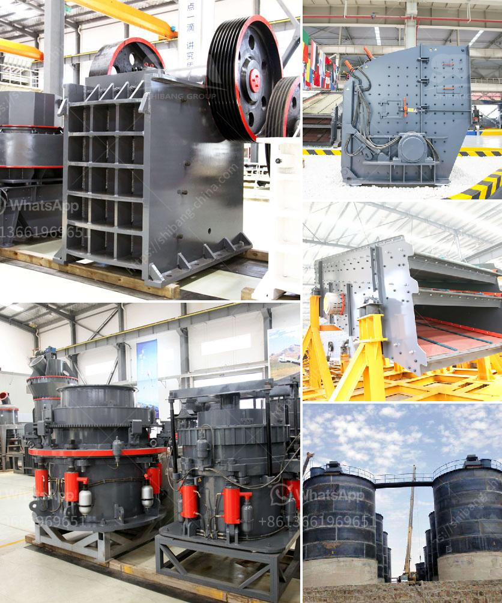

<h3>How to set up a quarry plant?</h3>
Quarrying is a highly specialized process that involves the extraction of rocks and minerals from the earth's crust. Setting up a quarry plant is not an easy task as it requires significant capital investment and careful planning. The quarrying industry employs thousands of people worldwide and plays an essential role in the construction and infrastructure development sectors. In this article, we will discuss the crucial steps involved in setting up a quarry plant.

1. Select a suitable location: The first step in setting up a quarry plant is to choose a site that has abundant deposits of rocks and minerals. Factors like accessibility, availability of transportation, and proximity to the market should be considered when selecting the location.

2. Obtain necessary permits and licenses: Before starting any construction activities, it is essential to obtain the required permits and licenses from the relevant authorities. These may include environmental, mining, and land-use permits to ensure compliance with local regulations.

3. Conduct site analysis and feasibility study: A comprehensive site analysis and feasibility study should be conducted to determine the viability of the quarry plant. This study will help assess the quality and quantity of the rocks and minerals, as well as the market demand and potential customers.

4. Acquire necessary equipment and machinery: Setting up a quarry plant requires the purchase and installation of various equipment and machinery such as crushers, screens, conveyors, and storage facilities. The size and capacity of the equipment depend on the scale of operations and production requirements.

5. Design the quarry layout and infrastructure: A well-planned layout and infrastructure are crucial for the efficient functioning of a quarry plant. The design should include the location of processing units, waste disposal areas, and access roads for transportation of raw materials and finished products.

6. Recruit and train workforce: Skilled and experienced workforce is essential for the smooth operations of a quarry plant. Depending on the scale of operations, personnel such as machine operators, mechanics, and maintenance staff may be required. Adequate training programs should be provided to ensure the safety and productivity of the workforce.

7. Implement safety and environmental measures: Quarrying involves heavy machinery and explosives, making safety a top priority. Strict safety protocols and guidelines should be put in place to protect the workers and prevent accidents. Environmental protection measures should also be implemented to minimize the impact of the quarry operations on the surrounding ecosystem.

8. Develop a marketing and sales strategy: Once the quarry plant is set up, the extracted rocks and minerals need to be marketed and sold to customers. Developing a marketing and sales strategy will help identify target markets, potential customers, and pricing strategies to ensure profitability.

In conclusion, setting up a quarry plant requires careful planning, investment, and adherence to legal and environmental regulations. The process involves selecting a suitable location, obtaining necessary permits, acquiring equipment, designing infrastructure, recruiting and training the workforce, and implementing safety and environmental measures. A well-executed quarry plant can contribute to the growth and development of the construction industry while providing employment opportunities in the local community.
<h3>Contact us</h3><ul><li><strong>Whatsapp:&nbsp;<a href="https://wa.me/8613661969651">+8613661969651</a></strong></li><li><a href="https://swt.shibang-china.com/?git&amp;zhl&amp;How to set up a quarry plant"><strong>Online Service(chat now)</strong></a></li></ul><h3>Related</h3><ul><li><a href='Maintenance method of impact crusher.md'>Maintenance method of impact crusher?</a></li><li><a href='How iron ore mining is conducted.md'>How iron ore mining is conducted</a></li><li><a href='how to  granite rocks in double toggle jaw crusher.md'>how to  granite rocks in double toggle jaw crusher</a></li><li><a href='How to choose the size of jaw crusher ？.md'>How to choose the size of jaw crusher ？</a></li><li><a href='How to run a crushing plant.md'>How to run a crushing plant?</a></li></ul>