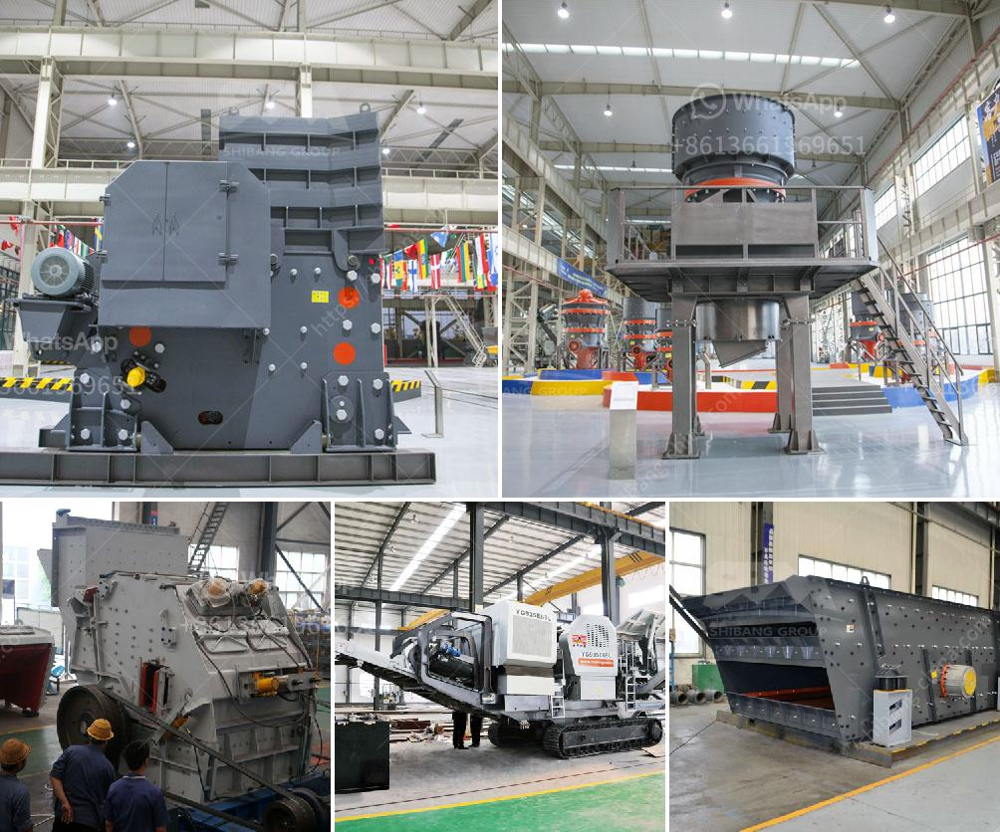

<h3>How to set up a small gold crushing plant? 7 steps to help you</h3>
Setting up a small gold crushing plant can be a complex and time-consuming process. However, choosing the right equipment, establishing a proper budget, and understanding the necessary steps can make it a lot more straightforward. In this article, we will guide you through seven essential steps to help you set up your small gold crushing plant successfully.

Before setting up a gold crushing plant, you need to determine its purpose and scope. Are you planning to extract gold from ore or crush gold-bearing rocks? Understanding the purpose will help you choose the right equipment and design the plant accordingly.

Evaluate the resources available to you, such as the location of your plant, the availability of water and power supply, and the quantity and quality of raw materials. Ensure that you have access to sufficient resources to sustain your crushing plant operations effectively.

Create a detailed plan and design for your gold crushing plant layout. Consider factors such as crushing capacity, equipment requirements, safety measures, and workflow optimization. This step should include identifying the necessary machinery, such as crushers, conveyors, and screens, and their respective sizes and capacities.

To legally establish and operate a gold crushing plant, you need to obtain the necessary permits and licenses from the local authorities. These permits may include environmental assessment approvals, health and safety certifications, and mining permits, among others. Ensure you comply with all regulatory requirements before proceeding.

Once you have designed your plant layout and obtained the required permits, it is time to procure and install the necessary equipment. Collaborate with reliable suppliers and manufacturers to purchase crushers, conveyors, screens, and any other machinery required for your gold crushing plant. Ensure that the installation is carried out by experienced professionals to ensure proper functionality and safety.

To prolong the lifespan of your equipment and ensure smooth operations, it is essential to develop a comprehensive maintenance plan. Regular inspections, equipment cleaning, lubrication, and repairs should be scheduled to prevent breakdowns and maximize productivity. Include a spare parts inventory and establish relationships with suppliers to ensure timely replacements.

Proper training and education of your staff are crucial for smooth plant operations. Train your employees on equipment usage, safety protocols, emergency response procedures, and environmental regulations. This will not only enhance productivity but also ensure the well-being of your employees.

In conclusion, setting up a small gold crushing plant requires thorough planning, resource evaluation, budgeting, and compliance with regulatory requirements. By following these seven essential steps - determining purpose and scope, evaluating resources, planning and designing the layout, obtaining permits, procuring and installing equipment, developing a maintenance plan, and training staff - you can efficiently establish and operate your gold crushing plant. Remember to monitor the performance periodically and make any necessary adjustments to optimize productivity and maximize your return on investment.
<h3>Contact us</h3><ul><li><strong>Whatsapp:&nbsp;<a href="https://wa.me/8613661969651">+8613661969651</a></strong></li><li><a href="https://swt.shibang-china.com/?git&amp;zhl&amp;How to set up a small gold crushing plant 7 steps to help you"><strong>Online Service(chat now)</strong></a></li></ul><h3>Related</h3><ul><li><a href='How to install a stone crusher hopper.md'>How to install a stone crusher hopper?</a></li><li><a href='How to commission a mobile cone crusher.md'>How to commission a mobile cone crusher?</a></li><li><a href='How is mill used in the copper ore mining process.md'>How is mill used in the copper ore mining process?</a></li><li><a href='How to design an iron ore conveyor.md'>How to design an iron ore conveyor?</a></li><li><a href='How to beneficiation tungsten ore.md'>How to beneficiation tungsten ore?</a></li></ul>