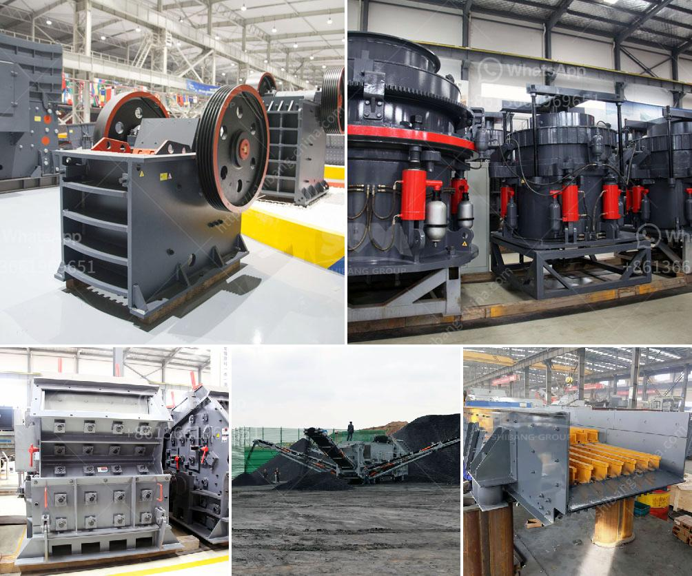

<h3>How to set up a stone crusher plant?</h3>
Setting up a stone crusher plant can be a complex task, especially for inexperienced individuals. Here are some tips to help you get started if you are considering this endeavor.

1. Understand the purpose of the plant: Before setting up a stone crusher plant, it is crucial to understand the purpose it serves. The crushing process of stone materials is used for a variety of reasons, such as the production of gravel, metal ore refining, and recycling. To obtain finished products that meet specifications, it is crucial to choose the right combination of machinery and crushing methods.

2. Determine the location and layout: Location is key when setting up a stone crusher plant. It should be convenient to the raw material sources and have suitable access to the quarry. Ideally, the location should also be close to the intended market to save transportation costs. Additionally, consider factors such as surrounding environmental conditions and topography when designing the layout of the plant. This will ensure efficient operations and adherence to safety regulations.

3. Select appropriate equipment: Finding the right equipment for your stone crusher plant is essential. The type of rock you plan to process and your desired product specifications will dictate the kind of equipment you need, including crushers, screens, feeders, and conveyors. Research different models, brands, and suppliers to determine which equipment best suits your requirements and budget.

4. Prepare a comprehensive business plan: A well-thought-out business plan is crucial for the success of your stone crusher plant. It will serve as a roadmap for your operation and guide your decision-making process. Your business plan should include a detailed financial analysis, market research, target demographics, and a marketing strategy to promote your products and services.

5. Secure necessary permits and licenses: Before commencing operations, it is essential to obtain all the required permits and licenses. This includes environmental clearances, mining licenses, land lease agreements, and any other documentation required by local regulations. Failing to comply with legal requirements can lead to severe penalties and even closure of your plant.

6. Ensure proper maintenance and operation: Once your stone crusher plant is up and running, it is essential to prioritize maintenance and regular inspections to ensure the plant is functioning correctly. Regular maintenance will help identify and address potential issues before they escalate into costly breakdowns. Additionally, train your staff in plant operation and safety procedures to prevent accidents and injuries.

In conclusion, setting up a stone crusher plant is a complex task that requires careful planning and consideration. Building a successful plant will ensure efficient operations and produce high-quality products that meet customer specifications. By following the steps outlined above, you can set up an efficient and profitable stone crusher plant.
<h3>Contact us</h3><ul><li><strong>Whatsapp:&nbsp;<a href="https://wa.me/8613661969651">+8613661969651</a></strong></li><li><a href="https://swt.shibang-china.com/?git&amp;zhl&amp;How to set up a stone crusher plant"><strong>Online Service(chat now)</strong></a></li></ul><h3>Related</h3><ul><li><a href='how to replace dryer bearing ？.md'>how to replace dryer bearing ？</a></li><li><a href='how to produce alternative to river sand ？.md'>how to produce alternative to river sand ？</a></li><li><a href='How to choose the right grinder for the processing mineral materials.md'>How to choose the right grinder for the processing mineral materials?</a></li><li><a href='How to work a gyratory crusher.md'>How to work a gyratory crusher?</a></li><li><a href='how much is an iron ore crushr machine？.md'>how much is an iron ore crushr machine？</a></li></ul>