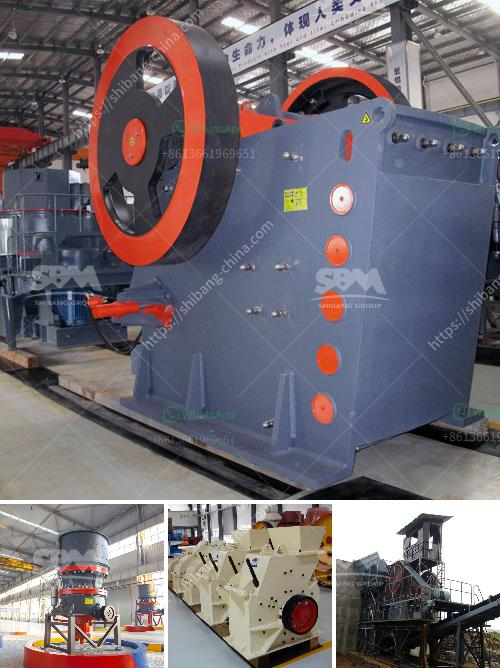

<h3>How to set up concrete batching plant malaysia ?</h3>
Setting up a concrete batching plant in Malaysia can seem like a daunting task. However, with careful planning and preparation, it can be a relatively simple process. Here are a few steps to help you get started.

Before setting up a concrete batching plant, it is essential to conduct thorough research and planning. Start by identifying the location and size of the plant. Consider factors such as proximity to raw material sources, accessibility for transportation, and local regulations.

Next, you will need to obtain the necessary permits and licenses to operate a concrete batching plant in Malaysia. These requirements may vary depending on the state or city regulations. Consult with local authorities to understand the specific requirements and ensure compliance.

Once you have the necessary permits in place, it is time to purchase the equipment for your batching plant. Choose high-quality equipment from reputable suppliers to ensure reliability and longevity. The essential equipment includes mixers, conveyors, cement silos, and batching machines.

To operate a concrete batching plant, you will need a steady supply of raw materials such as cement, aggregates, and water. Partner with reliable suppliers who can provide these materials according to your needs and specifications. Establish a system for monitoring and replenishing your stock to avoid any disruptions in production.

Now it's time to set up the batching plant itself. Start by preparing the site and leveling the land. Install the necessary infrastructure, such as electricity supply and water lines. Depending on the size of the plant, you may also need to construct storage facilities for raw materials and finished products.

Once the plant is ready, it is crucial to train your staff in operating and maintaining the equipment. Ensure that they understand the safety protocols and standard operating procedures. Provide training on the proper handling and storage of raw materials to avoid any accidents or wastage.

After setting up the concrete batching plant, it is essential to continuously monitor and optimize production. Regularly check the equipment for any signs of wear and tear and schedule necessary maintenance. Implement quality control measures to ensure that the concrete produced meets the required standards.

Finally, promote your concrete batching plant services to attract customers. Network with construction companies, developers, and contractors to inform them about your capabilities and competitive pricing. Utilize online platforms and social media to reach a broader audience and showcase your projects and testimonials.

Setting up a concrete batching plant in Malaysia requires careful planning and attention to detail. By following these steps and investing in high-quality equipment, you can establish a successful plant that meets the demand for high-quality concrete in the construction industry.
<h3>Contact us</h3><ul><li><strong>Whatsapp:&nbsp;<a href="https://wa.me/8613661969651">+8613661969651</a></strong></li><li><a href="https://swt.shibang-china.com/?git&amp;zhl&amp;How to set up concrete batching plant malaysia "><strong>Online Service(chat now)</strong></a></li></ul><h3>Related</h3><ul><li><a href='How to install ore jaw crusher.md'>How to install ore jaw crusher?</a></li><li><a href='How to install a conveyor belt down a crusher.md'>How to install a conveyor belt down a crusher?</a></li><li><a href='How to concentrate manganese ore.md'>How to concentrate manganese ore?</a></li><li><a href='How to increase the efficiency coal pulveriser on power plant.md'>How to increase the efficiency coal pulveriser on power plant?</a></li><li><a href='how to size vibrating screen.md'>how to size vibrating screen?</a></li></ul>