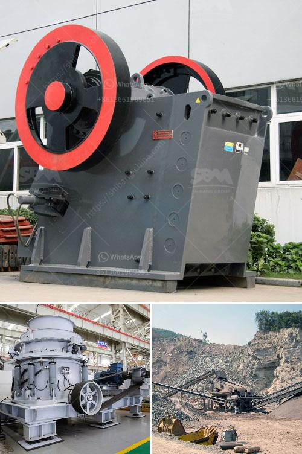

<h3>How to set up stone crushing business in kenya ?</h3>
Setting up a stone crushing business in Kenya is not an easy task, but it is achievable if you are determined and willing to put in the necessary effort. Here are some tips to help you get started.

1. Understand the market. You need to understand the market demand for stone aggregates in Kenya and know what types of stones are in high demand. This will enable you to identify the best location for your business and choose the right machinery to ensure efficient production.

2. Conduct thorough market research. Before starting your stone crushing business, you need to carry out detailed research and gather relevant information about the industry. This includes identifying potential customers, studying your competitors, and understanding the government regulations that may affect your business operations.

3. Obtain necessary licenses and permits. To operate a stone crushing business in Kenya, you will need to comply with various legal requirements such as obtaining the necessary licenses and permits from the relevant government agencies. These may include environmental permits, mining licenses, and trade licenses.

4. Secure suitable land. Find a suitable land area where you can set up your stone crushing business. Consider factors such as proximity to raw material sources and target markets, as well as the availability of utilities such as water and electricity.

5. Acquire the necessary equipment. To start a stone crushing business, you will need to invest in machinery such as crushers, conveyors, loaders, and trucks. You may also need to purchase tools and safety equipment such as helmets, gloves, and goggles for your employees.

6. Hire skilled employees. Depending on the scale of your operation, you may need to hire skilled workers such as machine operators, mechanics, drivers, and administrative staff. Ensure that you provide them with the necessary training and resources to carry out their duties effectively.

7. Develop a marketing strategy. To attract customers and promote your stone crushing business, you need to develop a comprehensive marketing strategy. This may include creating a website, advertising in local newspapers and directories, and participating in industry trade shows and exhibitions.

8. Establish partnerships with suppliers. Build relationships with suppliers of raw materials such as stones, sand, and cement to ensure a steady supply for your business. Negotiate favorable terms and prices to help keep your production costs low.

9. Implement efficient production processes. Streamline your production processes to maximize productivity and minimize wastage. Invest in modern machinery and technology to ensure efficient stone crushing and screening operations.

10. Provide excellent customer service. Deliver high-quality products and provide excellent customer service to build a strong reputation in the industry. Satisfied customers will become repeat clients and refer others to your business.

In conclusion, setting up a stone crushing business in Kenya requires a lot of groundwork and careful planning. However, with the right mindset, determination, and resources, it is a profitable venture that can contribute to the country's economic growth.
<h3>Contact us</h3><ul><li><strong>Whatsapp:&nbsp;<a href="https://wa.me/8613661969651">+8613661969651</a></strong></li><li><a href="https://swt.shibang-china.com/?git&amp;zhl&amp;How to set up stone crushing business in kenya "><strong>Online Service(chat now)</strong></a></li></ul><h3>Related</h3><ul><li><a href='How to extract copper from tailings.md'>How to extract copper from tailings?</a></li><li><a href='how to select stone crushing plant ？.md'>how to select stone crushing plant ？</a></li><li><a href='How to design a cement processing plant.md'>How to design a cement processing plant?</a></li><li><a href='How to crush borax .md'>How to crush borax ?</a></li><li><a href='How to measure the jaw crusher bearing temperature.md'>How to measure the jaw crusher bearing temperature?</a></li></ul>