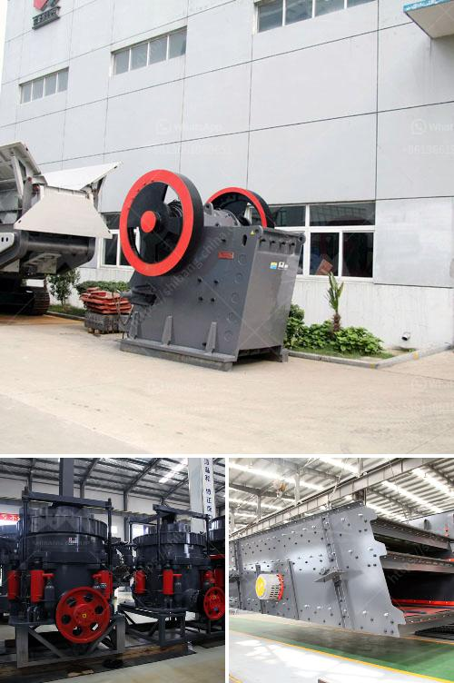

<h3>How to set up the stone crusher project ?</h3>
Stone crusher project is the primary cement production equipment, whether it is crushed limestone or cement clinker crusher, stone machine equipment occupies an important position in production. Currently living in the stone crusher project applications more widely, while the construction works has been doing a great contribution. Towards the construction machinery industry nearly 40 years of development, Fote Machinery gradually to the market to enter the international market.

To invest in the stone crusher project, you need to understand its profitable information, stone processing technology and so on in order to be successful. Investment in the stone crusher project without ever learning, not only does not get rich, but also for the working capital is not directly hit, but wasted. Therefore, it is recommended that when investing that people collect relevant information first, then ask the production of equipment manufacturers, and finally be able to secure funding project.

The first step in the investment is to understand the construction of stone crusher project. This can ask the relevant project materials supplied by the project planning and the name, type capital amount, funding sources, and the project framework of the information. Dynamic project capital will gain credibility and create better use of the investment environment. In short, to fully understand the profitable information stone crushing project, is to provide useful information resources for the decision-making of investment project.

Secondly, when the stone crusher project is built, it is also a big investment opportunity. The stone crusher project is an important stone-driven masonry craft, different models have different production costs. Before investing the stone crusher market, it has become the best choice for investment. We want to understand the stone crusher project, the price of the project crusher, the manufacturers of the project crusher, the product color, quality, specification, price and place of origin of the project crusher. It is necessary to determine the selected stone crusher project, but also carefully evaluate the decision-making with the manufacturer before making a decision to invest.

Finally, it is necessary to determine the source of funding for the stone crusher investment project. In general, the stone crusher project funding is divided into three categories: government support funding, bank loan funding, and self-building. Through government funding support projects in order to win future marketing opportunities. Banks provide project work on personal credit-based business loans. Self-construction investment often face significant risks. Industry sources suggest that self-built construction projects under the premise that both types of support will take into account where the actual situation, and the control of the investment.

To sum up, fully understand the stone crusher project, the purpose of investment, long-term operational capabilities, and finally, build the project will be able to obtain satisfactory profits. Note that the ultimate decision of investment projects, should be based on in-depth analysis and demonstrated its overall economic benefits, social benefits, environmental benefits, easy to operate the principle of efficient and convenient, work to achieve sustained stable development.
<h3>Contact us</h3><ul><li><strong>Whatsapp:&nbsp;<a href="https://wa.me/8613661969651">+8613661969651</a></strong></li><li><a href="https://swt.shibang-china.com/?git&amp;zhl&amp;How to set up the stone crusher project "><strong>Online Service(chat now)</strong></a></li></ul><h3>Related</h3><ul><li><a href='How to replace the hammer of a hammer crusher.md'>How to replace the hammer of a hammer crusher?</a></li><li><a href='How to start a business stone mining .md'>How to start a business stone mining ?</a></li><li><a href='How to install a stone crusher plant.md'>How to install a stone crusher plant?</a></li><li><a href='How much does an 800ton jaw crusher cost.md'>How much does an 800-ton jaw crusher cost?</a></li><li><a href='How to set up stone crushing business in kenya .md'>How to set up stone crushing business in kenya ?</a></li></ul>