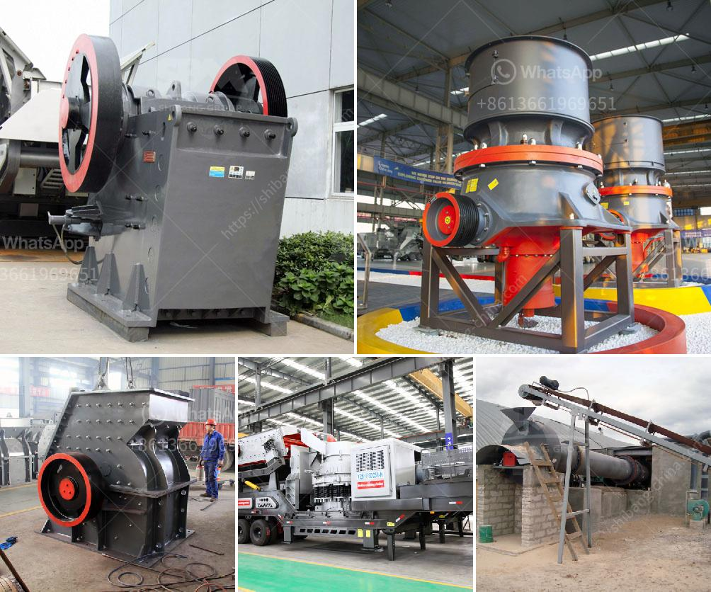

<h3>How to setting up of stone crusher unit in maharashtra and order there of ?</h3>
Setting up a stone crusher unit in Maharashtra and ordering thereof has its own set of challenges. To ensure minimal disruption to the environment and residents, the proper steps must be taken while setting up the unit.

Firstly, it is important to ascertain the requirements for the unit. This includes determining the size of the stone being crushed, the required capacity of the unit, and any additional equipment needed. A detailed feasibility study should be conducted to analyze the economic viability of the project.

Once the requirements are clear, a suitable location for the stone crusher unit needs to be identified. The location should be away from residential areas, water bodies, and sensitive environmental zones. It is advisable to consult with local authorities and obtain the necessary permits and clearances before finalizing the location.

Next, the necessary machinery and equipment need to be arranged. This includes crushers, conveyors, screens, and other auxiliary equipment. It is essential to choose reliable and efficient machinery to ensure smooth operations. Additionally, proper safety measures should be in place to prevent accidents and protect workers.

The unit should also have a dedicated power supply. Depending on the capacity and nature of operations, an electrical or diesel generator may be required. Adequate measures should be taken to ensure uninterrupted power supply to the unit.

Another important aspect is environmental compliance. Stone crushers have the potential to generate dust and noise, which can have adverse effects on the environment and nearby communities. To mitigate these impacts, dust suppression measures should be installed, such as water sprays or dust control systems. Noise barriers or enclosures can help reduce noise pollution. Regular monitoring and maintenance of these measures should be carried out to ensure their effectiveness.

Once the stone crusher unit is set up, it is crucial to regularly monitor its operations. This includes monitoring the quality and quantity of crushed stones produced, as well as ensuring proper maintenance of machinery. Regular inspections should be conducted to identify any issues and take corrective actions promptly.

The order of stone crusher units in Maharashtra can be obtained through a simple process. The concerned individual or company needs to apply for a license with the local mining department. The application should include details such as the location of the unit, its size, capacity, and any environmental clearances obtained. The mining department will review the application and issue an order as per the established guidelines.

In conclusion, setting up a stone crusher unit in Maharashtra requires careful planning and adherence to environmental regulations. The location, machinery, and operational practices should be chosen wisely to minimize impacts on the environment and surrounding communities. Regular monitoring and maintenance are essential for sustained operations. Obtaining the necessary order involves following the guidelines set by the mining department and obtaining the required licenses and permits. With proper planning and responsible operations, a stone crusher unit can be set up and operated successfully in Maharashtra.
<h3>Contact us</h3><ul><li><strong>Whatsapp:&nbsp;<a href="https://wa.me/8613661969651">+8613661969651</a></strong></li><li><a href="https://swt.shibang-china.com/?git&amp;zhl&amp;How to setting up of stone crusher unit in maharashtra and order there of "><strong>Online Service(chat now)</strong></a></li></ul><h3>Related</h3><ul><li><a href='How to Use Cone Crusher and Jaw Crusher ？.md'>How to Use Cone Crusher and Jaw Crusher ？</a></li><li><a href='How to choose the right primary crusher for your plant.md'>How to choose the right primary crusher for your plant?</a></li><li><a href='How to reduce vibration in a jaw crusher.md'>How to reduce vibration in a jaw crusher?</a></li><li><a href='how to repair a vibrating Sand Washer  ？.md'>how to repair a vibrating Sand Washer  ？</a></li><li><a href='How to install a secondary crusher.md'>How to install a secondary crusher?</a></li></ul>