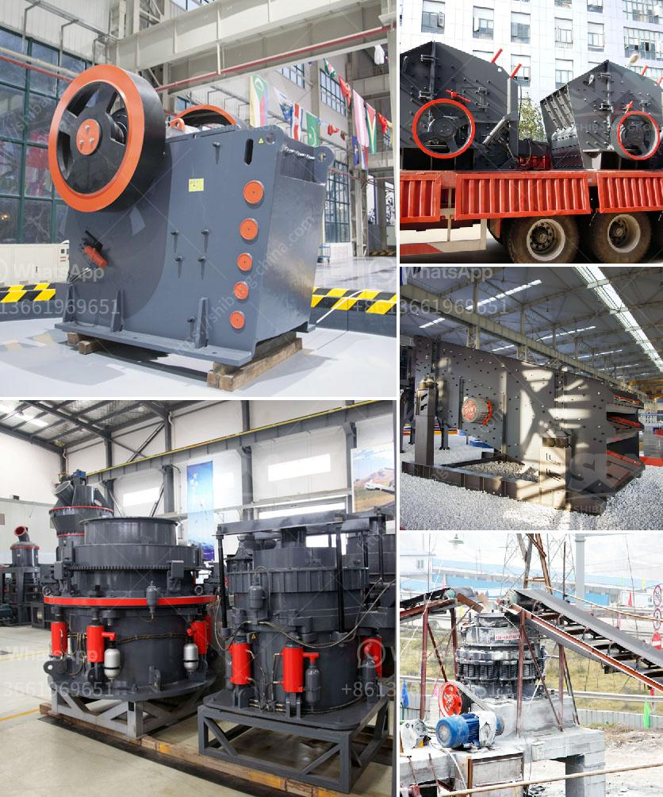

<h3>How to size grinding mills?</h3>
Grinding mills are essential equipment in the mining and processing industries for reducing the size of raw materials. Properly sizing grinding mills is crucial to ensure efficient and effective operations. This article will provide a comprehensive guide on how to size grinding mills.

Firstly, it is important to understand the specific requirements and objectives of the grinding process. Different industries have different needs for grinding mills, such as achieving a desired particle size distribution or maximizing throughput. By defining the objectives, one can narrow down the range of suitable grinding mills and determine the required capacity.

One of the fundamental factors in sizing grinding mills is the desired particle size distribution of the output material. This can be determined through various methods, such as sieve analysis or laser diffraction. By knowing the target particle size range, one can select a grinding mill that is capable of achieving this specific requirement.

The specific energy consumption is another critical parameter in sizing grinding mills. It represents the amount of energy required to grind a unit of material. To determine the specific energy consumption, the grindability of the material needs to be assessed. Grindability tests, such as the Bond Work Index test, measure the resistance of a particular material to grinding. By knowing the specific energy consumption, one can estimate the power requirements of the grinding mill.

The feed rate or tonnage is another vital parameter in sizing grinding mills. It refers to the amount of material that needs to be processed in a given period. The feed rate can be determined based on the production requirements and the desired throughput of the grinding mill. It is crucial to choose a grinding mill that can handle the anticipated feed rate without causing any operational issues.

The physical characteristics of the material being ground also play a significant role in sizing grinding mills. Some materials are more abrasive or harder to grind, requiring specialized equipment. For instance, materials with high moisture content may require mills with drying capabilities. Understanding the physical properties of the material is crucial in selecting the appropriate grinding mill.

Additionally, the required maintenance and operational costs should be considered when sizing grinding mills. Some mills may require more frequent maintenance or have higher energy consumption, leading to increased operational costs. Balancing the capital and operational costs is essential to ensure the overall economic viability of the grinding operation.

In conclusion, properly sizing grinding mills is a crucial step in achieving efficient and effective grinding processes. Defining the objectives and requirements, determining the desired particle size distribution, assessing the specific energy consumption, evaluating the feed rate, considering the material characteristics, and balancing the costs are key factors in sizing grinding mills. By following this comprehensive guide, one can select the appropriate grinding mill that meets the production requirements and optimizes the grinding process.
<h3>Contact us</h3><ul><li><strong>Whatsapp:&nbsp;<a href="https://wa.me/8613661969651">+8613661969651</a></strong></li><li><a href="https://swt.shibang-china.com/?git&amp;zhl&amp;How to size grinding mills"><strong>Online Service(chat now)</strong></a></li></ul><h3>Related</h3><ul><li><a href='How to set up a limestone processing plant.md'>How to set up a limestone processing plant?</a></li><li><a href='How to reline a vertical mill.md'>How to reline a vertical mill?</a></li><li><a href='How does a raw mill work in a cement plant.md'>How does a raw mill work in a cement plant?</a></li><li><a href='How to buy rock crusher in Sri Lanka .md'>How to buy rock crusher in Sri Lanka ?</a></li><li><a href='How to create a business plan for crushers in Brazil.md'>How to create a business plan for crushers in Brazil?</a></li></ul>