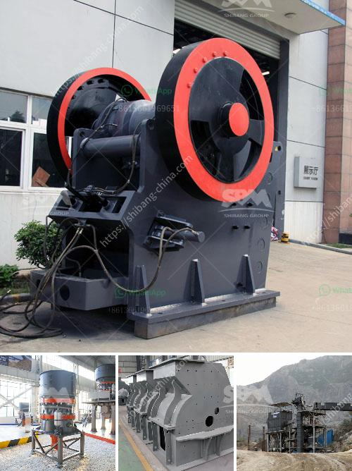

<h3>How to start a ballast crushing plant?</h3>
Ballast refers to the stones or pebbles that are used in the construction of railroads. It supports the railway tracks, providing stability and preventing deformation over time. In addition to its functional purpose, ballast also enhances the drainage system, acting as a filter to prevent waterlogging. As the demand for rail transportation continues to grow, starting a ballast crushing plant can be a lucrative venture. Here is a step-by-step guide on how to establish your own ballast crushing plant:

Before embarking on any business venture, it is essential to research and gain a deep understanding of the market and industry trends. Study the demand and supply patterns for ballast in your intended location. Analyze the market competition, envision potential challenges, and identify strategies to overcome them. By having a comprehensive understanding of the market, you can make informed decisions to stay ahead in the industry.

Create a detailed business plan that encompasses all aspects of your ballast crushing plant. Outline your goals, target market, marketing strategies, and financial projections. Determine the required startup costs, such as purchasing equipment, hiring labor, acquiring permits, and leasing land. A solid business plan will provide a roadmap for your venture and attract potential investors or lenders.

Select a strategic location for your ballast crushing plant. Consider factors such as proximity to railways and construction sites to minimize transportation costs. Ensure the site has adequate space for stockpiling materials and installation of machinery. Conduct thorough research and consult with local authorities to ensure compliance with environmental regulations, zoning restrictions, and land-use permissions.

To start a ballast crushing plant, you will need specific equipment and machinery. Procure high-quality crushers, screens, conveyor belts, and loaders suitable for processing ballast stones efficiently. Choose reliable suppliers and ensure that the equipment aligns with your production needs and budget constraints. It is essential to invest in durable and efficient machinery to minimize maintenance and maximize productivity.

Recruit a skilled workforce comprising operators, technicians, and maintenance personnel to operate the machinery and maintain smooth operations. Seek professionals with experience in the crushing industry and verify their qualifications and certifications. Provide adequate training to ensure the safe and efficient operation of the equipment.

Develop a robust marketing strategy to advertise your ballast crushing plant. Create a brand identity and market your services through various channels, such as online platforms, trade shows, and collaborations with construction companies. Build relationships with contractors and suppliers to generate leads and secure contracts. Provide exceptional customer service to ensure client satisfaction and foster long-term partnerships within the industry.

After establishing your ballast crushing plant, continuously monitor market trends, customer preferences, and industry innovations. Stay updated on technological advancements to improve your production methods and ensure you remain competitive. Regularly assess your financial performance, revisit your business plan, and make necessary adjustments to meet changing demands and maximize profitability.

Starting a ballast crushing plant requires meticulous planning, proper research, and strategic execution. By following these steps, you can lay a solid foundation for a successful and profitable venture in the ballast industry.
<h3>Contact us</h3><ul><li><strong>Whatsapp:&nbsp;<a href="https://wa.me/8613661969651">+8613661969651</a></strong></li><li><a href="https://swt.shibang-china.com/?git&amp;zhl&amp;How to start a ballast crushing plant"><strong>Online Service(chat now)</strong></a></li></ul><h3>Related</h3><ul><li><a href='how is aluminium made from its ore .md'>how is aluminium made from its ore ?</a></li><li><a href='How to crush and clean stone.md'>How to crush and clean stone?</a></li><li><a href='How to use the impact crusher ？.md'>How to use the impact crusher ？</a></li><li><a href='How to install a gyratory crusher 7 steps are critical.md'>How to install a gyratory crusher? 7 steps are critical</a></li><li><a href='How to plan to build a rock crusher production line.md'>How to plan to build a rock crusher production line?</a></li></ul>