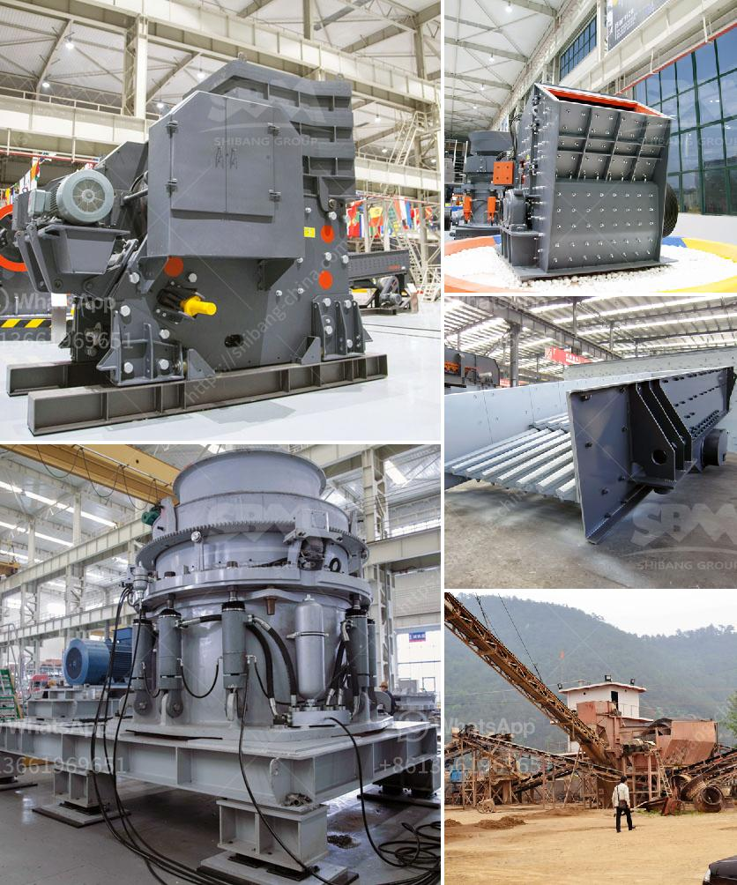

<h3>How to start a business stone mining ?</h3>
Starting a business in stone mining can be a lucrative venture for individuals who have the necessary expertise and resources. Stone mining involves the excavation and extraction of valuable stones or minerals from the earth's crust. Whether it's diamond mining, marble quarrying, or granite extraction, the process can be complex but rewarding. If you are considering diving into this industry, here are essential steps to help you start your own stone mining business.

The first crucial step is thorough market research and planning. Understand the demand for stone products in your target market, identify potential customers, and study your competition. Determine the type of stone you wish to mine, as different stones require specialized extraction techniques and equipment.

Ensure that you comply with all the legal and regulatory requirements for mining operations in your area. Obtain the necessary licenses and permits for mining operations, waste disposal, and other relevant activities. It is essential to consult with legal professionals or experts in the field to ensure you adhere to all legal obligations.

Starting a stone mining business can be capital-intensive. Evaluate your financial capacity and develop a comprehensive business plan to outline your financial requirements, revenue projections, and potential sources of funding. You may approach banks, venture capitalists, or seek out partnerships to secure the necessary financial resources.

Identify and acquire suitable mining sites for your operations. Consider factors such as geological characteristics, accessibility, proximity to transport infrastructure, and environmental impact. Engage with landowners and negotiate agreements for lease or purchase of the property.

Invest in the right equipment and machinery required for your mining operations. Depending on the type of stone, you may need excavators, loaders, crushers, or drilling machines. Ensure that your equipment is reliable, efficient, and well-maintained to minimize downtime and maximize productivity.

Assemble a skilled team of professionals with experience in stone mining operations. From geologists to machine operators, having a knowledgeable and dedicated workforce is crucial for success. Train your employees on safety procedures and provide them with personal protective equipment to ensure a safe working environment.

Mining operations can have a significant impact on the environment. Implement sustainable practices to minimize your ecological footprint. This includes restoring mined areas, managing water usage, and recycling waste material. Adhere to environmental regulations and consult with experts to ensure responsible and environmentally friendly processes.

Develop a marketing strategy to promote your stone mining business and attract potential customers. Consider building partnerships with contractors, construction companies, and architectural firms. Participate in industry trade shows and exhibitions to showcase your products and services. Utilize digital marketing tools such as social media, websites, and online directories to increase your reach.

Always strive for continuous improvement in your stone mining operations. Invest in research and development to stay updated with the latest extraction techniques, technologies, and industry trends. Monitor customer feedback and adapt your products and services accordingly.

Starting a stone mining business requires careful planning, execution, and adherence to legal and environmental regulations. With the right resources, expertise, and commitment, an individual can establish a successful and profitable stone mining business.
<h3>Contact us</h3><ul><li><strong>Whatsapp:&nbsp;<a href="https://wa.me/8613661969651">+8613661969651</a></strong></li><li><a href="https://swt.shibang-china.com/?git&amp;zhl&amp;How to start a business stone mining "><strong>Online Service(chat now)</strong></a></li></ul><h3>Related</h3><ul><li><a href='how to own quarry in nigeria.md'>how to own quarry in nigeria?</a></li><li><a href='How to choose manganese ore crushing machinery.md'>How to choose manganese ore crushing machinery?</a></li><li><a href='How to install a stone crusher plant.md'>How to install a stone crusher plant?</a></li><li><a href='How to setting up of stone crusher unit in maharashtra and order there of .md'>How to setting up of stone crusher unit in maharashtra and order there of ?</a></li><li><a href='How to choose the jaw crusher motor ？.md'>How to choose the jaw crusher motor ？</a></li></ul>