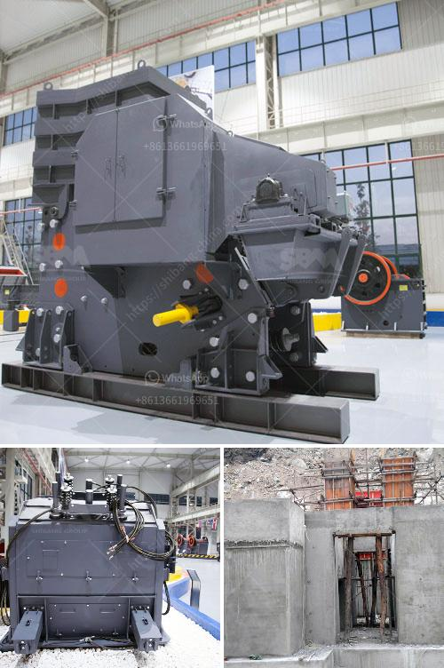

<h3>How to start a cone crusher?</h3>
A cone crusher is a vital part of most stone mining and quarrying operations. It is mainly used as a primary or secondary crusher to break down larger rocks, making them suitable for further crushing by different equipment. However, knowing how to start a cone crusher is essential in order to avoid damage to the machine and maximize its lifespan. In this article, we will discuss the step-by-step procedure on how to start a cone crusher.

1. Conduct a thorough pre-operation inspection: Before starting the cone crusher, you need to conduct a comprehensive inspection of all the components, including the mainframe, countershaft, countershaft box, eccentric shaft, and drive components, among others. Look for any signs of wear, damage, or loose connections. Ensure that the lubrication system is functioning correctly and that there is an adequate supply of oil.

2. Check the crusher's feed size: Verify that the feed material is within the acceptable size range specified by the crusher manufacturer. Excessively large or small feed material can cause damage to the crusher and result in production inefficiencies.

3. Adjust the setting: In order to achieve the desired product size, adjust the crusher's CSS (closed side setting) accordingly. This setting controls the product size by regulating the distance between the mantle and the concave liners. Follow the manufacturer's instructions to make the necessary adjustments.

4. Start the lubrication system: Turn on the lubrication system and ensure that it is working properly. The lubrication system helps to reduce friction and keep the crusher's components running smoothly. Insufficient lubrication can lead to excessive wear and premature failure of the crusher.

5. Start the crusher motor: Gradually start the crusher motor by turning the motor starter switch to the "ON" position. Allow the crusher to run for a few minutes before feeding it with the material. This warm-up period allows the crusher's components to reach their optimal operating temperature.

6. Gradually feed the material: Start feeding the material into the crusher using a well-regulated and continuous flow of material. Avoid excessive fluctuations in the feed rate, as it can cause overloading and damage the crusher.

7. Monitor the crusher's operation: Once the crusher is running, closely monitor its operation for any abnormalities or unusual noises. Any sign of trouble, such as excessive vibration, overheating, or metal-on-metal contact, should be immediately addressed to prevent further damage.

8. Regularly inspect and maintain the crusher: In addition to the initial pre-operation inspection, it is crucial to regularly inspect and maintain the cone crusher to ensure its optimal performance and longevity. Follow the manufacturer's maintenance schedule and perform routine maintenance tasks such as lubrication, replacing worn parts, and checking the crusher's overall condition.

Starting a cone crusher properly is crucial for both the machine's performance and the safety of the operators. By following the step-by-step procedure outlined in this article, you can ensure that your cone crusher operates efficiently and reliably, delivering high-quality crushed material for your mining or quarrying operation.
<h3>Contact us</h3><ul><li><strong>Whatsapp:&nbsp;<a href="https://wa.me/8613661969651">+8613661969651</a></strong></li><li><a href="https://swt.shibang-china.com/?git&amp;zhl&amp;How to start a cone crusher"><strong>Online Service(chat now)</strong></a></li></ul><h3>Related</h3><ul><li><a href='How does a coal crusher work.md'>How does a coal crusher work?</a></li><li><a href='How to fit a jaw crusher flywheel.md'>How to fit a jaw crusher flywheel?</a></li><li><a href='How to Adjust a Cone Crusher ？.md'>How to Adjust a Cone Crusher ？</a></li><li><a href='How to increase the output of ball mill.md'>How to increase the output of ball mill?</a></li><li><a href='How to change the toggle plate and toggle seat in a jaw crusher.md'>How to change the toggle plate and toggle seat in a jaw crusher?</a></li></ul>