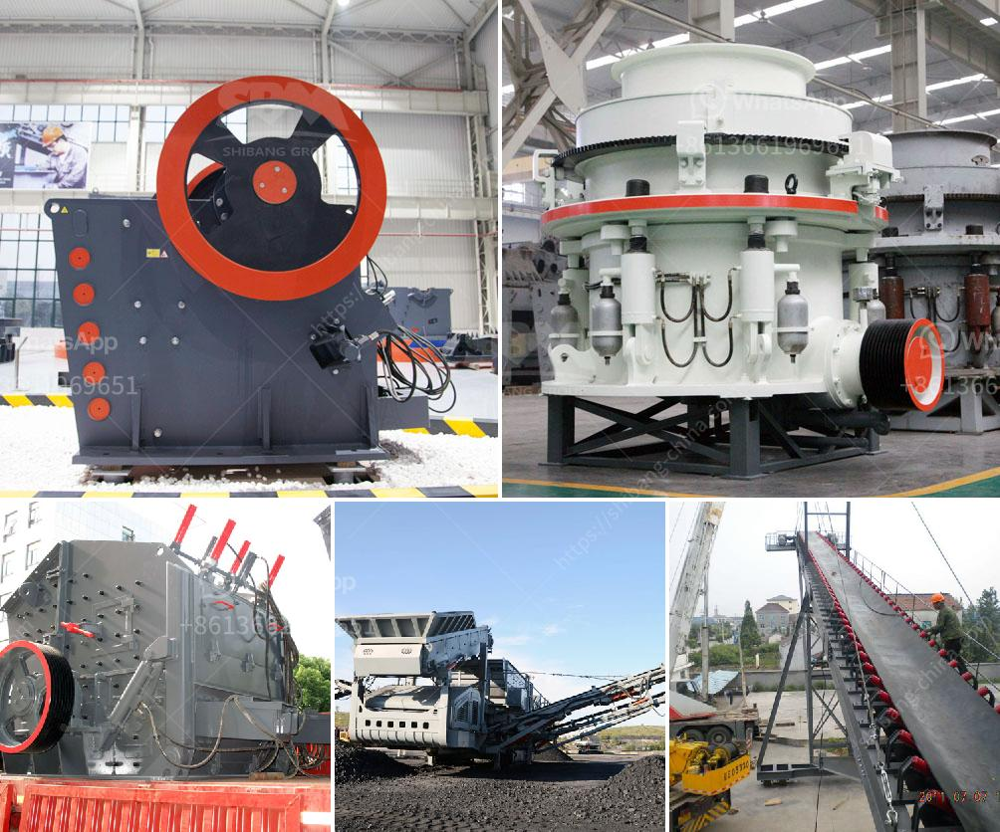

<h3>How to start a crusher plant in Odisha?</h3>
Are you considering starting a crusher plant in Odisha? If so, you've made a great choice, as the state is renowned for its rich mineral resources, particularly iron ore, coal, bauxite, manganese, and chromite. Setting up a crusher plant in Odisha can provide a lucrative opportunity for entrepreneurs, but it requires careful planning and execution. Here's a step-by-step guide on how to start a crusher plant in Odisha:

1. Identify the location: The first and foremost step is to identify a suitable location for your crusher plant. Factors to consider include proximity to raw material sources, availability of land, transportation infrastructure, and potential market demand. Seek advice from the local authorities, mining department, and industry experts to ensure your chosen location is ideal for your business.

2. Conduct a feasibility study: Before investing your time and finances into setting up a crusher plant, it's essential to conduct a thorough feasibility study. This study will help determine the profitability and viability of your venture. Assess market demand, available resources, potential competitors, regulatory requirements, and financial projections. Use this information to make an informed decision about starting the crusher plant.

3. Obtain necessary licenses and permissions: Establishing a crusher plant requires obtaining various licenses and permissions from the government. Apply for necessary clearances, such as land acquisition, pollution control, mining lease, environmental clearance, and consent to operate. Depending on the scale of your crusher plant, you may need to comply with additional regulations. Seek guidance from the state government and regulatory bodies to streamline the licensing process.

4. Procure machinery and equipment: Once you have obtained the necessary permissions, it's time to procure the machinery and equipment required for your crusher plant. Depending on the size and capacity of your plant, you will need primary crushers, secondary crushers, screening units, conveyors, and other related machinery. Choose reliable suppliers and ensure the machinery complies with safety and quality standards.

5. Hire skilled labor and technicians: Running a crusher plant involves various operations, such as crushing, screening, loading, and maintenance. To ensure smooth operations, it's crucial to hire skilled labor and technicians. Look for individuals with experience in the mining and crushing industry. Provide them with adequate training on occupational health and safety practices.

6. Develop a marketing strategy: Creating a solid marketing strategy will help you effectively promote your crusher plant and attract customers. Identify potential target markets and develop a marketing plan accordingly. Utilize various channels, such as online platforms, industry exhibitions, word-of-mouth referrals, and collaborations with construction companies and infrastructure projects.

7. Focus on quality and after-sales services: In a competitive market, offering high-quality products and excellent after-sales services is crucial for the success of your crusher plant. Ensure that the raw materials used in the manufacturing process meet the required standards. Regularly inspect and maintain your machinery to avoid any breakdowns that may disrupt operations. Provide prompt customer support and address any concerns or grievances in a timely manner.

Starting a crusher plant in Odisha requires determination, thorough preparation, and adherence to regulatory requirements. By following these steps and seeking guidance from experts, you can establish a successful crusher plant in Odisha and tap into the state's thriving mining industry.
<h3>Contact us</h3><ul><li><strong>Whatsapp:&nbsp;<a href="https://wa.me/8613661969651">+8613661969651</a></strong></li><li><a href="https://swt.shibang-china.com/?git&amp;zhl&amp;How to start a crusher plant in Odisha"><strong>Online Service(chat now)</strong></a></li></ul><h3>Related</h3><ul><li><a href='How to crush small gravel into sand.md'>How to crush small gravel into sand?</a></li><li><a href='How to choose the specification of jaw crusher？.md'>How to choose the specification of jaw crusher？</a></li><li><a href='How to start a quarry factory in Nigeria.md'>How to start a quarry factory in Nigeria?</a></li><li><a href='How to set up a quarry plant.md'>How to set up a quarry plant?</a></li><li><a href='How iron ore mining is conducted.md'>How iron ore mining is conducted</a></li></ul>