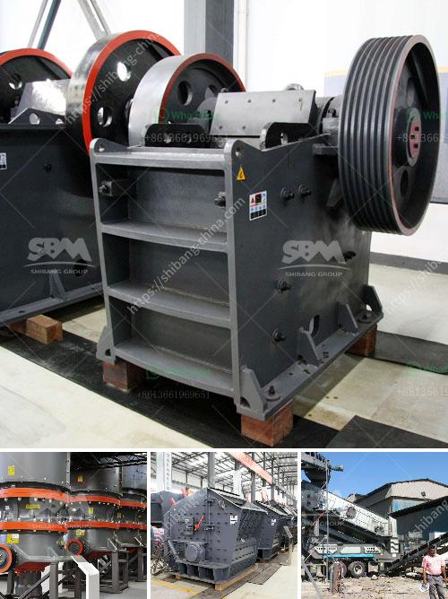

<h3>How to start a gold ore mining business?</h3>
Gold has been a symbol of wealth and luxury for centuries. Its timeless value and stability have rendered it a sought-after commodity for both individuals and nations. If you have a passion for mining and a keen eye for potential opportunities, starting a gold ore mining business can be a profitable venture. However, diving into this industry without proper planning and knowledge can lead to failure. In this article, we will outline essential steps to help you successfully launch your gold ore mining business.

Before embarking on any business venture, thorough research and education are crucial. Familiarize yourself with gold ore mining methods, equipment, and extraction techniques. Take courses or attend workshops on mining and geology to expand your knowledge. Connect with industry experts and learn from their experiences. Solid theoretical preparation will lay the foundation for your future success.

Understanding the gold market is vital to determine the profitability of your business. Identify potential customers, such as jewelry manufacturers, investors, and central banks. Analyze current market trends and competitors to evaluate demand and pricing. Additionally, study the geopolitical and economic factors that may impact the price and availability of gold. A comprehensive market analysis will guide your business strategy and help you make informed decisions.

A well-structured business plan acts as a roadmap for success. Include a detailed description of your mining operations, target market, marketing strategies, and financial projections. Identify potential risks and possible solutions. Outline your organizational structure and identify key personnel and their roles. An effective business plan is essential for securing funding, partnerships, and permits.

Starting a gold ore mining business requires significant capital investment. Seek funding from investors, banks, or government grants. Present your business plan convincingly, emphasizing your knowledge, market analysis, and potential for profitability. Seek out industry-specific financing options designed for mining operations. Ensure you have a robust financial plan that covers equipment, labor, permits, and exploration costs.

Mining operations require various permits and licenses from regulatory authorities. Consult with local mining departments to understand the legal requirements in your area. Obtain environmental permits to ensure your activities align with sustainability regulations. Compliance with safety standards should be a priority to protect your employees and the environment.

Invest in high-quality equipment suitable for gold ore mining. Research and compare suppliers to ensure you obtain the best value for your investment. Equipment such as drills, excavators, crushers, and concentrators are essential for efficient extraction. Consider outsourcing specific tasks like transportation or ore processing to specialized contractors to optimize your operations.

Recruit qualified staff who are experienced in geological exploration, mining, and extraction processes. Implement comprehensive training programs to maintain operational efficiency, safety, and ensure optimal gold yields. Regularly update employees with the latest technology and industry developments.

Starting a gold ore mining business is a challenging endeavor, but with thorough planning, research, and sufficient funding, it can be a highly rewarding venture. By following these steps and continuously adapting to market dynamics, you can establish a successful and sustainable gold mining operation. Remember to prioritize safety, sustainability, and ethical practices to build a long-lasting reputation in the mining industry.
<h3>Contact us</h3><ul><li><strong>Whatsapp:&nbsp;<a href="https://wa.me/8613661969651">+8613661969651</a></strong></li><li><a href="https://swt.shibang-china.com/?git&amp;zhl&amp;How to start a gold ore mining business"><strong>Online Service(chat now)</strong></a></li></ul><h3>Related</h3><ul><li><a href='How to choose a supplier of stone crushers.md'>How to choose a supplier of stone crushers?</a></li><li><a href='How to choose a cone crusher equipment manufacturer .md'>How to choose a cone crusher equipment manufacturer ?</a></li><li><a href='How to disassemble the jaw plate of jaw crusher.md'>How to disassemble the jaw plate of jaw crusher?</a></li><li><a href='How to set up a clinker grinding unit.md'>How to set up a clinker grinding unit?</a></li><li><a href='how to increase efficiency plant of iron ore process？.md'>how to increase efficiency plant of iron ore process？</a></li></ul>