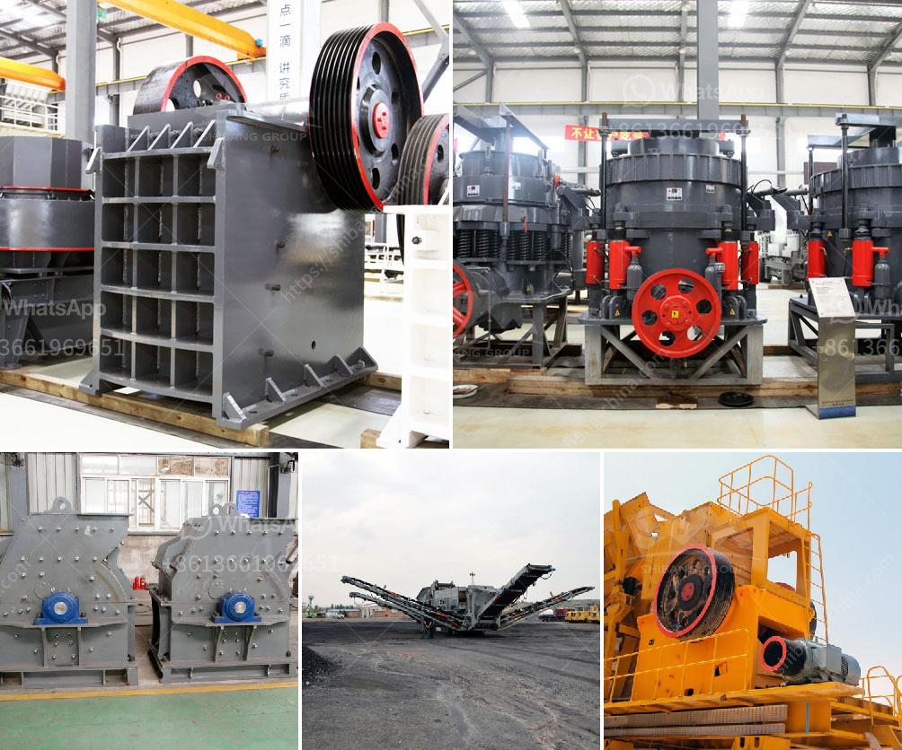

<h3>How to start a granite quarry?</h3>
Granite is an igneous rock composed of quartz, feldspar, and mica, which are ideal for various construction purposes. Granite quarries are abundant across the globe, making it a profitable business venture for individuals with keen interest and knowledge in the industry. If you're considering starting a granite quarry, here are the essential steps to get you started.

Before investing in a granite quarry, it is crucial to conduct thorough market research. Analyze the demand and supply scenario of granite in your region, ensuring there is enough demand to support your quarrying business. Additionally, research the competition and identify ways to differentiate your quarry or provide added value to prospective customers.

A well-crafted business plan is essential for any startup, including a granite quarry. This document will serve as a roadmap for your business, outlining your goals, target market, operations, financial projections, and growth strategy. A strong business plan will also be helpful if you seek financing from investors or banks.

Before commencing operations, you must obtain the necessary permits and licenses required by local and national authorities. This will ensure that your quarrying activities are legal and compliant with regulations. Engage with relevant governmental departments to understand the specific requirements and ensure you meet them before starting your quarry.

Choosing the right location for your granite quarry is crucial for its success. Look for areas with abundant granite reserves and easy accessibility to major highways or transportation routes. Consider proximity to construction markets, as it can significantly reduce transportation costs and increase your competitive edge.

Starting a granite quarry requires significant investment in equipment and machinery. This includes excavators, crushers, loaders, diamond wire saws, and cutting blades, among others. Research reputable suppliers and compare prices to ensure you get high-quality equipment that suits your specific needs.

To effectively run a granite quarry, you'll need a team of skilled professionals. Key personnel may include quarry managers, geologists, engineers, machine operators, and administrative staff. A team with experience in the industry will contribute to smooth operations and efficient management of your quarry.

Building strong relationships with suppliers and customers is crucial for the success of your granite quarry. Cultivate partnerships with reliable suppliers who can provide you with quality tools, consumables, and raw materials needed for quarrying activities. Make efforts to understand the needs and requirements of potential customers, such as construction companies and contractors, to secure long-term contracts and consistent revenue.

Working in a granite quarry involves various risks, including accidents, rock falls, and exposure to harmful dust particles. Prioritize workers' safety by implementing comprehensive safety measures and providing appropriate personal protective equipment. Conduct regular safety training sessions to ensure that everyone understands and follows safety guidelines.

Starting a granite quarry will require careful planning, investment, and hard work. It's crucial to approach the venture with a clear understanding of the market, a solid business plan, and adherence to legal requirements. With determination and perseverance, your granite quarry can become a successful and profitable business endeavor.
<h3>Contact us</h3><ul><li><strong>Whatsapp:&nbsp;<a href="https://wa.me/8613661969651">+8613661969651</a></strong></li><li><a href="https://swt.shibang-china.com/?git&amp;zhl&amp;How to start a granite quarry"><strong>Online Service(chat now)</strong></a></li></ul><h3>Related</h3><ul><li><a href='How to Buy a Stone Crusher in India ？.md'>How to Buy a Stone Crusher in India ？</a></li><li><a href='How to overhaul a jaw crusher.md'>How to overhaul a jaw crusher?</a></li><li><a href='how much does rock crusher cost ？.md'>how much does rock crusher cost ？</a></li><li><a href='How to select cone crusher parts.md'>How to select cone crusher parts?</a></li><li><a href='How to set up a gold mining ball mill.md'>How to set up a gold mining ball mill?</a></li></ul>